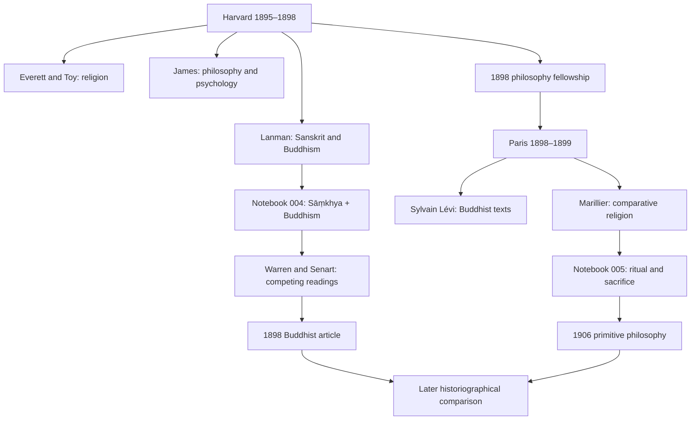

# Arthur O. Lovejoy: Archives, Intellectual Networks, and the History of Ideas
# 阿瑟·O. 洛夫乔伊：档案、学术网络与观念史

> Repository status / 仓库状态：私人研究语料库；两册手稿英文校正转录共 191 页完整收录。中文部分覆盖研究框架、证据标准、人物机构网络、术语和材料索引；004 笔记全部 71 页已完成逐页全文翻译；005 笔记 PDF 第 1—75 页已完成翻译，其余页面继续处理。原始拼写、疑难读法和置信度以 JSON 校正版为准。

## Contents / 目录

1. Research argument / 研究论点
2. Chronology / 时间线
3. People and institutions / 人物与机构
4. Evidence chains / 证据链
5. Method and editorial policy / 方法与编辑原则
6. Technical vocabulary / 专门术语
7. Notebook 004 complete transcription / 004 笔记全文
8. Notebook 005 complete transcription / 005 笔记全文
9. Core research materials / 核心研究材料
10. Repository-wide source index / 全库材料索引

## Research argument / 研究论点

Lovejoy's early engagement with Indian philosophy, Buddhist philology, Sanskrit studies, and comparative religion belongs to the working prehistory of his historical practice. The argument concerns documented operations: comparing witnesses, distinguishing borrowing from arrangement, testing causal and chronological relationships, classifying ritual mechanisms, and stating the limits of available evidence. It does not assume that Buddhism caused the mature unit-idea method or that later history of ideas emerged from a single non-Western source.

洛夫乔伊早年处理印度哲学、佛教语文学、梵文研究与比较宗教学的方式，属于其历史研究实践形成过程中的可证实部分。论证重点是可以在手稿和刊本之间具体追踪的操作：校勘不同文本证据，区分材料借用与观念排列，辨析因果关系和年代先后，按实际机制重新划分仪式，并明确现有证据的限度。这里讨论的是工作过程及其知识环境，而不是把佛教简单写成成熟「观念单元」方法的单一起源。

The strongest first-order proposition is Lovejoy's own: terms, “perhaps even the ideas,” could be borrowed, while their “arrangement and application” remained “original and characteristic.” A philosophical formation could therefore be historically composite without being merely derivative.

最稳固的一阶论点直接来自洛夫乔伊本人：术语，「甚至也许包括观念」，可以出自前人的材料，而这些材料的「排列与应用」仍然可能「独创而具有自身特征」。一种哲学体系可以在历史构成上具有复合来源，同时并不因此仅仅是被动模仿。

Existing biography already records Lovejoy's Sanskrit and Buddhist study. The contribution lies in reconstructing the propositions, source comparisons, and technical disagreements through which this work proceeded, and in distinguishing its biographical visibility from its limited place in later methodological genealogies.

既有传记已经提及洛夫乔伊学习梵文与佛教，因此研究的新意并不在于宣称这段经历此前无人知道。真正需要重建的是他的具体命题、来源比较和技术性争论，以及这段经历作为传记事实长期可见、作为学科方法谱系却较少被细致处理之间的差别。

## Chronology / 时间线

| Date / 日期 | Event / 事件 | Evidential qualification / 证据限定 |
|---|---|---|
| 1895–1898 | Harvard graduate training; Sanskrit and Buddhist texts under Charles Rockwell Lanman; comparative religion under Charles Carroll Everett; Hebrew religion under Crawford Howell Toy. / 哈佛研究生训练；随 Lanman 研读梵文及佛教文本，接触 Everett 的比较宗教学与 Toy 的希伯来宗教史。 | Lanman study is supported by established biographical evidence; attendance at individual public lectures is not demonstrated. / 随 Lanman 学习有传记依据；不能据此推定参加每一场公开讲座。 |
| 29 Apr. 1896 | Lanman's public lecture frames Buddhism through Sāṃkhya, Vedānta, Sanskrit/Pāli sources and the canon. / Lanman 公开讲座从数论、吠檀多、梵巴文资料和佛教典籍讨论佛教。 | Local availability; Lovejoy's attendance is unproved. / 证明当地可接触的知识环境，不证明 Lovejoy 到场。 |
| 1896 | Henry Clarke Warren publishes *Buddhism in Translations*. / Warren 出版《佛教译文集》。 | Warren is explicitly engaged in notebook 004. / 004 笔记明确讨论 Warren。 |
| 7 Apr. 1897 | Lanman's Cambridge Conferences lecture on practical Buddhist teachings. / Lanman 在剑桥讲座讨论佛陀实践性教义。 | Specific attendance remains unproved. / Lovejoy 是否出席尚未证实。 |
| 1898 | Lovejoy publishes “The Buddhistic Technical Terms upādāna and upādisesa.” / Lovejoy 发表讨论 upādāna 与 upādisesa 的佛教学论文。 | Notebook 004 contains strong, page-specific manuscript-to-print connections. / 004 笔记与刊本之间存在具体页码可核实的对应。 |
| June 1898 | James Walker Fellowship, formally classified as philosophy and authorizing study abroad. / 获 James Walker 奖学金，行政分类为哲学，获准赴海外学习。 | Administrative classification does not establish a commission to study comparative religion. / 哲学分类不能直接推导出专门奉派研究比较宗教学。 |
| 1898–1899 | Paris: contact with Sylvain Lévi and active participation in Léon Marillier's EPHE environment. / 巴黎时期：接触 Sylvain Lévi，并进入 Léon Marillier 的高等研究实践学院学术环境。 | Notebook 005 and institutional comparisons support the connection. / 005 笔记与课程材料对读支持这种联系。 |
| 1901 | Four-lecture syllabus on the philosophy of Buddhism. / 四讲佛教哲学教学提纲。 | Bibliographic evidence; does not alone demonstrate an uninterrupted research programme. / 属于书目证据，单独不足以证明持续不断的研究计划。 |
| 1902 | “Religion and the Time-Process” reuses Buddhist materials in a wider argument. / 《宗教与时间过程》在更广泛的论证中再次处理佛教材料。 | Specific correspondences should be verified individually. / 具体对应须逐项核实。 |
| 1905–1906 | Later notebook reuse and “The Fundamental Concept of the Primitive Philosophy.” / 笔记后期再利用与《原始哲学的基本概念》。 | Mechanism and source-ecology overlaps are strong; a literal draft relationship is not established. / 机制和文献环境高度重合，但不能据此断定逐字底稿关系。 |
| 1907 | Review of Paul Deussen's Indian-philosophy work. / 评论 Paul Deussen 的印度哲学著作。 | Evidence of continuing engagement, not retrospective proof of the 1895–1898 network. / 证明后续接触，但不能反推早期网络中所有人物已经相识。 |
| 1936 | *The Great Chain of Being*. / 《存在巨链》。 | Comparison may establish contrasts and continuities, not automatic origin or influence. / 可比较差别与延续，不能自动推出单线起源或影响。 |

## People and institutions / 人物与机构

| Person / 人物 | Context / 环境 | Connection / 联系 | Evidence level / 证据等级 |
|---|---|---|---|
| Arthur O. Lovejoy / 洛夫乔伊 | Harvard, Paris, Washington University, Johns Hopkins / 哈佛、巴黎、华盛顿大学、约翰斯·霍普金斯 | Manuscripts, published articles, teaching and later historiographical writing / 手稿、论文、教学与后期史学方法 | Direct / 直接 |
| Charles Rockwell Lanman / 兰曼 | Harvard Sanskrit and Buddhist studies / 哈佛梵文与佛教学 | Lovejoy studied Sanskrit and Buddhist texts under him / Lovejoy 随其研读梵文及佛教文本 | Documented biographical connection / 传记明确记载 |
| Henry Clarke Warren / 沃伦 | Harvard Oriental Series; Buddhist translation / 哈佛东方学丛书与佛教翻译 | Notebook 004 explicitly contests his interpretation of attachment and desire / 004 明确讨论其对于执取与欲望的解释 | Notebook and 1898 publication / 手稿及刊本 |
| Émile Senart / 塞纳尔 | French Indology and Buddhist philology / 法国印度学与佛教语文学 | Lovejoy accepts composite materials but disputes accidental arrangement / Lovejoy 承认材料来源复合，同时反驳排列纯属偶然 | Notebook and 1898 publication / 手稿及刊本 |
| Charles Carroll Everett / 埃弗里特 | Harvard comparative religion / 哈佛比较宗教学 | Wider comparative-religion instruction / 比较宗教学训练 | Biographical and institutional / 传记与制度材料 |
| Crawford Howell Toy / 托伊 | Harvard Hebrew religion / 哈佛希伯来宗教史 | Historical treatment of Hebrew religious traditions / 希伯来宗教传统的历史研究 | Biographical and institutional / 传记与制度材料 |
| William James / 威廉·詹姆斯 | Harvard philosophy, psychology and psychical research / 哈佛哲学、心理学与心灵研究 | Existing relationship to Lovejoy; independently documented James–Marillier network / 与 Lovejoy 有已知联系；James 和 Marillier 之间另有独立可证的学术往来 | No proof currently that James introduced Lovejoy to Marillier / 目前不能证明 James 介绍 Lovejoy 认识 Marillier |
| Léon Marillier / 马里耶 | EPHE, Paris; comparative religion and psychology / 巴黎高等研究实践学院、比较宗教学与心理学 | Notebook 005 intersects with his teaching on survival, sacrifice, ritual and ethnographic comparison / 005 与其关于死后存续、献祭、仪式及民族志比较的教学交叉 | Documentary and thematic support; preserve distinctions / 有文献与主题支持，仍须区分不同证据层次 |
| Sylvain Lévi / 莱维 | Paris Indology and Buddhist texts / 巴黎印度学与佛教文本 | Lovejoy's Paris Buddhist reading / Lovejoy 巴黎时期的佛教阅读 | Existing biographical evidence / 既有传记依据 |
| Hermann Oldenberg / 奥尔登堡 | German Buddhist philology / 德语佛教语文学 | Buddhism–Sāṃkhya controversy / 佛教与数论关系之争 | Named source and controversy participant / 可证实的文献与论争参与者 |
| Hermann Jacobi / 雅各比 | German Indology / 德语印度学 | Buddhism–Sāṃkhya genealogical debate / 佛教与数论谱系争论 | Named contemporary interlocutor / 可证实的同时代论争对象 |
| F. Max Müller / 马克斯·缪勒 | Oxford comparative philology and religion / 牛津比较语文学与宗教学 | Wider comparative scholarly ecology / 更广泛的比较研究环境 | Context only unless direct uptake is shown / 未证实具体阅读前仅作环境材料 |
| Paul Deussen / 保罗·多伊森 | Indian philosophy and Vedānta / 印度哲学与吠檀多 | Lovejoy's 1907 review / Lovejoy 于 1907 年发表书评 | Published source / 已刊文献 |
| James G. Frazer / 弗雷泽 | Comparative anthropology and ritual / 比较人类学与仪式研究 | Sources and critical discussion in notebook 005 / 005 中的文献来源与批评性讨论 | Notebook evidence / 手稿依据 |
| W. Robertson Smith / 罗伯逊·史密斯 | Religion, sacrifice and kinship / 宗教、献祭与亲属关系 | Lovejoy separates explanatory mechanisms rather than accepting one sacrificial origin / Lovejoy 区分解释机制，不接受单一献祭起源 | Notebook evidence / 手稿依据 |
| Marcel Mauss / 马塞尔·莫斯 | French sociology and sacrifice / 法国社会学与献祭研究 | Comparative analytical control for French ritual debates / 法国仪式争论的比较参照 | Direct influence must not be inferred from conceptual resemblance / 不能仅凭概念相似推定直接影响 |

### Network / 学术网络

The James–Marillier relationship predates Lovejoy's Paris year. Its existence is evidence of a network, not evidence that James arranged Lovejoy's participation. / James 与 Marillier 的联系早于 Lovejoy 的巴黎时期。它证明学术网络存在，不能直接证明 James 安排了 Lovejoy 参与。

## Evidence chains / 证据链

### Warren → notebook 004 → 1898 / Warren → 004 笔记 → 1898 年文章

Warren treats attachment and desire as a relation of “identity.” On notebook 004 PDF p. 22 / manuscript p. 75, Lovejoy objects: “But not so if we are to follow the present text.” The published article differentiates semantic, psychological, and causal relations. / Warren 将执取与欲望处理为「同一」关系。在 004 笔记 PDF 第 22 页、手稿第 75 页，Lovejoy 写道：「但如果遵循当前文本，情况并非如此。」刊本进一步区分语义、心理和因果层面的联系。

### Senart → notebook 004 → 1898 / Senart → 004 笔记 → 1898 年文章

Senart describes composite categories arranged in an “ordre plus ou moins accidentel.” On notebook 004 PDF p. 49 / manuscript p. 137, Lovejoy concedes heterogeneous prior materials but rejects the conclusion that the formula is illogical, unintelligible, or accidental. In the 1898 article, he distinguishes borrowed terms or ideas from original arrangement and application. / Senart 将不同来源的成分解释为依照「多少带有偶然性的秩序」拼合。004 笔记 PDF 第 49 页、手稿第 137 页显示，Lovejoy 承认材料来源不同，却拒绝将其进一步推定为缺乏逻辑、不可理解或纯属偶然。1898 年刊本据此区分既有术语或观念与独创的排列和应用。

### Upādisesa → notebook 004 → 1898 / upādisesa → 004 笔记 → 1898 年文章

Notebook 004 PDF p. 66 / manuscript p. 173 contains a near-verbatim precursor to the 1898 article, p. 135. Print adds explicit evidential caution: meaning must be examined through usage, some evidence is relevant but not necessarily conclusive, and the question cannot be regarded as finally settled. / 004 笔记 PDF 第 66 页、手稿第 173 页，与 1898 年文章第 135 页存在接近逐字的对应。刊本另外明确补充证据限定：词义须结合实际用法考察；部分证据虽相关，却未必具有决定性；问题仍不能视为已经彻底解决。

### Notebook 005 → Paris seminars → 1906 / 005 笔记 → 巴黎研讨 → 1906 年文章

Notebook 005 links death, survival, totemism, sacrifice, kinship, blood transfer, agricultural rites, and impersonal efficacy. The strongest connection to the 1906 article lies in recurrent explanatory mechanisms and source ecologies, not a proven literal draft sequence. / 005 笔记贯穿死亡、死后存续、图腾、献祭、亲属关系、血液转移、农业仪式和非人格化效力。其与 1906 年文章最坚实的联系是反复出现的解释机制与共同文献环境，而不是已经证实的逐字底稿关系。

## Method and editorial policy / 方法与编辑原则

- Preserve Lovejoy's abbreviations, original technical forms and multilingual quotations. / 保留 Lovejoy 的缩写、技术术语原貌及多语种引文。
- Distinguish PDF page numbers from manuscript page labels. / 区分 PDF 页码与手稿原始页码。
- Retain transcription confidence and uncertain readings. / 保留转录置信度与疑难读法。
- Do not silently resolve `[illegible]`, `[?]`, uncertain proper names, or difficult Pāli/Sanskrit forms. / 不擅自补全 `[illegible]`、`[?]`、未定人名或难辨的巴利文、梵文形式。
- Separate direct documentary evidence from institutional availability, thematic resemblance and speculative interpersonal transmission. / 区分直接文献证据、制度环境中的可接触性、主题相似以及未经证实的人际传递。
- Preserve problematic historical terms as evidence of the original classification, not as present-day editorial endorsement. / 历史文本中的问题性分类词汇须作为史料保留，不代表当代编者认可。
- A complete English transcription is not itself a complete Chinese translation. Until translation exists, pages are labeled as English transcription rather than misrepresented as bilingual. / 英文全文转录并不等于中文全文译本。在逐段翻译真正完成之前，各页明确标为英文转录，不虚称已经双语化。

## Mature publications: Buddhism, India, China, and citation networks / 成熟著作中的佛教、印度、中国与引文网络

**Full documented audit / 完整逐页核查:** [research_notes/Lovejoy_Great_Chain_Essays_Buddhism_India_China_named_sources_audit_2026-08-23.md](research_notes/Lovejoy_Great_Chain_Essays_Buddhism_India_China_named_sources_audit_2026-08-23.md)

Two user-provided OCR books were searched at page and layout-block level: *The Great Chain of Being* (408 PDF pages) and *Essays in the History of Ideas* (388 PDF pages). Search counts include paratext unless qualified. / 对《存在巨链》408 页和《观念史论文集》388 页 OCR 按印刷页码、PDF 页码、正文、脚注、尾注、书目和索引分别核查。

| Topic / 主题 | Great Chain /《存在巨链》 | Essays /《观念史论文集》 | Interpretation / 解释 |
|---|---:|---:|---|
| Buddhism / 佛教 | 7 textual matches including index; key pp. 30, 97, 218; note p. 344 | 2 matches, both bibliography p. 340 | Mature comparative type versus bibliographic preservation / 成熟比较类型与书目层面的保存 |
| India / 印度 | 5 matches; pp. 27, 93, 142, 305 | 11 matches, some unrelated to South Asia | Distinguish Indian philosophy from American Indian references / 区分印度哲学与美洲原住民 |
| Upanishads / 奥义书 | 3 matches; pp. 30, 42, 93 | 0 | Comparative negative theology / 比较性的否定神学 |
| Vedānta / 吠檀多 | 2 exact matches; pp. 30, 93 variant | Bibliography p. 341 uses Vēdanta | Variant spellings require manual verification / 不同拼写须人工复核 |
| China / 中国 | 1 match | 197 matches across text, notes, headers, index; chapter pp. 99–135 | Major China-to-Europe transmission argument / 中国因素进入欧洲审美的系统论证 |

### Continuity and compression / 延续与压缩

Notebook 004 PDF p. 56 / manuscript p. 151 describes Nirvāṇa negatively, and PDF p. 62 / manuscript p. 165 describes cessation of existence. *The Great Chain of Being* p. 30 preserves this negative interpretive tendency. But notebook 004 PDF p. 18 / manuscript p. 65 questions whether Buddhist refusals reflect merely practical rejection of speculation: the problem may instead lie in the form of the questions. *The Great Chain* p. 97 compresses this qualification into a broader account of primitive Buddhism as practical escape from suffering. / 004 笔记第 56、62 页对涅槃和存在终止的否定性解释，在《存在巨链》第 30 页得到延续；但 004 笔记第 18 页对「拒答是否针对问题形式」所作的细致区分，在《存在巨链》第 97 页被压缩为较宽泛的实践性拒绝思辨。

### Citation network and false positives / 引文网络与同名误认

William James is directly documented in Lovejoy's preface: he recalls hearing James early in his philosophical training. Paul Deussen appears in the 1907 bibliography; J. G. Frazer appears in *Great Chain* p. 338, but as a commentator on Plato rather than an authority on sacrifice. Y. Z. Chang is explicitly named in *Essays* p. 111 as a linguistic consultant whom Lovejoy asked to investigate *sharawadgi*. / William James 的师承关系由 Lovejoy 自序直接证实；Paul Deussen 出现在 1907 年书目；Frazer 在《存在巨链》第 338 页作为柏拉图研究者出现，而不是献祭理论来源；Y. Z. Chang 在《论文集》第 111 页脚注中被明确记录为 Lovejoy 主动请教的汉语语言顾问。

Lanman, Warren, Senart, Oldenberg, Hermann Jacobi, Max Müller, William Dwight Whitney, Sylvain Lévi, and Marillier do not reliably appear in the two mature books. Apparent matches resolve to F. H. Jacobi, Lois Whitney, Adam/Johannes von Müller, ordinary “woods,” or Johns Hopkins University. / Lanman、Warren、Senart、Oldenberg、印度学家 Hermann Jacobi、Max Müller、William Dwight Whitney、Sylvain Lévi 和 Marillier，在这两本成熟著作中均无可靠出现；表面同姓命中实际多为 F. H. Jacobi、Lois Whitney、Adam 或 Johannes von Müller、「树林」或 Johns Hopkins University。

### Disciplinary framing / 学科自我界定

The *Essays* foreword defines the History of Ideas Club through work in **occidental literature**; the author's preface states that general methodological ideas grew out of particular inquiries and that some technical philosophical studies were excluded from the collection. Buddhism therefore remains visible as biography and bibliography while its early technical scholarly community recedes from the mature disciplinary presentation. / 《论文集》前言把观念史俱乐部的研究范围明确限定在「西方文学」；作者自序强调一般方法从具体研究中生长，并说明部分技术性研究没有收入论文集。于是佛教经验继续作为传记事实和书目起点存在，而早期佛教学术共同体在成熟的学科自我呈现中逐渐退场。

## Technical vocabulary / 专门术语

| Term / 原词 | Working Chinese / 暂定中文 | Qualification / 说明 |
|---|---|---|
| Sāṃkhya | 数论 | Preserve historical spelling where Lovejoy uses “Sankhya.” / 原稿写作 Sankhya 时保留。 |
| Vedānta | 吠檀多 | A contemporaneous Indian philosophical classification. / 同时期讨论中的印度哲学分类。 |
| Buddhism | 佛教 | Avoid projecting a single doctrinal system across distinct witnesses. / 避免把不同文本预设为单一完整教义系统。 |
| paṭicca-samuppāda | 缘起 | Historical spelling varies. / 原稿拼写存在变化。 |
| nidāna | 因缘支；缘起支 | Meaning depends on textual setting. / 具体译法随文本位置调整。 |
| upādāna | 执取；取 | Competing interpretations are the historical problem. / 不同解释本身构成历史问题。 |
| upadhi / upādi | 依；余依；执取相关概念 | Translation depends on contested usage. / 须根据争议中的具体用法处理。 |
| upādisesa | 有余依 | Technical interpretation remains historically contested. / 技术性解释存在历史争议。 |
| anupādisesa | 无余依 | Do not assume that every occurrence denotes physical death. / 不能预设每次出现均指生理死亡。 |
| khandha / skandha | 蕴 | Preserve singular/plural and source-specific usage. / 保留单复数及各文本的具体用法。 |
| Nirvāṇa | 涅槃 | Represent uncertainty rather than settling doctrinal disputes editorially. / 呈现原有争论，不由编者预先裁定。 |
| survivance | 存续；遗存 | Meaning varies between post-mortem survival and historical survival. / 须区分死后存续与历史遗存。 |
| sacrifice | 献祭；牺牲仪式 | Classification depends on mechanism rather than appearance alone. / 按机制而非仅凭外观分类。 |
| efficacy | 效力 | Distinguish personal agency from impersonal transferable force. / 区分人格化作用与可转移的非人格化效力。 |
| communion | 共餐；共融 | Specify ritual context. / 依仪式环境确定。 |
| genealogy | 谱系；源流 | Distinguish historical transmission from analytical resemblance. / 区分历史传递与分析层面的相似。 |
| analogy | 类比 | Similarity does not establish historical borrowing. / 相似性本身不足以证明借用。 |
| arrangement and application | 排列与应用 | Lovejoy's central distinction concerning borrowed materials and originality. / Lovejoy 用来区分材料借用与独创性的核心表述。 |

## Notebook 004: complete corrected transcription / 004 笔记：完整校正英文转录

**Archive identifier / 档案编号:** `MS38_004_001_061_004`  
**Pages / 页数:** 71  
**Source PDF SHA-256 / 原始 PDF 校验值:** `1ec301a9696949c04acf1c64633377db3fa8c68348d170831b8caa53c561b75f`  
**OCR SHA-256 / OCR 校验值:** `e14956e2904f2c907d29163bbea3f3f162a011da2a53928dbf370efe7d031d84`  
**Translation status / 翻译状态:** 完整英文原文已收录；004 笔记全部 71 页已完成中文全文翻译；005 笔记 PDF 第 1—75 页已完成翻译，其余页面继续处理。

### Batch p001-018 / 批次 p001-018

**Source file / 来源文件:** [archive_transcriptions/MS38_004_001_061_004_p001-018_clean.json](archive_transcriptions/MS38_004_001_061_004_p001-018_clean.json)

**Research signals / 本批研究线索:**

- Sankhya method: pramana, syllogism, perception, testimony
- Buddhist agnosticism and practical indifference to speculative questions
- Flux/impermanence and the continuity problem
- Chronological priority and possible relation of Sankhya and Buddhism
- Brahma-jala / Digha-Nikaya classification of sixty-two heresies
- Lovejoy’s comparison of Sankhya dualism with early Buddhist formulations about self, world, soul/body, and future life

#### 004 · PDF 001 · Manuscript / 手稿 未标页 / unnumbered

**Type / 类型:** cover  
**Confidence / 置信度:** high

**English transcription / 英文转录**

A. O. Lovejoy
Sankhya + Buddhism

Harvard Cooperative Society.

**Chinese translation / 中文译文**

A. O. 洛夫乔伊
数论与佛教

哈佛合作社。

#### 004 · PDF 002 · Manuscript / 手稿 未标页 / unnumbered

**Type / 类型:** ownership/signature  
**Confidence / 置信度:** high

**English transcription / 英文转录**

A. O. Lovejoy.

**Chinese translation / 中文译文**

A. O. 洛夫乔伊。

#### 004 · PDF 003 · Manuscript / 手稿 5

**Type / 类型:** index  
**Confidence / 置信度:** high

**English transcription / 英文转录**

Index.

Anicca, p. 49–52,
Gotama, p. 131, 169,
Agnosticism, p. 21.

**Chinese translation / 中文译文**

索引。

无常（Anicca），第 49—52 页；
乔达摩（Gotama），第 131、169 页；
不可知论，第 21 页。

#### 004 · PDF 004 · Manuscript / 手稿 8

**Type / 类型:** notes  
**Confidence / 置信度:** medium-high

**English transcription / 英文转录**

The Method of the Sankhya
Garbe p. 150
[For bibliog. problem, etc. see other note-book.]

“All the Hindu systems manifest a genuine philosophical temper in that they recognize the necessity of giving an account of the sources of knowledge acknowledged by them. The usual wd for a source of kn. is pramana; etymologically = that whereby anything is measured off, accurately established, discovered as real knowledge (pramiti).

The systems differ in the number of pramanas; but in the discussion of that one wh. is most important, and accepted by all schools as the distinctively philosophical method of proof, viz. the syllogism, the text-book”

**Chinese translation / 中文译文**

数论的方法
Garbe，第 150 页。
［关于书目问题等，参见另一本笔记。］

「所有印度教哲学体系都展现出真正的哲学精神，因为它们承认有必要说明自身认可的知识来源。表示知识来源的常用词是 pramāṇa；从词源看，其含义是：借以衡量、准确确立，并将某物发现为真实知识（pramiti）的东西。

各体系所承认的 pramāṇa 数量并不相同；但是，在讨论其中最重要、并被所有学派接受为具有鲜明哲学特征的证明方法，也就是三段论时，正统体系的教科书……」

**Uncertain readings / 疑难读法:** abbreviated bibliographic parenthesis; some Sanskrit diacritics not explicit in manuscript

#### 004 · PDF 005 · Manuscript / 手稿 9

**Type / 类型:** notes  
**Confidence / 置信度:** medium

**English transcription / 英文转录**

[continuation from preceding page]

“of the orthodox systems show pretty complete agreement. The probable terminology, definitions, examples are on this point almost uniformly the same. This much indicates that the results of the logic worked out by the Nyaya-Vaisesika School had been adopted by the other schools as an established logical method. Consequently when we find a similar theory of the syllogism in certain Sankhya writings (e.g. S.-t.-k. & S. [illegible] Bhasya) we must recognize an alien element; which fact however a European expositor of the Sankhya need notice only in so far as it bears upon the method of the system.

Our system recognizes 3 sources of knowledge:
1. Perception (pratyaksha, drishta)
2. Syllogism (anumana)
3. Certain reliable testimony (aptavacana, sabda).

1. Perception. Defined, Karika 5 as ‘apprehension of indiv. objects.’ First F. [?] says in Sutra I, 89 as ‘F. function of that wh., on contact (w. a thing) represents the form of that thing.’”

**Chinese translation / 中文译文**

［接上页］

「……表现出相当完全的一致。在这一点上，有关术语、定义和例子几乎处处相同。这至少表明：正理—胜论学派发展出来的逻辑成果，已经被其他学派接受为既定的逻辑方法。因此，当我们在某些数论著作中发现类似的三段论理论时，例如 S.-t.-k. 和 S.［难辨］Bhasya，就必须承认其中存在外来的成分；不过，欧洲的数论阐释者只须在这个事实影响体系方法的范围内加以注意。

我们的体系承认三种知识来源：
1. 知觉（pratyaksha、drishta）；
2. 三段论或推论（anumana）；
3. 某些可靠的证言（aptavacana、sabda）。

1. 知觉。《颂》第 5 节将其界定为『对个别对象的把握』。《经》Ⅰ，89 首先［?］将其解释为：『某种东西在接触一物时，呈现该物形式的功能。』」

**Uncertain readings / 疑难读法:** one Sankhya text title in parenthesis; source label before Sutra I, 89

#### 004 · PDF 006 · Manuscript / 手稿 21

**Type / 类型:** notes  
**Confidence / 置信度:** medium

**English transcription / 英文转录**

Buddh. Agnosticism
[heading abbreviated/uncertain in manuscript]

Sabbasava Sutta of F. Maj. Nik. [?]. First of F. several is F. “considering of things wh. ought not to be considered.”

“Unwisely does he consider thus: Have I existed during F. ages of F. past, or not? What was I during F. ages of F. past? How was I? Having been what, what did I become during F. ages of F. past? Shall I exist in F. future, or shall I not? etc. [The] questions above are repeated for F. future. Or he debates thus w. himself as to F. present: Do I really exist, or do I not? What am I? How am I? Whence did this being come? Whither will it go? In him then unwisely considering there springs up one or another”

**Chinese translation / 中文译文**

佛教的不可知论
［标题在手稿中使用缩写，读法未完全确定。］

《中部》的《一切漏经》［?］。诸项中的第一项，是「思考本不应思考的事情」。

「他不明智地如此思量：在过去诸时代里，我存在过，还是没有存在过？在过去诸时代里，我是什么？我以何种方式存在？在过去诸时代里，我先是什么，后来又变成什么？在未来我将存在，还是不会存在？等等。上述问题又针对未来重复提出。或者，他就现在与自己争辩：我真的存在，还是并不存在？我是什么？我怎样存在？这个存在者从何而来？又将去向何处？当他这样不明智地思考时，便会生起某一种……」

**Uncertain readings / 疑难读法:** heading/source line; abbreviated reference to Majjhima Nikaya

#### 004 · PDF 007 · Manuscript / 手稿 23

**Type / 类型:** notes  
**Confidence / 置信度:** low-medium

**English transcription / 英文转录**

[continuation from preceding page]

“of F. 6 heretical notions: [uncertain passage on the views ‘I have a self,’ ‘I have no self,’ and the permanence of self]. … ‘this self of mine wh. is permanent, lasting, eternal, not subject to change, enduring’ … This F. walker in heresy, F. jungle of heresy, F. wilderness of heresy.”

On F. certain passages of F. Sutta Nipata, esp. F. Atthaka-vagga, the seeker in possession of an auto-philos. sort wh. cannot be accepted for on the grounds. Though it might be regarded as merely satirical expression of contempt for F. false & fruitless reasoning of F. heretics, & as inquisitiveness agt disputation for F. sake of disputation, wh., by cultivating intellectual pride, will obviously increase rather than diminish attachment to existence. But some sentences are more extreme in tone; e.g. (S.N. 911) “A Brahmana is no follower of heretical doctrines, he is not a friend of knowledge (ñana [?]), & having destroyed acquired opinions wh. have arisen, he is indifferent to learning while others acquire it.” Again, “Not by opinion, not by tradition, not by knowledge, do F. wise call any one a Muni.” But these must be taken in conjunction w. other passages, e.g. w. other passage below in F. [next page].

**Chinese translation / 中文译文**

［接上页］

「……六种异端见解之一：［关于『我有自我』『我没有自我』以及自我是否恒常的一段，读法不确定。］……『我的这个自我是持久的、恒常的、永恒的、不受变化支配的、持续存在的』……这就是走入异端、异端的丛林、异端的荒野。」

关于《经集》中的某些段落，尤其是《八颂品》：求道者持有某种自立的哲学式见解［该处句意不清］。这些话也许可以理解为对异端错误且徒劳的推理所作的讽刺，或者是针对为争论而争论的诘难；因为这类争辩会培养智识上的骄傲，显然只会增加，而非减少，对存在的执取。但是，有些句子的语气更加极端。例如《经集》911：「婆罗门不是异端教义的追随者，也不是知识的朋友（ñana［?］）；在摧毁已经产生的后得见解之后，当别人追求学问时，他对学问无动于衷。」又说：「智者并不依据见解、传统或知识，称某人为牟尼。」不过，这些话必须结合其他段落一同理解，例如［下一页所引］另一段文字。

**Uncertain readings / 疑难读法:** opening quotation on six heretical notions; one Pali/Sanskrit term after ‘knowledge’

#### 004 · PDF 008 · Manuscript / 手稿 25

**Type / 类型:** notes  
**Confidence / 置信度:** medium-high

**English transcription / 英文转录**

Buddh. indiff. to theoretical kn.

[Source illegible], p. 20f. — Gotama & leaves of Simsapa-wood.

“There are more leaves on F. tree than in my hand, so do I know many more truths than those F. I have revealed to you. Why have I revealed some & not others? Bec. F. ones I have not revealed cannot be of profit to you, since they will not help you the more to turn away fr. earthly things, to suppress desire, to purify the intelligence, etc.”

**Chinese translation / 中文译文**

佛教对理论性知识的淡漠。

［来源难辨］，第 20 页及以下。乔达摩与尸摄林树叶。

「树上的叶子比我手里的叶子更多；同样，我所知道的真理，也远多于我向你们揭示的真理。为什么我揭示其中一部分，而不揭示其他部分？因为那些没有揭示的真理对你们并无益处：它们不会进一步帮助你们远离尘世之物、压制欲望、净化心智，等等。」

**Uncertain readings / 疑难读法:** bibliographic source before p. 20f

#### 004 · PDF 009 · Manuscript / 手稿 43

**Type / 类型:** notes  
**Confidence / 置信度:** medium

**English transcription / 英文转录**

Contents, cont.

7 or priority of doctrine of Sankhya & Buddhism.
[Reference:] [Brahma-jala?] p. 173, tr. s.v. in yellow note bk.

**Chinese translation / 中文译文**

目录，续。

第 7 项：数论与佛教教义何者在先。
［参见：］《梵网经》［?］，第 173 页；译文见黄色笔记本相关条目。

**Uncertain readings / 疑难读法:** reference line after topic note

#### 004 · PDF 010 · Manuscript / 手稿 49

**Type / 类型:** notes  
**Confidence / 置信度:** high

**English transcription / 英文转录**

Flux

V. Warren p. 150 f. Vis Mag.

“Just as a chariot-wheel in rolling rolls only at one point of F. tire, … in exactly F. same way F. living being lasts only for F. period of one thought. As soon as that thought has ceased, F. being is said to have ceased.”

Also [reference] 141.

In MP II, 33, Milinda objects A. a doctrine of absolute flux destroys time itself, — you must have some static units, or else your sequence is a chain without links; in his words: “If that wh. was not, becomes, & as soon as it has begun to become passes again away, then surely being thus cut off at both ends it must be entirely destroyed.” N’s answer

**Chinese translation / 中文译文**

流变。

参见 Warren，第 150 页及以下，《清净道论》。

「正如车轮滚动时，只有轮缘上的一点与地面接触……同样，活着的存在者也只持续一个念头的时间。一旦那个念头终止，就说那个存在者也终止了。」

另参见［文献］第 141 页。

在《弥兰陀问经》Ⅱ，33 中，弥兰陀提出异议：绝对流变的教义会摧毁时间本身，因为必须存在某些静止的单位，否则所谓连续序列就会成为一条没有环节的链条。用他的话说：「如果原本不存在的东西开始存在，而它一开始存在又马上消逝，那么它在两端都被切断，必定完全毁灭。」那先的回答……

**Uncertain readings / 疑难读法:** abbreviated source after Warren; one secondary reference before 141

#### 004 · PDF 011 · Manuscript / 手稿 51

**Type / 类型:** notes  
**Confidence / 置信度:** medium-high

**English transcription / 英文转录**

Flux

[continuation]

simply insists upon F. fact A. time is of this sort, — a growing again fr. a point wh. is cut off in F. act of becoming. In other words, he seems to regard F. time process w. all its inconceivabilities as an ultimate & inexplicable fact.

MP II, 35: “All predispositions arise through a (gradual) becoming.” Illustration of building of a house, growing tree, etc.

Maha-Parinibbana-Sutta (vi) [reference]. F. last words of F. Buddha are a reminder of F. first & fundamental of F. 3 characteristics: “And now, F. monks, I take leave of you; all the constituents of being are transitory; work out your salvation with diligence.” F. nothing likely to be preserved scrupulously by tradition; we may therefore regard it as an historical fact that Gotama thus with his last breath emphasized that cardinal doctrine upon which his whole ministry had been based.

2. Pitakas at all events seem to admit A. F. body preserves a permanent identity for a considerable time — c. 21, during a single lifetime while karma continues to hold F. elements to-gether in a single form (rupa). F. extreme doctrine of absolute transitionism is applied only to F. mind; A. object wh. is called mind, intellect, consciousness, keeps up an incessant round by day & night of perishing as one thing

**Chinese translation / 中文译文**

流变。

［接上页］

……只是坚持时间确实如此：它从一个点重新生长，而这个点在形成的过程中同时被切断。换言之，他似乎将时间过程连同其所有难以理解之处，视为一个终极而无法解释的事实。

《弥兰陀问经》Ⅱ，35：「一切习性都通过［逐渐的］生成而生起。」举例：建造房屋、树木生长等。

《大般涅槃经》［第六部分］［文献略］。佛陀最后的话再次提醒人们注意三种特征中的第一项，也是最根本的一项：「诸比丘，如今我向你们告别；一切存在的构成因素都是无常的；应当精勤求取解脱。」［以下语句有省略或不确定处。］这类说法最有可能被传统谨慎保存；因此，我们可以把这一点视为历史事实：乔达摩在临终前仍强调了构成其整个传教活动基础的那项核心教义。

2. 无论如何，三藏似乎承认，身体在相当长的一段时间内维持恒定的同一性，大约持续一生；只要业继续把诸要素维系为同一个形态（rūpa），情况便如此。绝对变化的极端教义仅适用于心：被称为心、智性或意识的对象，日夜不停地作为某一事物消亡……

**Uncertain readings / 疑难读法:** abbreviated source details and several pronouns/abbreviations

#### 004 · PDF 012 · Manuscript / 手稿 53

**Type / 类型:** notes  
**Confidence / 置信度:** medium

**English transcription / 英文转录**

Flux

[continuation]

“and springing up as another.” II, p. 151.

Maha-Parinibbana-Sutta, vi, 15. “Then F. Blessed One died, Brahma Sahampati uttered a stanza:
‘They all, all beings that have life shall lay aside F. complex form, F. aggregate of mental & material qualities wh. gives them, or in heaven or on earth, their fleeting individuality.’
And Sakka said:
‘They’re transient all, each being’s parts & powers; growth is F. nature, & decay. They are produced, they are dissolved again; and then is best, when they have sunk to rest.’”

F. epigrams of Buddha are probably F. most authentic in F. whole range of Buddhist literature; & whole story of his death has extreme plausibility & verisimilitude.

Philos. material & contemp. date of Sankhya & Buddhism.

[Com. Le?], Buddhism, p. 24.
“It was quite otherwise w. F. Sankhya system. Centuries afterward, when Buddhism had become corrupted, it will appear A. F. Sankh. was allied [illegible] to support F. Vedanta; & as it had often been held by European scholars A. Buddhism was more or less based on F. Sankhya, it will be necessary to consider F. question of the priority. Logically it stands half-way bet. F. Vedanta & Buddhism & was before a poss. stepping-stone to F. Buddhist position. And F. Buddhist themselves acknowledge A. Kapila … lived several”

**Chinese translation / 中文译文**

流变。

［接上页］

「……又作为另一事物生起。」Ⅱ，第 151 页。

《大般涅槃经》Ⅵ，15：「世尊去世时，梵天娑婆主诵出一偈：
『他们都会，凡是具有生命的存在者都会，舍弃那种复合形态：心理与物质性质的聚合，使他们无论在天上还是地上，都只拥有短暂的个别性。』
帝释又说：
『一切众生的诸部分与能力都是无常的；它们的本性是生长与衰败。它们产生，又再度消散；而最好的状态，是它们终于归于寂止之时。』」

佛陀的这些短偈，可能是全部佛教文献中最可靠的部分；有关其死亡的整个叙述也极具可信性和逼真性。

数论与佛教的哲学材料及其年代关系。

［Com. Le?］，《佛教》，第 24 页。
「数论体系的情况则完全不同。数百年后，当佛教已经发生变化时，可以看到数论与［难辨］结合，用来支持吠檀多；又因为欧洲学者经常认为佛教在不同程度上建立于数论，所以有必要考察何者在先。从逻辑上看，数论处在吠檀多与佛教之间，因此可能是通往佛教立场的一块踏脚石。佛教徒自己也承认，迦毗罗……生活在佛陀之前好几……」

**Uncertain readings / 疑难读法:** source author/title in right-hand paragraph; several abbreviated words

#### 004 · PDF 013 · Manuscript / 手稿 55

**Type / 类型:** notes  
**Confidence / 置信度:** medium-high

**English transcription / 英文转录**

[continuation]

“generations bef. F. Buddha. It is, therefore, to say F. Sankhya system also preceded F. Buddhism, or was F. outcome of F. same intellectual movement.

But what we know is A. in F. centuries immed. before & after F. birth of [Christ?] (i.e., some centuries after F. rise of Buddhism) it was F. Sankhya rather than F. Vedantism wh. was F. predominant school; & A. its adherents claimed a still more remote origin for tr. speculations. Mr. Garbe, … if opinion A. F. Sankhya teachers are right & A. F. teaching does indeed go back before F. rise of Buddhism. F. point seems to me, I confess, to be most doubtful. All F. Sankhya texts are much later in date. F. very oldest of them — F. Sankhya Karika of Isvara Krishna — cannot be placed at an earlier period than a full thousand yrs after F. time of Gotama, and although it is quite certain A. F. system, as a system already worked out, was much older than A., — we find it referred to, & in great part adopted, along w. Vedantism in perhaps certainly 2 or 3 centuries before Christ in Manu, & in F. Bhag. Gita, — yet tre is still a great gap to be bridged over. … On weighing all F. evidence it seems to me A. F. only conclusion”

**Chinese translation / 中文译文**

［接上页］

「……代。因此，有人认为数论体系也先于佛教，或者说，它们出自同一场思想活动。

但我们确实知道的是：在［基督?］诞生前后几个世纪，也就是佛教兴起之后数百年，占主导地位的学派是数论，而不是吠檀多；数论的追随者还宣称，他们的思想可以追溯到更遥远的时代。Garbe 先生……认为数论教师们的说法正确，其教义确实早于佛教的兴起。坦白说，在我看来，这一点非常可疑。所有数论文本的年代都要晚得多。其中最早的《自在黑数论颂》，也不可能早于乔达摩时代之后整整一千年。诚然，作为一个已经发展完备的体系，数论肯定比现存文本更古老：我们发现它在《摩奴法典》和《薄伽梵歌》中受到提及，且有很大部分与吠檀多一起被吸收；这些作品也许可以上溯至基督之前两三百年。但是，中间仍然存在一个必须跨越的巨大年代断层。……衡量全部证据之后，在我看来，唯一……」

**Uncertain readings / 疑难读法:** one date marker before parenthesis; Garbe/source phrasing

#### 004 · PDF 014 · Manuscript / 手稿 57

**Type / 类型:** notes  
**Confidence / 置信度:** high

**English transcription / 英文转录**

[continuation]

“to be rightly drawn is A. there is no evidence A. Kapila was F. real author of F. school, but A. there were, bef. F. time of F. Buddha, isolated thinkers of whose works we have no trace, who elaborated views similar to those out of wh. F. Sankhya was eventually developed.”

Philos. that in time of Gotama.

F. sixty-two heresies, given in [reference]: Brahma-jala = Digha-Nikaya 1 (Davids, p. 3).

The sixty-two theories are as follows:
1–4. Sassata-Vada. People who either fr. meditation & deeper [?] or fr. reasoning have become to believe A. both F. ext. world as a whole & individual souls are eternal.

5–8. Ekacca-Sassatika. People who in F. way hold A. some souls are eternal & some are not:
a. Those who hold A. God is eternal, but not indiv. souls.
b. Those who hold A. gods are eternal, but not F. indiv. souls.
c. F. who hold A. certain illustrious gods are eternal but not F. indiv. souls.
d. F. who hold A. while F. bodily forms are not eternal, tre is a subtle something called Heart or Mind or Consciousness, wh. is.

9–12. Antanantika. People who dispute abt finity & infinity:
a. F. world is finite.
b. It is infinite.
c. It is both.
d. It is neither.

**Chinese translation / 中文译文**

［接上页］

「……能够恰当得出的结论是：没有证据表明迦毗罗确实是该学派的创立者；不过，在佛陀时代之前，确实可能存在一些分散的思想者，他们的著作已经无从追寻，却阐发了某些见解，而数论后来正是从类似见解发展而来。」

乔达摩时代的哲学。

六十二种异端见解，见［文献］：《梵网经》＝《长部》第 1 经，Davids，第 3 页。

六十二种理论如下：
1—4. Sassata-Vāda，常住论。某些人通过禅定与更深入的［?］观察，或通过推理，相信外部世界作为整体，以及个别灵魂，都是永恒的。

5—8. Ekacca-Sassatika，一分常论。某些人以类似方式认为，有些灵魂永恒，有些并不永恒：
a. 认为上帝永恒，但个别灵魂并不永恒；
b. 认为诸神永恒，但个别灵魂并不永恒；
c. 认为某些卓越的神祇永恒，但个别灵魂并不永恒；
d. 认为身体形态并不永恒，但有一种被称为心、意或意识的微妙存在是永恒的。

9—12. Antānantika，边无边论。某些人争论有限与无限：
a. 世界有限；
b. 世界无限；
c. 世界既有限又无限；
d. 世界既非有限，也非无限。

**Uncertain readings / 疑难读法:** bibliographic parenthesis before Brahma-jala; phrase describing meditation/reasoning

#### 004 · PDF 015 · Manuscript / 手稿 59

**Type / 类型:** notes  
**Confidence / 置信度:** high

**English transcription / 英文转录**

13–16. Amara-Vikkhepika. People who equivocate abt virtue & vice.
a. Fr. fear lest if they express a decided opinion one (if possible mistake) will incur injury.
b. From fear of forming injurious attachment.
c. From fear lest they may not be able to answer skilful disputants.
d. Fr. dullness or stupidity.

17–18. Adhicca-Samuppannika. People who think A. F. origin of things can be explained without a cause.

19–50. [Heading uncertain]. People who believe in F. future existence of human soul.
a. 16 phases of F. support of a conscious existence after death.
b. Eight phases of F. support of an unconscious existence after death.
c. Eight phases of F. support of an existence both conscious & unconscious after death.

51–57. Uccheda-Vada. People who teach F. doctrine A. tre is a soul but A. it will cease to exist:
a. On F. death of F. bodily form.
b. At F. end of F. next life.
c. At F. end of subsequent lives.

58–62. Dittha-Dhamma-Nibbana-Vada. People who hold A. tre is a soul & A. it can attain to perfect bliss in F. world, or wherever it happens to be. a. b. c. d. e. (q.v.)

It is to be noted A. these do not all represent separate systems, but detached doctrines, many of them might or might not be combined w. many of F. others. Buddhism however as a system regards them all as false, and that for a coherent or systematic reason. If it be difficult to summarize

**Chinese translation / 中文译文**

13—16. Amarā-Vikkhepika，诡辩论。某些人对善与恶含糊其词：
a. 因为害怕一旦表达明确意见，可能因出错而遭受损害；
b. 因为害怕形成有害的执取；
c. 因为害怕无法回答善于争辩的人；
d. 因为迟钝或愚昧。

17—18. Adhicca-Samuppannika，无因生论。某些人认为，事物的起源无需原因也能得到解释。

19—50. ［标题不确定。］某些人相信人的灵魂未来仍然存在：
a. 支持死后仍有意识地存在的 16 种形式；
b. 支持死后无意识地存在的 8 种形式；
c. 支持死后既有意识又无意识地存在的 8 种形式。

51—57. Uccheda-Vāda，断灭论。某些人主张确实存在灵魂，但灵魂终将停止存在：
a. 在身体死亡之时；
b. 在下一世结束之时；
c. 在后续生命结束之时。

58—62. Diṭṭha-Dhamma-Nibbāna-Vāda，现法涅槃论。某些人认为存在灵魂，而且灵魂能够在今世或其所处之处达到完美幸福。a、b、c、d、e，各项另见相关条目。

需要注意的是，这些理论并不都代表独立体系，而是彼此分离的教义，其中许多既可能与其他见解结合，也可能不结合。不过，佛教作为一个体系，认为它们全部都是错误的，而且这种判断有连贯或系统性的理由。如果难以把这些否定性判断概括起来……

**Uncertain readings / 疑难读法:** heading for nos. 19–50 is difficult in Lovejoy’s hand; classification prose is clear

#### 004 · PDF 016 · Manuscript / 手稿 61

**Type / 类型:** notes  
**Confidence / 置信度:** high

**English transcription / 英文转录**

[continuation]

F. negations to get a positive statement of Buddhistic views on F. questions at issue, F. following appears to be F. result:

1. Buddhism does not believe (? denies) in F. eternity of F. world or F. individual souls.
2. Buddhism declines to make any one of F. 4 logically possible assertions abt F. infinity of F. world.
3. Bism [blank].
4. Buddhism holds A. F. origin of things cannot be explained without a cause (?).
5. Bism, denying the soul, denies alike A. it will continue & A. it will cease to exist.

The other #4 = F. Sankhya.

F. Language is as follows:
“In F. case, brethren, some recluse or Brahman is addicted to logic & reasoning. He gives utterance to F. follg. conclusion of his own, reached by his argumentation based on his sophistry: ‘Eternal is the self; eternal is F. world [or Matter]. They give birth to nothing; but are themselves unshaken as a mountain-peak, as a pillar firmly fixed. And though these living beings pass along, transmigrate, fall out of one state of existence & are born in another, yet they are forever & ever.’”

On F. Rhys Davids says: “It is precisely F. point in F. Sankhya in wh. F. Sankhya differs fr. F. Vedanta. … F. Sankh. holds A. tre is”

**Chinese translation / 中文译文**

［接上页］

……并据此对佛教在相关问题上的立场作出肯定性陈述，那么似乎可以得到以下结果：

1. 佛教不相信［或者说否认?］世界或个别灵魂永恒。
2. 佛教拒绝在关于世界是否无限的四种逻辑可能判断中，断定其中任何一种。
3. 佛教［空白］。
4. 佛教认为，事物起源不能在没有原因的情况下得到解释［?］。
5. 佛教既然否认灵魂存在，也就同时否认灵魂将继续存在，以及灵魂将停止存在。

另一项第 4 条＝数论。

原文如下：
「在这种情况下，诸兄弟，某位沙门或婆罗门沉迷于逻辑和推理。他根据自己的诡辩与论证，提出以下结论：『自我是永恒的；世界［或物质］是永恒的。它们不产生任何东西；自身却像山峰一样不动摇，像牢牢立起的柱子一样稳固。虽然这些活着的存在者不断流转、迁移，从一种存在状态中离开，又在另一种状态中出生，但它们始终永恒。』」

对此，Rhys Davids 说：「这恰恰是数论不同于吠檀多的地方。……数论认为……」

#### 004 · PDF 017 · Manuscript / 手稿 63

**Type / 类型:** notes  
**Confidence / 置信度:** medium-high

**English transcription / 英文转录**

[continuation]

“no God, A. the primordial Prakriti is eternal, & A. F. souls have an indiv. existence of tr. own & continue to exist in infinite numbers. It will be noticed on F. other hand A. in F. Bist. description of F. particular heresy F. Sankhya technical term Prakriti is not used, though perhaps F. vague expression ‘world’ may be taken here in F. special sense of F. ‘orig. matter’ of F. Sankhya. Then we come to another contradiction. Acc. F. Sankhya it is precisely out of F. ‘orig. matter’ & F. indiv. souls A. F. visible world & living beings are produced. F. heretics described in our passage hold A. F. soul & F. world … give birth to nothing. I am at a loss to understand how F. passage can be considered good evidence A. F. Sankhya system existed as a whole, just as we find it in F. many centuries later.”

To R.D.’s remark it should be added A., although F. dualism, in F. eternity of Matter & of F. Self is not its most clear doctrine; the central point wh. it makes, F. point whereon its “doctrine of release” is based is F. separateness of F. Self & F. World, — in a word its thorough-going dualism. A more likely reference to a genuinely Sankhyan doctrine is A. in F. Majjhima-Nikaya Sutta 63: “F. soul is one thing & F. body is another” etc.

N.B. F. list of v. heresies cf. F. list of 10 given in Majjh. Nik. Sutt. 6 [?] (Warren p. 174f): (1) A. F. world is

**Chinese translation / 中文译文**

［接上页］

「……没有上帝，原初自性（Prakriti）是永恒的，诸灵魂各有自身的个别存在，并以无限数量持续存在。不过，另一方面也会注意到，在佛教对这一特殊异端的描述中，并未使用数论的技术术语 Prakriti；虽然含糊的『世界』一词，在这里也许可以被理解为数论所说的『原初物质』。然后，我们遇到了另一处矛盾。依照数论，正是从『原初物质』和个别灵魂之中，产生了可见世界与活着的存在者。我们这段文字所描述的异端，却认为灵魂和世界……不产生任何东西。我无法理解，为什么这一段可以被视为充分证据，证明数论体系作为整体，在那个时候就已经以数百年后我们所见的形式存在。」

对 Rhys Davids 的评论，还应补充一点：虽然数论的二元论及其对于物质与自我永恒性的判断，并不总是以最清晰的形式出现，但其核心主张，也是其「解脱教义」建立的基础，在于自我与世界彼此分离；简言之，在于彻底的二元论。更可能真正指向数论教义的，是《中部》第 63 经中的说法：「灵魂是一回事，身体是另一回事」，等等。

注意：上述异端清单应与《中部》第 6 经［?］中列出的十项见解比较，见 Warren 第 174 页及以下：第 1 项，世界……

**Uncertain readings / 疑难读法:** a few abbreviations in Rhys Davids discussion and the final Majjhima Nikaya reference

#### 004 · PDF 018 · Manuscript / 手稿 65

**Type / 类型:** notes  
**Confidence / 置信度:** high

**English transcription / 英文转录**

[continuation]

“eternal; (2) A. F. world is not eternal; (3) A. F. world is finite; (3) A. F. world is infinite; (4) A. F. soul & body are identical; (5) A. F. soul is one thg, & F. body another; (6) A. F. Saint [manuscript; but rather ‘F. sentient being’] exists after death; (7) A. F. [sentient being] does not exist after death; (8) A. F. sentient being both exists & does not exist after death; (9) A. F. sentient being neither exists nor does not exist after death.”

Here again, then, summarizing we find 4 subjects upon wh. Bism is declared fr. assertion one way or another, viz.:
1. Infinity (presumably spatial).
2. Eternity of world.
3. Relation of Soul to Body.
4. Future life.
Similarly in Maj. Nik. Sutt. 72.

Now this certainly seems at first sight like F. philosophical agnosticism of a purely practical teacher who regards such questions with contempt. But a closer scrutiny of F. passages themselves will show A. this is not a necessary interpretation of F. language employed; & that F. still more general survey of Bist teaching will show A. the refusals to assert are based on an objection to F. form of F. questions put, not merely to F. impertinence of a “common-sense” moralist. Bism too is a doctrine of salvation based on insight; it finds F. origin of suffering wh. for it = F. origin of existence, before it prescribes methods”

**Chinese translation / 中文译文**

［接上页］

「……是永恒的；第 2 项，世界不是永恒的；第 3 项，世界有限；［原文再次标作第 3 项］世界无限；第 4 项，灵魂与身体相同；第 5 项，灵魂是一回事，身体是另一回事；第 6 项，圣者［手稿如此，但更可能应作『有情众生』］死后存在；第 7 项，［有情众生］死后不存在；第 8 项，有情众生死后既存在又不存在；第 9 项，有情众生死后既非存在，也非不存在。」

因此，再次概括，可以发现佛教拒绝就四类问题作出某一方向的断言：
1. 无限性，大概是空间意义上的；
2. 世界是否永恒；
3. 灵魂与身体的关系；
4. 来世。
《中部》第 72 经也有类似说法。

乍看之下，这当然像是一位纯粹实践性的教师所持的哲学不可知论，仿佛他以轻蔑的态度对待这些问题。但是，更仔细地审查这些段落本身，就会发现这种理解并不是相关措辞唯一可能的解释；而对佛教教义进行更广泛的考察，也会表明：之所以拒绝作出断言，是因为反对这些问题提出的形式，而不仅仅因为一位「常识」道德家认为它们无关紧要。佛教同样是一种以洞见为基础的解脱教义；在规定实践方法之前，它首先寻找痛苦的起源，而对它来说，这也就是存在的起源……

### Batch p019-036 / 批次 p019-036

**Source file / 来源文件:** [archive_transcriptions/MS38_004_001_061_004_p019-036_clean.json](archive_transcriptions/MS38_004_001_061_004_p019-036_clean.json)

**Research signals / 本批研究线索:**

- Dependent origination (paticca-samuppada) is treated as the technical working-out of Buddhism’s general philosophical position and linked to the Three Characteristics.
- Lovejoy decomposes the twelve nidanas term by term: birth, bhava, upadana, tanha, sensation, contact, ayatana, namarupa, consciousness, sankhara, avijja.
- The notebook repeatedly cross-references Warren, Childers, Oldenberg, Rhys Davids, Buddhaghosa, Hardy and Hopkins.
- Lovejoy diagrammatically maps consciousness → namarupa → sense-organs → contact → sensation → desire, then asks how the chain relates to the Four Truths.
- Karma is used to explain continuity across rebirth while the khandhas perish; Lovejoy explicitly probes causal continuity, personal identity, and annihilation at Nirvana.

#### 004 · PDF 019 · Manuscript / 手稿 67

**Type / 类型:** notes  
**Confidence / 置信度:** high

**English transcription / 英文转录**

[continuation from preceding page]

for F. removal of A. suffering.
(Note the passages in Maj. Nik. further.)

**Chinese translation / 中文译文**

［接上页］

……为了消除那种痛苦。
［另须注意《中部》中的相关段落。］

#### 004 · PDF 020 · Manuscript / 手稿 71

**Type / 类型:** notes  
**Confidence / 置信度:** medium

**English transcription / 英文转录**

Nidānas

To understand F. general philos. positn of Bism, as correlated with F. 3 Characteristics, and then to understand F. technical working out of this general conception, in colln. w. F. current Indic ideas, in F. Paticca-samupp., is to understand Bism; for, leaving F. ethical system out of acct., all A. is essential in Bistic doctrine is involved in F. 12 notions & F. very complicated inter-relation. [F. degree of this complication has very seldom been stated as it is by European writers?] The most that can be hoped for in F. present effort is some degree of approaching such understanding, through a careful analysis of F. comprehension of texts.

The Nidānas (Paticcasamuppādo)
F. fr. Nidāna-Saṁyutta on F. whole sequence: Saṁy. Nik. 12, 2.

‘Once upon a time F. Blessed One was dwelling at Sāvatthi in Jetavana monastery in F. park of Anāthapiṇḍika. There the Blessed One addressed F. bhikkhus: “Bhikkhus,” said he. “Lord,” said F. bhikkhus to F. Blessed One in reply. And F. Blessed One spoke as follows: “O bhikkhus, I will cause you to understand dependent origination; give ear to it & heed well what I shall say.” “So be it, Lord,” replied F. bhikkhus. And F. Blessed One spoke as follows: “What, O F., is dep’d’t Origination? From ignorance as a cause arises Conformations, from Conformations …”’

**Chinese translation / 中文译文**

十二因缘。

要理解佛教，就必须先理解它与三法印相关的一般哲学立场，再理解这种一般观念如何结合当时流行的印度思想，在缘起论中得到具体而精细的展开。因为，暂且不论伦理体系，佛教教义中一切根本性的内容，都包含在这十二个概念及其极其复杂的相互关系之中。［欧洲作者很少准确指出这种复杂程度?］眼下所能期待的，至多是通过细致分析与理解相关文本，在一定程度上接近这种认识。

十二因缘，缘起（Paṭiccasamuppādo）。
关于完整序列，见《相应部》第 12 篇第 2 经，《因缘相应》。

「有一次，世尊住在舍卫城祇树给孤独园。世尊在那里对诸比丘说：『诸比丘。』诸比丘回答世尊：『世尊。』于是世尊说：『诸比丘，我将让你们理解缘起；你们应当倾听，并仔细留意我要讲的话。』诸比丘回答：『好的，世尊。』世尊于是说道：『诸比丘，什么是缘起？以无明为因，生起诸行；由诸行……』」

**Uncertain readings / 疑难读法:** left-page sentence on how rarely the interrelation has been stated; exact subtitle/reference under The Nidānas; a few words in quoted introduction

#### 004 · PDF 021 · Manuscript / 手稿 73

**Type / 类型:** notes  
**Confidence / 置信度:** medium-high

**English transcription / 英文转录**

[continuation of dependent-origination sequence]

… arises Consciousness etc.
‘That, O F., are old age & death?’

‘What, O F., is Birth? Whatever of any being in F. aggregate of beings is birth, propagation, descent, rebirth, arising of khandas, [manifestation?] of F. [12] āyatanas — A., O F., is what is meant by birth.’

Nidānas cont.

Bhava (Existence). ‘What, O F., is existence? Tre are for me 3 existences: desire-existence (kāma-bhava), form-existence (rūpa-bhava), formless-existence (arūpa-bhava). A. is what is meant by existence.’ Nidāna Saṁyutta.

F. is to say, existence in F. Kāmaloka (F. 11 Kāmalokas = 6 devalokas, F. world of men, F. world of F. Pretas, F. world of animals, & Hell) or in F. Rūpaloka (strictly F. rūpa-brahma-lokas) & F. Arūpaloka (arūpa-brahmaloka). In other words, bhava = F. existence of a being in general, which was specifically taken [in] F. form of Jāti & Jarāmaraṇa. Bhavo, tr. by Childers, ‘continued existence,’ wh. is precisely what it means in F. paticca-samuppāda formula.

**Chinese translation / 中文译文**

［接缘起序列］

……生起识，等等。
「诸比丘，什么是老与死？」

「诸比丘，什么是生？在众生的聚合中，任何众生的出生、繁殖、降生、再生、诸蕴的生起、［十二］处的显现［?］，诸比丘，这就是所谓的生。」

十二因缘，续。

有（Bhava）。「诸比丘，什么是有？依我所说，有三种存在：欲有（kāma-bhava）、色有（rūpa-bhava）、无色有（arūpa-bhava）。这就是所谓的有。」《因缘相应》。

也就是说，存在于欲界。十一欲界包括六个天界、人间、饿鬼界、畜生界与地狱。或者存在于色界，严格说是色梵天界，以及无色界，也就是无色梵天界。换句话说，bhava 一般指众生的存在，而这种存在具体呈现为生与老死。Childers 将 bhavo 译为「持续的存在」，这正是它在缘起公式中的含义。

**Uncertain readings / 疑难读法:** one phrase in definition of birth; several transliterated cosmological terms

#### 004 · PDF 022 · Manuscript / 手稿 75

**Type / 类型:** notes  
**Confidence / 置信度:** medium-high

**English transcription / 英文转录**

Nidānas cont.

Upādāna (Attachment). ‘What, O F., is attachment? Tre are four attachments: F. attachment of sense (or desire, kāma), F. attachment of heresy, F. attachment of ritualism, F. attachment of individuality (attavāda); A. is what is meant by attachment.’ (Nid. Saṁy.)

[On specification of Alabaster, Wheel of F. Law, p. 238, & esp. for conn. w. subj. of khandas, Childers, art. upādāna and khandas.]

Warren, ‘Buddh. in Transl.,’ regards relation of attachment to desire as A. of ‘identity.’ But not so if we are to follow F. present text. Tre are 4 attachments as above, & six widely diff. sorts of desire as follg. Buddhaghosa (V. p. 187) gives F. six sorts of desire, quoting F. Vibhaṅga. He goes on to show F. each of F. 4 is triple, according …

**Chinese translation / 中文译文**

十二因缘，续。

取、执取（Upādāna）。「诸比丘，什么是执取？有四种执取：对感官或欲望的执取、对异端见解的执取、对仪式的执取、对个体自我的执取（attavāda）。这就是所谓的执取。」《因缘相应》。

［关于 Alabaster 的具体分类，见《法轮》第 238 页；尤其关于与诸蕴问题的联系，见 Childers 词典 upādāna 和 khandhas 条。］

Warren 在《佛教译文集》中把执取与欲望的关系理解为「同一」。但如果依照当前文本，情况并非如此。如上所述，执取有四类，而欲望则有六种差别很大的形式。Buddhaghosa［见第 187 页］引《分别论》，列出六类欲望。他接着说明，每一类又可以分为三种，依据……

**Uncertain readings / 疑难读法:** bibliographic bracket after definition; one source/title abbreviation

#### 004 · PDF 023 · Manuscript / 手稿 77

**Type / 类型:** notes  
**Confidence / 置信度:** medium-high

**English transcription / 英文转录**

[continuation]

… as it manifests itself as a craving for a sensual relation to some form-object in F. field of vision, in wh. case it is called desire for sensual pleasure; or as a heretical belief in F. persistence of existence, & considers its object as stable & permanent, in wh. case it is called desire for permanent existence; or as a heretical belief in F. annihilation of existence, & considers A. its object will be annihilated & perish, in wh. case it is called desire for transitory existence. F. makes 18 desires.

Nidānas cont.

Desire (Taṇhā). ‘What, O F., is desire? Tre are six sorts [kāyo?] of desire: desire of sight, desire of sound, smell, taste, touch, dhamma [?]. A. is what is meant by desire.’ (Nid. Saṁy.) F. desire, in short, of F. six external āyatanas, wh. corr. to F. six internal āyatanas, or organs of sense. Cf. fr. F. Sāṅkhya.

**Chinese translation / 中文译文**

［接上页］

……欲望如何表现。如果它表现为对于视野中某种色相对象的感官关系之渴求，就叫作对感官享乐的欲望；如果它表现为相信存在将持续的异端见解，并认为其对象稳定而恒久，就叫作对持续存在的欲望；如果它表现为相信存在终将毁灭的异端见解，并认为其对象将被消灭而消失，就叫作对短暂存在的欲望。这样一来，共有十八种欲望。

十二因缘，续。

爱、渴爱（Taṇhā）。「诸比丘，什么是欲望？有六类［kāyo?］欲望：对于色、声、香、味、触以及法［?］的欲望。这就是所谓的欲望。」《因缘相应》。简而言之，就是对六种外处的欲望，它们对应于六种内处，即感觉器官。另参见数论。

**Uncertain readings / 疑难读法:** exact wording of first object of desire; final dhamma term

#### 004 · PDF 024 · Manuscript / 手稿 79

**Type / 类型:** notes  
**Confidence / 置信度:** high

**English transcription / 英文转录**

Nidānas cont.

Sensation. ‘What, O F., is sensation? Sensation A. springs from eye-contact, sensation A. springs fr. ear-contact, sensation A. springs fr. nose-contact, sensation A. springs fr. tongue-contact, sensation A. springs fr. body-contact, sensation A. springs fr. mind-contact. A. is what is meant by sensation.’ (Nid.-Saṁy.)

V. p. 174.

**Chinese translation / 中文译文**

十二因缘，续。

受、感觉。「诸比丘，什么是感觉？由眼触生起的感觉、由耳触生起的感觉、由鼻触生起的感觉、由舌触生起的感觉、由身触生起的感觉、由意触生起的感觉。这就是所谓的感觉。」《因缘相应》。

另见第 174 页。

#### 004 · PDF 025 · Manuscript / 手稿 81

**Type / 类型:** notes  
**Confidence / 置信度:** high

**English transcription / 英文转录**

Nidānas cont.

Contact. ‘What, O F., is contact? Tre are, O F., 6 kinds of contact: contact of eye, ear, nose, tongue, body, mind. A. is what is meant by contact.’ (Nid.-Saṁy.)

**Chinese translation / 中文译文**

十二因缘，续。

触。「诸比丘，什么是接触？诸比丘，有六种接触：眼、耳、鼻、舌、身、意的接触。这就是所谓的接触。」《因缘相应》。

#### 004 · PDF 026 · Manuscript / 手稿 83

**Type / 类型:** notes  
**Confidence / 置信度:** high

**English transcription / 英文转录**

Nidānas cont.

Six Seats of Sensation. ‘What, O F., are F. 6 seats of sensation? Tre are eye, ear, nose, tongue, body, mind. A. is what is meant by F. 6 seats of sensation.’ (Nid. Saṁy.)

F. āyatana = dwelling-place, abode, receptacle, ‘cause’ [?].

**Chinese translation / 中文译文**

十二因缘，续。

六种感觉处。「诸比丘，什么是六种感觉处？它们是眼、耳、鼻、舌、身、意。这就是所谓的六种感觉处。」《因缘相应》。

āyatana＝居处、住所、容器，或「原因」［?］。

**Uncertain readings / 疑难读法:** final gloss after āyatana

#### 004 · PDF 027 · Manuscript / 手稿 85

**Type / 类型:** notes-and-diagram  
**Confidence / 置信度:** medium

**English transcription / 英文转录**

The relation of F. Nidānas 3–8 inclusive may be represented thus:

3. Consciousness: eye-consciousness / ear-consciousness / nose-consciousness / tongue-consciousness / body-consciousness / mind-consciousness.
4. Nāmarūpa.
5. Sense-organs: eye / ear / nose / tongue / body / mind.
6. Contact of: eye / ear / nose / tongue / body / mind.
7. Sensation of: sight / sound / smell / taste / touch / thought or perception [?].
8. Desire of: sight / sound / smell / taste / touch / thought or perception [?].

Nidānas cont.

Nāmarūpa (Name & Form). ‘What, O F., is name & form? … Sensation, perception, consciousness (cetanā [?]), contact, attention; A. is what is meant by name. Tre are also 4 great elements & a form springing fr. each of F. 4 great elements’ etc. (Nid. Saṁy.)

[F. 4 gr. elements are F. earthy element, watery element, fiery element, windy element; & F. together constitute F. body. Cf. Saṁyutta Nikāya XII 62; Warren p. 158.]

Buddhaghosa on it, Warren p. 58; and name & form together seem to be the subtle & the gross components wh. go to make up F. bodily indiv. organism. But F. further [reference uncertain], cf. Oldenberg, p. 228, points. Name & form appear to equal in F. denotation F. indiv. organism.

**Chinese translation / 中文译文**

第 3 至第 8 支因缘之间的关系，可以表示如下：

3. 识：眼识、耳识、鼻识、舌识、身识、意识。
4. 名色（Nāmarūpa）。
5. 感觉器官：眼、耳、鼻、舌、身、意。
6. 接触：眼触、耳触、鼻触、舌触、身触、意触。
7. 感觉：对色、声、香、味、触及思想或知觉［?］的感觉。
8. 欲望：对色、声、香、味、触及思想或知觉［?］的欲望。

十二因缘，续。

名色。「诸比丘，什么是名与色？……感觉、知觉、思［cetanā?］、接触、注意；这就是所谓的名。另外还有四大，以及由四大各自生起的形态」，等等。《因缘相应》。

［四大是地、水、火、风；它们共同构成身体。参见《相应部》Ⅻ，62；Warren 第 158 页。］

Buddhaghosa 对此的解释见 Warren 第 58 页。名与色合起来，似乎就是构成个别身体有机体的精微与粗重成分。但还需参见［文献不确定］以及 Oldenberg 第 228 页。名与色在指称上似乎等同于个别有机体……

**Uncertain readings / 疑难读法:** diagram final category thought or perception; cetanā/consciousness wording in nāmarūpa definition; references in lower-right commentary

#### 004 · PDF 028 · Manuscript / 手稿 87

**Type / 类型:** notes  
**Confidence / 置信度:** medium-high

**English transcription / 英文转录**

[continuation]

& personality during F. period [?] of a single combination of khandas; i.e. F. indiv. bef. birth & his dissolution; w. rebirth comes a new nāmarūpa. [Reference to MP II, 2 uncertain.] Loc. cit. also gives name as F. immaterial, & form as F. material elements of F. person.

Nidānas cont.

Consciousness? ‘What, O F., is consciousness? Tre are 6 sorts of consciousness: eye-consciousness, ear-consciousness, nose-consciousness, tongue-consciousness, bodily-consciousness, mind-consciousness. A. is what is meant by consciousness.’ (Nid. Saṁy.)

Mahānidāna-Sutta, tr. Oldenberg, p. 228: ‘If consciousness, Ānanda, did not enter into F. womb, wd name & corp. form arise in F. womb?’ ‘No, sire.’ … ‘And if consciousness were again lost to F. [embryo?], boy or F. girl, wd name & corporeal form attain growth, increase, prosperity?’ ‘No, sire.’

Says Oldenberg: ‘F. proposition “from consciousness comes name & corp. form” is envisaged as to F. moment of conception.’ V. or Rh. Davids on consciousness, v. p. 94.

**Chinese translation / 中文译文**

［接上页］

……以及由某一组诸蕴暂时组合而成的个体性；也就是说，是出生之前与最终解体之间的个体。随着再生，又会出现新的名色。［《弥兰陀问经》Ⅱ，2 的出处不确定。］同一出处也把名解释为人的非物质成分，把色解释为物质成分。

十二因缘，续。

识［?］。「诸比丘，什么是识？有六种识：眼识、耳识、鼻识、舌识、身识、意识。这就是所谓的识。」《因缘相应》。

《大因缘经》，Oldenberg 译，第 228 页：「阿难，如果识不进入母胎，名与身体形态还会在母胎中生起吗？」「不会，世尊。」……「如果识又离开那个［胚胎?］、男孩或女孩，名与身体形态还会成长、增加、兴盛吗？」「不会，世尊。」

Oldenberg 说：「『由识而有名与身体形态』这一命题所指的，是受孕时刻。」关于识，另见 Rhys Davids，第 94 页。

**Uncertain readings / 疑难读法:** left-page opening phrase and MP reference; word describing loss of consciousness from embryo

#### 004 · PDF 029 · Manuscript / 手稿 89

**Type / 类型:** notes  
**Confidence / 置信度:** medium-low

**English transcription / 英文转录**

Childers, p. 576 foll. ‘Consciousness’ is inadequate to express all A. is meant by viññāṇa. It may, I think, sometimes be adequately rendered by thought or Mind, the more so as both citta & mano are more or less accurate synonyms for it. It consists mainly of thought or mental impressions of various sorts; but F. thinking pt. of F. indiv. [uncertain phrase] is F. most important of F. 5 khandhas, & if any one can be said to constitute F. indiv. it is F. In Buddhist works by F. destruction of viññāṇa F. whole being perishes. Of F. 4 mental khandhas, F. superiority of V. is strongly asserted in F. first verse of Dhammapada: ‘F. mental faculties (dhamma) are dominated by Mind, begot of Mind.’ Re. But v. Childers s.v. dhamma & Müller’s Dhammapada for a diff. interpretation of Dhammapada 1.

Nidānas cont.

Conformations. ‘What, O F., are conformations? Tre are for me, O F., 3 conformations: body-conformations, speech-conformations, & thought-conformations. A. is what is meant by conformations.’ (Nid. Saṁyutta.)

Saṅkhāras = karma; & why they are placed second is clear enough. If tre is to be existence at all, & F. is due to Avijjā, F. ‘predispositions’ give F. primary determination to F. course of F. existence, & in a sense carry existence over into F. new life. Cf. Saṅkhāruppatti Sutta in Maj. Nikāya, tr. Oldenberg in Buddha [?], p. 34: ‘It happens A. a monk endowed w. faith, righteousness, knowledge of F. doctrine, resignation, wisdom, communes thus w. himself: How should I, when my body is dissolved in death, attain …’

**Chinese translation / 中文译文**

Childers，第 576 页及以下：「意识」不足以表达 viññāṇa 的全部含义。在我看来，它有时可以更恰当地译为「思想」或「心」，尤其因为 citta 和 mano 都在一定程度上与它同义。它主要由思想或不同类型的心理印象组成；不过，个体的思维部分［该处词组不确定］是五蕴中最重要的一项。如果说哪一蕴构成了个体，那就是这一蕴。佛教著作认为，当 viññāṇa 被摧毁时，整个存在者也随之消亡。在四种心理性蕴中，《法句经》首偈强烈强调识的优先性：「诸心理机能由心主导，生于心。」但关于《法句经》首偈的另一种解释，可参见 Childers 词典 dhamma 条，以及 Müller 的《法句经》。

十二因缘，续。

行、构成作用。「诸比丘，什么是诸行？诸比丘，依我所说有三种行：身行、语行、意行。这就是所谓的诸行。」《因缘相应》。

Saṅkhāras＝业；它们为什么被列在第二项，理由相当清楚。如果存在要发生，而它又由无明引起，那么这些「倾向」就会对存在的进程作出最初的规定，并在某种意义上把存在延续到新的一生。参见《中部·行生经》，Oldenberg 译，《佛陀》［?］第 34 页：「某位比丘具备信心、正直、对教义的理解、舍离与智慧，他这样自我思量：当我的身体因死亡而解体时，我怎样才能获得……」

**Uncertain readings / 疑难读法:** several phrases in Childers quotation/commentary; Oldenberg/Buddha bibliographic title/page

#### 004 · PDF 030 · Manuscript / 手稿 91

**Type / 类型:** notes  
**Confidence / 置信度:** medium

**English transcription / 英文转录**

[continuation]

‘… rebirth in a powerful princely family; he thinks to A., dwells on A., cherishes A.; these saṅkhāras, internal conditions [?], A. he has thus cherished within him … lead to his rebirth in such an existence. His discipline [?] is F. avenue … wh. leads to rebirth in such an existence.’

‘F. word saṅkhāra-karma is a mere abstraction; it is declared to be a concrete, w’out a mind.’ Hardy, p. 386. [Reading uncertain.]

Nidānas cont.

Ignorance. ‘What, O F., is ignorance? Whatever is lack of knowledge of sorrow, of F. cause of sorrow, of F. removal of sorrow, of F. method of removal of sorrow, A. is what is meant by ignorance.’ (Nid. Saṁy.) [Cf. Warren s.v.]

Most signif. passages in F. [Āriya?] are: 1. [Sutta title uncertain] (Mahāvagga 12, 7): ‘This ignorance is F. great folly by wh. existence has been traversed so long; but those beings who resort to knowledge do not go to rebirth.’ Upāli? ‘Not seeing F. 4 sacred truths as they are, I have wandered a long path fr. one birth to another. Now I have seen them … F. root of suffering is destroyed; henceforth tre …’

**Chinese translation / 中文译文**

［接上页］

「……在有权势的王族中再生？他如此思考、反复沉思并怀抱这一愿望；他在内心中培养的这些行、内在条件［?］，引导他在这样的存在状态中再生。他的修行［?］就是通向这种再生的道路……」

「saṅkhāra-karma 一词只是一种抽象；它被说成是具体存在，却没有心。」Hardy，第 386 页。［读法不确定。］

十二因缘，续。

无明。「诸比丘，什么是无明？凡是对于苦、苦的原因、苦的消除，以及消除苦的方法缺乏认识，这就是所谓的无明。」《因缘相应》。［另参见 Warren 相关条目。］

最重要的段落有：1.［经名不确定］，《大品》12，7：「这种无明是巨大的愚昧，正因如此，存在者才长期流转；但依止知识的众生不会再进入新生。」Upāli［?］：「由于没有如实看见四圣谛，我在一次次出生之间走过漫长道路。现在我已经看见它们……苦的根源已经被摧毁；从此……」

**Uncertain readings / 疑难读法:** quotation on saṅkhāras and Hardy sentence; title/source of first ignorance passage; name before four-truths quotation

#### 004 · PDF 031 · Manuscript / 手稿 93

**Type / 类型:** notes  
**Confidence / 置信度:** low-medium

**English transcription / 英文转录**

[continuation]

‘… is no rebirth.’ F. Sammādiṭṭhi Sutta defines ignorance in same terms as Nidāna-Saṁyutta above; so also Buddhaghosa (Warren p. 178 [?]).

Cf. Oldenberg, p. 290: ‘Wherever in F. sacred Pāli literature F. question is mooted, F. answer is invariably F. same. F. ignorance is not declared to be anything in F. way of a cosmic power nor anything like a mysterious original sin, but it is w’in F. range of reality, tangible reality; F. ignorance is F. ignorance of F. four sacred truths.’

Putting avijjā at F. head of series is justified by Saṁy. Nik. XX I. 3 [?], where F. is repr’d saying: ‘Just as F. rafters of a house incline toward F. peak & are united in F. peak, but when F. peak is removed all come to removal,—just so all F. evil qualities [= corruptions?] have ignorance for F. root, & are united in ignorance, but at F. removal of ignorance they all come to removal.’

Paticca-samuppāda again. Relation to F. Truths. ‘We may add A. F. relations of F. Paticca, whose course is not but obscure [uncertain passage] between F. noble ariya-saccas & F. system of F. 12 Nidānas, wh. is far in one instance (Aṅguttara-Nikāya? Mahā-Nipāta? [reference uncertain]) as to directly replace, in giving F. tenet of F. 4 ariya-saccas, F. [usual?] of F. Nidānas in direct & reverse order respectively.’

**Chinese translation / 中文译文**

［接上页］

「……不再有再生。」《正见经》对无明的界定，与上述《因缘相应》一致；Buddhaghosa 也是如此，见 Warren 第 178 页［?］。

参见 Oldenberg，第 290 页：「无论巴利语圣典在哪里讨论这个问题，答案总是一样。无明既不是一种宇宙性的力量，也不是某种神秘的原罪；它处在现实的、可把握的现实范围内：所谓无明，就是对四圣谛的无知。」

把无明置于整个序列开头，可以从《相应部》ⅩⅩ，Ⅰ，3［?］得到支持。那里记载：「正如房屋的椽木都朝向屋顶，并汇聚于屋顶，一旦屋顶被拆除，所有椽木也会随之拆除；同样，一切恶的性质［＝烦恼?］都以无明为根，并汇聚于无明；一旦无明被消除，它们也会全部消除。」

再论缘起及其与四圣谛的关系。「我们还可以补充说，缘起与圣谛之间的关系［中间一段不确定］，以及十二因缘体系，在至少一处［《增支部》?《大集》?，出处不确定］，甚至直接取代通常的表述：在阐述四圣谛时，分别按顺序与逆序列出诸因缘。」

**Uncertain readings / 疑难读法:** Warren/Buddhaghosa page reference; Saṁyutta reference; most of short paragraph Relation to F. Truths

#### 004 · PDF 032 · Manuscript / 手稿 95

**Type / 类型:** notes  
**Confidence / 置信度:** medium

**English transcription / 英文转录**

Paticca-samuppāda. Various versions given by author F. MP (II, 32) thus: ‘Where tre is an organ (eye) & also forms, tre arises eye-consciousness; when tre is eye-consciousness tre arises contact; when tre is eye-contact tre arises sensation; when tre is sensation tre is desire; when tre is desire tre is attachment; when tre is attachment tre is becoming; when tre is becoming tre is birth, old age etc.’

On F. first 3 of these, Rh. Davids says: ‘It is not clear fr. F. terse phraseology of F. passage whether F. form (e.g. visible object) is to be a subjective stage preliminary to F. “phasso,” or whether it is inclusive of it.’ (Cf. Dhamma Saṅgaṇi 584, 599, 620.) I am inclined to think it is F. former. But A. latter [reading uncertain] might be rendered, ‘tre arises consciousness (of existence) wh. is dependent on F. eye.’

What appears to me F. [point] is A. form & consciousness are parallel since [?], whose order may be inverted w’out making any difference, while F. subsequent links down to taṇhā follow in fixed sequence. MP gives same order in II, 32, but still more abridged in F. he makes karma follow directly upon taṇhā, v. p. 167. It seems clear fr. tre A. 3–9 form a single indivisible group, while 1–2 may be regarded separately, & 10–12 are simply 3–9 looked at fr. another point of view.

**Chinese translation / 中文译文**

缘起。《弥兰陀问经》Ⅱ，32 给出的不同版本如下：「有感觉器官，例如眼，又有色相时，就生起眼识；有眼识，就生起触；有眼触，就生起受；有受，就生起爱；有爱，就生起取；有取，就生起有；有有，就生起生、老，等等。」

关于前面三项，Rhys Davids 说：「由于原文措辞简略，尚不清楚色相，例如可见对象，是先于 phasso［触］的主观阶段，还是已经包括触。」参见《法集论》584、599、620。我倾向于认为是前一种解释。不过，后一种［读法不确定］也可以译作：「生起依赖于眼的［存在］意识。」

在我看来，关键似乎在于：色与识是平行的［?］，它们的次序可以互换而不会造成差别；而从其后的环节直到 taṇhā［爱］，则必须遵循固定顺序。《弥兰陀问经》Ⅱ，32 采用相同次序，但另一处更加简略，直接让业跟在爱之后，见第 167 页。因此似乎很清楚：第 3—9 项构成不可分割的一组，第 1—2 项可以单独考虑，而第 10—12 项只是从另一个角度重新观察第 3—9 项。

**Uncertain readings / 疑难读法:** Rhys Davids quotation syntax around phasso; one analytical sentence about form/consciousness

#### 004 · PDF 033 · Manuscript / 手稿 97

**Type / 类型:** notes  
**Confidence / 置信度:** medium

**English transcription / 英文转录**

Ignorance. Cf. F. Nirvāṇa doctrine.

When false notions [?] — desire for agreeable & dislike of disagreeable F. pass away; w. them ceases activity, & w. F. ceases birth; & w. F. cessation of birth comes F. entire abolition of pain; F. absolute abolition is final bliss.

Upādāna, Relation to Karma. May MP be called F. causal of F. fact of continued existence, & karma F. cause of F. manner of continued existence? F. Hardy, p. 394.

**Chinese translation / 中文译文**

无明。参见涅槃教义。

当错误观念［?］消失时，对令人愉快之物的欲望和对不愉快之物的厌恶也会消失；随之停止的是行动；随着行动停止，出生也会停止；随着出生停止，痛苦便彻底消除；这种绝对的消除，就是最终的幸福。

执取（Upādāna）与业的关系。是否可以说：［MP?］是持续存在这一事实的原因，而业则是持续存在采取何种方式的原因？Hardy，第 394 页。

**Uncertain readings / 疑难读法:** opening phrase after heading Ignorance; exact grammar of MP/karma question

#### 004 · PDF 034 · Manuscript / 手稿 99

**Type / 类型:** notes  
**Confidence / 置信度:** medium-high

**English transcription / 英文转录**

Khandhas

Childers: ‘Tre are 5 khandhas or elements of being: rūpakkhandha, vedanā, saññā, saṅkhāra, viññāṇa,’ or Form, Sensation, Perception, Determination, Consciousness. Khandha in F. comp. prob. means collection or aggregate, for rūpakkhandha, or F. physical body, is an assemblage of 28 elements & properties, & viññāṇakkhandha includes [?] 89 divisions, & saṅkhāra 55. F. 5 khandhas embrace all F. essential properties of every sentient being; some beings possess them less completely than others, & F. inhabitants of F. four arūpa-brahmalokas do not possess F. first khandha (rūpa) at all. When a man dies, F. khandhas of wh. he is constituted perish, but …

**Chinese translation / 中文译文**

诸蕴（Khandhas）。

Childers：「存在有五种蕴或要素：色蕴（rūpakkhandha）、受、想、行、识」，也就是形态、感觉、知觉、意志规定与意识。在这个复合词中，khandha 可能意味着集合或聚合；因为色蕴，也就是身体，由 28 种要素及属性组成；识蕴包括［?］89 个类别；行蕴包括 55 个类别。五蕴囊括了一切有情众生的根本属性。有些存在者对这些属性的具备不如其他存在者完整；四无色梵天界的众生甚至完全不具有第一蕴，也就是色蕴。当一个人死亡时，构成他的诸蕴随之消亡，但是……

**Uncertain readings / 疑难读法:** number/word before 89 divisions; minor Childers wording

#### 004 · PDF 035 · Manuscript / 手稿 101

**Type / 类型:** notes  
**Confidence / 置信度:** medium-high

**English transcription / 英文转录**

[continuation]

… by F. force of his Kamma a new set of khandas instantly starts into existence, & a new being appears in another world, who, tho possessing different khandas & another form, is in reality identical w. F. man just passed away, because F. Kamma is F. same. Kamma is, therefore, F. link wh. preserves F. identity of a being thro’ all F. countless changes wh. it undergoes in its progress through Saṁsāra. But A. khandhas perish at death, tre is no break in F. line of organized existence, v. [reference uncertain]. When, by F. attainment of Nirvāṇa, last being destroyed, F. potentiality for rebirth conveyed by Kamma ceases, and F. death of F. Arhat is F. annihilation not merely of F. khandas but of his existence.

Vedanā, saññā & saṅkhāras are collectively termed dhamma, ‘faculties’ (Dh. 90 [?]); cf. p. 67.

Hopkins: ‘Metaphysically F. human ego to F. Bist is only a collective of five skandhas (form, sensation, ideas, faculties of mind, & reason). A. vanishes when F. collective is dispersed, but F. factor of F. collective reforms again, & F. new ego is F. result of F. reformation.’

**Chinese translation / 中文译文**

［接上页］

……在其业力作用下，一组新的蕴立刻生起，另一个世界中出现新的存在者。虽然它具有不同的蕴和另外一种形态，但实际上仍与刚刚死去的人保持同一，因为业是同一个。因此，业就是维持众生在轮回过程中经历无数变化时仍保持同一性的环节。尽管诸蕴会在死亡时消失，有组织的存在之链却不会中断，见［出处不确定］。达到涅槃之后，最后的存在被摧毁，由业传递的再生潜能终止；阿罗汉的死亡不仅意味着诸蕴消失，也意味着他的存在终止。

受、想与行合称 dhamma，即「诸机能」，见《法句经》90［?］；另参见第 67 页。

Hopkins：「从形而上学角度说，在佛教看来，人的自我仅仅是五蕴的集合，即色、受、思想、心的能力与理性。当这一集合解体时，自我也消失；但集合的诸因素再次形成组合，而新的自我正是这种重新形成的结果。」

**Uncertain readings / 疑难读法:** reference after organized existence; dhamma page/reference

#### 004 · PDF 036 · Manuscript / 手稿 103

**Type / 类型:** notes  
**Confidence / 置信度:** high

**English transcription / 英文转录**

Upādāna: Saṁy. Nik. 38/12 [?].

‘There are 4 upādānas: kāmup., diṭṭhup., sīlabbatup., attavādup. There is a way, there is a course for getting rid of these up’s. That course is the noble 8-fold path, right that etc.’

**Chinese translation / 中文译文**

执取（Upādāna）：《相应部》38／12［?］。

「有四种执取：欲取、见取、戒禁取、我语取。有一条道路，有一种方法，可以摆脱这些执取。那条道路就是八正道，即正［见等］。」

**Uncertain readings / 疑难读法:** Saṁyutta Nikāya citation; final abbreviated phrase

### Batch p037-054 / 批次 p037-054

**Source file / 来源文件:** [archive_transcriptions/MS38_004_001_061_004_p037-054_clean.json](archive_transcriptions/MS38_004_001_061_004_p037-054_clean.json)

**Research signals / 本批研究线索:**

- The notebook turns from dependent origination to the five khandhas as an overlapping classificatory system.
- Lovejoy diagrams correspondences among namarupa, rupa, vedana, sanna, sankhara and vinnana.
- The sankharas are treated as a heterogeneous psychological catalogue; the Milindapanha soul/window analogy is used against a substantial self.
- Upadana/upadhi become a philological and structural problem: clinging, substratum/support, and collective designation are compared.
- Lovejoy argues that the nidana chain is composite but technically intelligible rather than merely accidental.
- Avijja and sankhara are traced toward Upanishadic and Samkhya-Yoga conceptual backgrounds.
- The final pages connect upadana/upadhi, karma, rebirth and asava terminology through etymological notes on support, clinging and flowing.

#### 004 · PDF 037 · Manuscript / 手稿 107

**Type / 类型:** notes  
**Confidence / 置信度:** medium

**English transcription / 英文转录**

Infinity of Causal Series. MP II. 32, 3: Nagasena says the ‘ultimate point of time is not apparent’ and illustrates this with a recurring natural series and an abridged dependent-origination sequence: eye/form → sight → contact → sensation (vedana) → desire (tanha) → karma → renewed production of the eye. Nagasena further explains that the ultimate point of separate links may be known, but not that of the whole series. [Lower passage partly illegible.]

**Chinese translation / 中文译文**

因果序列的无限性。《弥兰陀问经》Ⅱ，32、3：那先说，「时间的最终起点并不明显」，并用一个反复循环的自然序列及简化的缘起序列加以说明：眼／色→视觉→触→受（vedanā）→爱（taṇhā）→业→眼的再次产生。那先进一步解释，个别环节的最终起点也许可以知道，但整个序列的最终起点却无法知道。［下方文字部分难辨。］

**Uncertain readings / 疑难读法:** natural-series example; some words in quoted causal sequence; lower-page continuation

#### 004 · PDF 038 · Manuscript / 手稿 109

**Type / 类型:** notes  
**Confidence / 置信度:** low

**English transcription / 英文转录**

[Short continuation at top only; mostly illegible.] ‘absolute first destruction … time totally’ [?].

**Chinese translation / 中文译文**

［只有顶部保留一小段续文，大部分无法辨认。］「绝对的第一次毁灭……时间彻底……」［?］。

**Uncertain readings / 疑难读法:** nearly entire short continuation

#### 004 · PDF 039 · Manuscript / 手稿 111

**Type / 类型:** notes  
**Confidence / 置信度:** medium

**English transcription / 英文转录**

Form. Rupam. v. Warren p. 487. Derivative forms are described as forms springing or proceeding from the four great elements. Lovejoy lists the four physical sense-organs (ayatanas) and the sensible qualities connected with them: form for the eye, sound for the ear, odor for the nose, taste for the tongue, and bodily qualities for the body. Final paragraph notes the intelligibility, despite awkwardness, of this reduction/classification.

**Chinese translation / 中文译文**

色（Rūpam）。参见 Warren 第 487 页。派生的形态被描述为从四大生起或形成的形态。Lovejoy 列出感觉器官（āyatanas）及其相关的感觉性质：眼对应色，耳对应声，鼻对应香，舌对应味，身对应身体性质。最后一段指出，虽然这种归约或分类方式比较生硬，但仍然可以理解。

**Uncertain readings / 疑难读法:** reference after four great elements; exact wording of final paragraph

#### 004 · PDF 040 · Manuscript / 手稿 113

**Type / 类型:** blank_or_stub  
**Confidence / 置信度:** high

**English transcription / 英文转录**

Rupam, cont.

**Chinese translation / 中文译文**

色（Rūpam），续。

#### 004 · PDF 041 · Manuscript / 手稿 121

**Type / 类型:** diagram_and_notes  
**Confidence / 置信度:** medium

**English transcription / 英文转录**

The Khandhas = form, sensation, perception, dispositions/conformations, consciousness. Left-page diagram maps khandhas against paticca-samuppada: namarupa divides into rupa and nama; nama is related to vedana, sanna, sankhara and vinnana. Right-page note cites Majjhima Nikaya and treats destruction/removal of the conditions of existence through the analogy that removal of fuel means cessation of fire.

**Chinese translation / 中文译文**

五蕴＝色、受、想、行、识。左页图表将五蕴与缘起体系相互对应：名色分为色与名；名又与受、想、行、识相关。右页笔记引《中部》，讨论存在条件的摧毁或消除，并采用这样一个类比：移除燃料，就意味着火焰熄灭。

**Uncertain readings / 疑难读法:** several diagram labels; exact Majjhima Nikaya wording

#### 004 · PDF 042 · Manuscript / 手稿 123

**Type / 类型:** notes_and_diagram  
**Confidence / 置信度:** medium-high

**English transcription / 英文转录**

Khandhas. Lovejoy writes that the khandha formula is probably pre-Buddhistic, current at the period in which Buddhism developed and taken for granted in early sermons and in the Four Truths / Dependent Origination framework. Diagram: namarupa → rupa plus nama; nama includes vedana, sanna, sankhara, vinnana. On vinnana (Childers), the fourth mental khandha is generally omitted in accounts of paticca-samuppada; namarupa is the immediate effect of vinnana, yet once the individual exists vinnana continues as part of his being. Vinnana is temporally (?) antecedent to namarupa and logically a subdivision of it.

**Chinese translation / 中文译文**

诸蕴。Lovejoy 写道，诸蕴公式可能早于佛教；它在佛教形成时期已经流行，并在早期说法及四圣谛、缘起的框架中被当作既有内容。图表：名色→色加名；名包含受、想、行、识。关于识（viññāṇa），据 Childers，第四种心理性蕴通常在缘起描述中被省略；名色是识的直接结果，但一旦个体存在，识又继续作为其存在的一部分。识在时间上［?］先于名色，在逻辑上却是名色的一个下位组成。

**Uncertain readings / 疑难读法:** early-sermon citation; Childers page number

#### 004 · PDF 043 · Manuscript / 手稿 125

**Type / 类型:** notes  
**Confidence / 置信度:** medium-high

**English transcription / 英文转录**

Khandhas. Vedana. Vedana is treated both as a subdivision of nama and as a link in the causal chain. Lovejoy notes a double threefold classification yielding eighteen sorts: by affective quality (pleasant, unpleasant, indifferent) and by sensory source (eye, ear, etc.), so the sensation from each organ may have any of the three affective qualities.

**Chinese translation / 中文译文**

诸蕴。受（Vedanā）。受既被当作名的下位组成，也被当作因果链中的一个环节。Lovejoy 注意到一种交叉分类，共得到十八类：先按感受性质分为乐、苦、不苦不乐，再按眼、耳等六种感觉来源划分；因此，每个感觉器官产生的感受，都可能具有这三种性质之一。

**Uncertain readings / 疑难读法:** one phrase describing the two threefold divisions

#### 004 · PDF 044 · Manuscript / 手稿 127

**Type / 类型:** notes  
**Confidence / 置信度:** medium

**English transcription / 英文转录**

Khandhas. Vinnana. For evidence of the primacy of vinnana, Lovejoy notes that the four mental khandhas are collectively termed a ‘conscious group’ and points again to vinnana’s place in paticca-samuppada. A Rhys Davids note treats consciousness as extensively subdivided for Buddhist psychology, culminating in a classification into 89 classes.

**Chinese translation / 中文译文**

诸蕴。识（Viññāṇa）。为了证明识的首要性，Lovejoy 指出，四种心理性蕴合称一个「意识群」，并再次强调识在缘起中的位置。Rhys Davids 的一条笔记说明，佛教心理学对意识进行了细密划分，最终列出 89 个类别。

**Uncertain readings / 疑难读法:** first bibliographic reference; exact Rhys Davids wording; technical term before 89 classes

#### 004 · PDF 045 · Manuscript / 手稿 129

**Type / 类型:** notes_and_list  
**Confidence / 置信度:** medium

**English transcription / 英文转录**

Khandhas. Sanna. Childers/Rhys Davids: ideas are divided into six classes corresponding to the six classes of sensation; e.g. blue/tree under sight, sweetness under taste. The Sankhara: ‘52 divisions not mutually exclusive.’ Lovejoy begins a long list including contact (phassa), sensation (vedana), idea/perception (sanna), reflection (manasikara), memory (sati), vitality (jivitindriya), attention (vitakka), investigation (vicara), effort (viriya), joy (piti), and many later moral/mental qualities; numerous Pali glosses in the list remain uncertain.

**Chinese translation / 中文译文**

诸蕴。想（Saññā）。据 Childers 和 Rhys Davids，观念分为六类，分别对应六种感觉：例如蓝色与树属于视觉，甜味属于味觉。诸行（Saṅkhāra）：「52 个并非彼此排斥的类别。」Lovejoy 开始列出长长一串项目，包括触（phassa）、受（vedanā）、想或知觉（saññā）、作意（manasikāra）、记忆或念（sati）、生命机能（jīvitindriya）、寻或注意（vitakka）、伺或探究（vicāra）、精进（viriya）、喜（pīti），以及许多后续的道德或心理性质；表中的不少巴利文注释仍难以确定。

**Uncertain readings / 疑难读法:** many Pali glosses and English equivalents in the 52-item list

#### 004 · PDF 046 · Manuscript / 手稿 131

**Type / 类型:** notes  
**Confidence / 置信度:** medium-high

**English transcription / 英文转录**

The Sankhara. In later Buddhist psychology they are divided into 52 divisions, practically encompassing the human mental qualities/capabilities that make up the individual; Lovejoy remarks on the miscellaneous and repetitive character of the list. Attan: Milindapanha II.3.6 asks whether nama/soul is a living principle within the body. The king compares the soul using the senses to someone looking from different windows of a palace. Nagasena replies by reductio: if one inner soul used the organs indiscriminately, it should be able to see by the ear, etc., which it cannot.

**Chinese translation / 中文译文**

诸行（Saṅkhāra）。在后期佛教心理学中，诸行被分为 52 类，实际上涵盖构成个体的各种心理性质和能力。Lovejoy 注意到，这份清单既杂乱，又存在重复。自我（Attan）：《弥兰陀问经》Ⅱ，3，6 追问，名或灵魂是否是身体内部的生命原则。国王把灵魂通过各种感觉器官感知事物，比作一个人从宫殿里不同的窗户向外看。那先使用归谬法回答：如果存在一个内部灵魂，能够不加区分地使用各个器官，那么它就应该也能用耳朵看东西，等等；但事实上并不能如此。

**Uncertain readings / 疑难读法:** some Sankhara wording; exact Milindapanha quotation

#### 004 · PDF 047 · Manuscript / 手稿 133

**Type / 类型:** notes  
**Confidence / 置信度:** medium-high

**English transcription / 英文转录**

Upadana. Oldenberg treats upadana and upadhi as almost synonymous. Nirvana is made dependent on non-presence of upadhi nearly as much as on upadana. A Samyutta Nikaya causal series runs from tanha to upadhi and thence to old age/death; paticca-samuppada analogously runs tanha → upadana → later links. Upadhi is glossed as laying one thing on another / giving it support; upadana as substratum and also laying hold of, clinging to, as a flame catches fuel. Fuel or that which is laid hold of can itself be called upadana.

**Chinese translation / 中文译文**

执取（Upādāna）。Oldenberg 几乎把 upādāna 和 upadhi 视为同义。涅槃之所以可能，依赖于没有 upadhi，其程度几乎与没有 upādāna 相同。《相应部》的一条因果序列从 taṇhā［爱］通向 upadhi，再由此通向老与死；缘起序列则类似地排列为 taṇhā→upādāna→后续诸支。Upadhi 被解释为把一个东西放在另一个东西上，或给予支撑；upādāna 则既指基础或依托，也指抓住和执着，就像火焰附着于燃料。燃料或被抓住的东西本身，也可以被称为 upādāna。

**Uncertain readings / 疑难读法:** one opening phrase; exact cited Samyutta sequence

#### 004 · PDF 048 · Manuscript / 手稿 135

**Type / 类型:** notes  
**Confidence / 置信度:** low-medium

**English transcription / 英文转录**

Continuation on upadana/upadhi. Clinging and the act of clinging are both associated with upadana; despite different derivations, upadana and upadhi acquire overlapping senses of support/substratum/clinging. A Pali quotation from Samyutta Nikaya is retained as uncertain. In a Senart note on the twelve nidanas, Lovejoy tests whether upadana is merely an abbreviation/collective designation and notes separately enumerated forms of upadana such as sensuality, false views, rites/observances and belief in self.

**Chinese translation / 中文译文**

续论 upādāna 与 upadhi。执着之物与执着行为，都和 upādāna 有关。虽然词源不同，upādāna 和 upadhi 却获得了彼此重叠的「支持」「基础」和「执着」等含义。《相应部》中的一段巴利文引文仍未能确定。Lovejoy 在一则讨论 Senart 关于十二因缘观点的笔记中，检验 upādāna 是否仅仅是缩略语或集合性名称，并另外注意到四种分别列出的执取：感官欲望、错误见解、仪式与持戒，以及对自我的信念。

**Uncertain readings / 疑难读法:** Pali quotation; French article title/source; several technical compounds

#### 004 · PDF 049 · Manuscript / 手稿 137

**Type / 类型:** notes  
**Confidence / 置信度:** medium

**English transcription / 英文转录**

Upadana / nidana formula continued. Lovejoy addresses the apparent duplication of the khandhas in the formula. He concedes that the formula is composite, that its terms are not all original to Buddhism, that objective and subjective elements are mingled, and that the sequence is not homogeneous in strict temporal relation. Yet he rejects the claim that the arrangement is unintelligible or merely accidental: there is, he argues, a discoverable technical system underlying the arrangement.

**Chinese translation / 中文译文**

续论 upādāna 与缘起公式。Lovejoy 讨论诸蕴在该公式中似乎被重复列出的现象。他承认这个公式是复合形成的，其中的术语并不全由佛教首创；客观与主观因素相互混杂，整个序列也没有严格一致的时间先后关系。然而，他拒绝据此断言这种排列不可理解，或者仅仅出于偶然。他认为，排列背后存在一种可以被发现的技术性体系。

**Uncertain readings / 疑难读法:** opening sentence; attribution around the criticism; exact quoted conclusion

#### 004 · PDF 050 · Manuscript / 手稿 139

**Type / 类型:** notes  
**Confidence / 置信度:** low-medium

**English transcription / 英文转录**

If upadana were simply a collective designation for a khandha/group, the dependent-origination formula would produce repeated enumeration; namarupa itself is also a collective designation, so the same elements can appear both collectively and separately. Lovejoy’s main difficulty becomes the relation among terms that precede one another temporally as well as logically. Bibliographic references and the final short paragraph remain partly illegible.

**Chinese translation / 中文译文**

如果 upādāna 仅仅是某一蕴或某一组要素的集合性名称，那么缘起公式就会产生重复列举；名色本身也属于集合性名称，因此，同一些要素可能既以整体方式出现，也分别以个别形式出现。Lovejoy 主要遇到的困难，是这些术语之间既存在时间上的先后，又存在逻辑上的先后，如何解释两者关系。书目引用及末尾短段仍有部分文字难以辨认。

**Uncertain readings / 疑难读法:** bibliographic references; technical terms in first half; final paragraph

#### 004 · PDF 051 · Manuscript / 手稿 141

**Type / 类型:** notes  
**Confidence / 置信度:** medium

**English transcription / 英文转录**

Nidanas. Senart p. 285: the enumeration might easily be abridged or extended; Lovejoy cites an alternate series in which sorrow is derived through terms including avijja, sankhara, vinnana, phassa, vedana, tanha and upadana. He then argues that neither the number nor order of avijja and sankhara belongs to Buddhism ab initio. Upanishadic emphasis on knowledge/avidya prepared the conceptual role of ignorance; Buddhism reinterprets it practically as ignorance of the truths of salvation, but that alone would not justify its ontological position at the head of the nidanas. Sankhara’s position suggests an outside tradition, probably Samkhya-Yoga, where intellectual/moral dispositions accumulate through action.

**Chinese translation / 中文译文**

十二因缘。Senart，第 285 页：因缘清单可以相当容易地缩短或扩展。Lovejoy 引用另一条序列，其中苦通过无明、行、识、触、受、爱和取等项目推导出来。接着，他认为，无明与行的数量和排列次序，并非佛教从一开始就固有的内容。《奥义书》对知识与无明的重视，为无明的概念角色作了准备；佛教在实践层面将其重新解释为对解脱真理的无知，但仅凭这一点，还不足以说明为什么无明在本体论上被放在十二因缘之首。行所处的位置则暗示另一个外部传统，可能是数论—瑜伽体系；在那里，智识和道德倾向通过行动不断积累。

**Uncertain readings / 疑难读法:** alternate-series citation and one term; exact Samkhya-Yoga wording

#### 004 · PDF 052 · Manuscript / 手稿 143

**Type / 类型:** notes  
**Confidence / 置信度:** medium

**English transcription / 英文转录**

Continuation: sankharas persist through successive existences as germs/conditions of future existence. Avidya is one of the sankharas and therefore can figure as first cause of renewal of life. Lovejoy is cautious about claiming direct borrowing from Samkhya-Yoga, but concludes that the enumerative interpretation is secondary in origin and the formula composite in character. He then asks ‘And what of namarupa?’ and argues that its place likewise reflects a composite history; affinities with Samkhya do not by themselves prove a theory conceived all of a piece.

**Chinese translation / 中文译文**

［接上页］诸行会持续穿过接连不断的存在状态，成为未来存在的种子或条件。无明本身也是诸行之一，因此可以作为生命更新的第一原因。对于是否存在直接借自数论—瑜伽的关系，Lovejoy 保持谨慎；但他认为，这种列举式解释的起源属于后出的层次，而整个公式具有复合性质。随后他又问：「名色又该如何解释？」他认为，名色在序列中的位置同样反映了复合形成的历史；与数论之间存在相似性，并不能单独证明整套理论曾经一次性、完整地被构思出来。

**Uncertain readings / 疑难读法:** several connecting phrases; Vedanta/Samkhya wording

#### 004 · PDF 053 · Manuscript / 手稿 145

**Type / 类型:** notes  
**Confidence / 置信度:** low-medium

**English transcription / 英文转录**

Upadana/upadhi are repeatedly treated as causes of differences in rebirth. The khandhas cannot simply be destroyed by an individual moral act; karma does not die at once but waits until the combination of khandhas to which previous karma gave rise naturally dissolves. Right-page notes revisit the etymology of upadhi/upadana: support/substratum versus clinging/finding support. Lovejoy then turns to the asavas and lists four forms, with active/passive senses and related compounds; exact Pali forms are partly uncertain.

**Chinese translation / 中文译文**

Upādāna 与 upadhi 多次被当作造成再生差异的原因。个体的道德行为不能立刻直接摧毁诸蕴；业也不会马上终止，而是要等到由先前的业所造成的诸蕴组合自然解体。右页笔记再次讨论 upadhi 和 upādāna 的词源差别：一方指支持或基础，另一方指执着或寻求依托。随后，Lovejoy 转向诸漏（āsavas），列出四种形式，并讨论其主动、被动含义及相关复合词；具体巴利文形式仍有部分不确定。

**Uncertain readings / 疑难读法:** top bibliographic citation; etymological details; exact four-asava list

#### 004 · PDF 054 · Manuscript / 手稿 147

**Type / 类型:** notes  
**Confidence / 置信度:** low-medium

**English transcription / 英文转录**

Asava / etymology continued. From a Majjhima Nikaya passage involving Buddhist etymological wordplay, Lovejoy considers whether the technical term should be recognized through a verbal sense connected with ‘flowing’ / ‘flowing away.’ He prefers the verbal derivation and argues that the transition from an ordinary meaning of flowing to a technical meaning such as ‘impurity’ is otherwise gratuitous. Exact Pali quotation and section reference remain uncertain.

**Chinese translation / 中文译文**

续论漏（Āsava）及其词源。Lovejoy 根据《中部》一段带有词源性文字游戏的材料，考虑这个技术术语是否应依据与「流动」或「流出」相关的动词意义来理解。他倾向于采用动词词源，并认为，如果不这样处理，就难以合理说明这个词如何从普通的「流动」意义转变为「污秽」之类的技术意义。具体巴利文引文及经文出处仍不确定。

**Uncertain readings / 疑难读法:** technical Pali form; Majjhima Nikaya page/section; exact quotation

### Batch p055-071 / 批次 p055-071

**Source file / 来源文件:** [archive_transcriptions/MS38_004_001_061_004_p055-071_clean.json](archive_transcriptions/MS38_004_001_061_004_p055-071_clean.json)

**Research signals / 本批研究线索:**

- Lovejoy closes the dependent-origination section by mapping the twelve nidānas onto the khandhas and comparing Buddhist technical vocabulary with Sāṁkhya and Vedānta.
- The final third becomes an extended philological argument over upādāna, upādhi, upādisesa and anupādisesa, testing attachment, residual impurity, physical aggregates and causal rebirth as rival meanings.
- Lovejoy distinguishes Nirvāṇa as extinction of the causes of rebirth from parinirvāṇa / extinction without residue, and at one point states that the final Buddhist goal is absolute cessation of existence.
- He nevertheless argues that upādisesa/anupādisesa in several Sutta-Nipāta passages are ethical terms for residual impurity or freedom from attachment, not descriptions of whether the present skandhas physically persist.
- The notebook ends with an explicit historical-structural outline: original elements = flux/three characteristics + dependent origination; derived elements = sense-perception theory + psychology + khandhas.
- Saṁyutta-Nikāya passages on non-clinging to the khandhas bind the philological analysis back to the ethical mechanism of liberation.

#### 004 · PDF 055 · Manuscript / 手稿 149

**Type / 类型:** outline_and_notes  
**Confidence / 置信度:** medium-high

**English transcription / 英文转录**

Paticca-samuppāda.

1. Avijjā.
2. Saṅkhārā. [4th khandha; note also 2nd/3rd [?]]
3. Viññāṇaṃ. 5th khandha.
4. Nāmarūpaṃ. Rūpam = 1st khandha, in part; nāma includes the mental elements, with marginal cross-reference to vedanā, saññā, and saṅkhārā.
5. Saḷ-āyatana = rūpam, 1st khandha, in part.
6. Phasso.
7. Vedanā. 2nd khandha; ‘concerned with enjoyment’ [MP reference]; hence three kinds: pleasant, painful, indifferent.
8. Taṇhā.
9. Upādāna.
10. Bhavo.
11. Jāti.
12. Jarāmaraṇa.

Cf. use of technical terms — contact, etc. — in Sāṁkhya & Vedānta. Correspondences with Sāṁkhya are noted, including the three guṇas (rajas, sattva, tamas) beside Buddhist threefold classifications.

Difference between later Piṭakas & MP: on the one hand, in MP the affirmation of Nirvāṇa seems to have passed into a more definite and philosophical doctrine; on the other hand, if later than MP, there had been an increasing reluctance to admit that Nirvāṇa was nothingness, and an increasing tendency to equate it with, or attribute to it, Vedāntist supernatural/absolute ideas.

**Chinese translation / 中文译文**

缘起（Paṭicca-samuppāda）。

1. 无明（Avijjā）。
2. 行（Saṅkhārā）。［第四蕴；另注意与第二、第三蕴的关系［?］。］
3. 识（Viññāṇaṃ）。第五蕴。
4. 名色（Nāmarūpaṃ）。色部分对应第一蕴；名包含心理要素，页边另指向受、想与行。
5. 六处（Saḷ-āyatana）。部分对应色，即第一蕴。
6. 触（Phasso）。
7. 受（Vedanā）。第二蕴；「涉及享受」［《弥兰陀问经》出处］，因此分为乐、苦、不苦不乐三类。
8. 爱（Taṇhā）。
9. 取（Upādāna）。
10. 有（Bhavo）。
11. 生（Jāti）。
12. 老死（Jarāmaraṇa）。

参见数论与吠檀多对触等技术术语的使用。另记下与数论的对应，包括三德：动性（rajas）、明性（sattva）和暗性（tamas），并将其与佛教的三分分类并列。

后期三藏与《弥兰陀问经》的差别：一方面，在《弥兰陀问经》中，对涅槃的肯定似乎已经发展为更明确、更具哲学性的教义；另一方面，如果某些文本晚于《弥兰陀问经》，其中似乎越来越不愿承认涅槃就是虚无，并越来越倾向于把涅槃等同于，或者赋予它，吠檀多式的超自然或绝对观念。

**Uncertain readings / 疑难读法:** small marginal numerals beside saṅkhārā; exact wording of the Sāṁkhya correspondence note; final adjective attached to Vedāntist/Absolute

#### 004 · PDF 056 · Manuscript / 手稿 151

**Type / 类型:** notes  
**Confidence / 置信度:** medium

**English transcription / 英文转录**

In the Piṭakas Nirvāṇa is indeed seldom, if ever (but see p. 161), described as nothingness; but it is there a purely negative conception. I incline to suspect that the philosophical thinker who developed to even greater distinctness the original Buddhist conception of impermanence belonged to a tendency in the history of Buddhism different from, and later than, the popularizing temper which began to tone down Nirvāṇa, and bring rise eventually to Buddhist mysticism.

Upādāna. [Seven passages / secondary-source notes, including a French quotation, partly illegible.] One French note glosses upādāna in relation to perception / pañcakkhandha.

Upādāna in a Majjhima-Nikāya passage: the ‘five upādānakkhandhas’ are connected with love/desire. [Reference partly illegible.]

Up. synonymous with saṁyojana? Saṁyojaniya-dhammā are ‘entanglements’ and amount to just the same as upādāniya-dhammā (v. same source).

Upādhi, āsava, & saṁyojana, then, are three expressions with slightly different connotations and derivations, but systematically/in the system are devised for essentially the same fundamental idea — that of attachment to the objects of physical experience.

**Chinese translation / 中文译文**

在三藏中，涅槃确实很少，甚至也许从未，被直接描述为虚无［但参见第 161 页］；不过，它在那里仍然是一个纯粹否定性的概念。我倾向于怀疑：那个将佛教原有无常观念阐发得更加鲜明的哲学思想者，属于佛教史上一种不同的、而且更晚出现的倾向；这种倾向不同于那种开始淡化涅槃、最终导致佛教神秘主义兴起的大众化取向。

取（Upādāna）。［七条段落或二手文献笔记，其中包括一段法文引文，部分难辨。］一条法文笔记根据知觉与五蕴解释 upādāna。

《中部》一段文字中的 upādāna：「五取蕴」与爱或欲望相关。［出处部分难辨。］

Up. 是否与 saṃyojana 同义？Saṃyojaniya-dhammā 是「束缚」，与 upādāniya-dhammā 基本相同，参见同一来源。

因此，upādhi、āsava 和 saṃyojana 是三个含义细节和词源略有不同的表达；但从体系性角度看，它们实际上指向同一个根本观念：对于感官经验对象的执着。

**Uncertain readings / 疑难读法:** French secondary-source citation and quotation; exact Majjhima-Nikāya reference; spelling of saṁyojaniya/upādāniya compounds

#### 004 · PDF 057 · Manuscript / 手稿 153

**Type / 类型:** notes_and_quotation  
**Confidence / 置信度:** medium-high

**English transcription / 英文转录**

Upādānaṃ.

In Saṁyutta-Nikāya XXII [reference uncertain]: ‘Master, the trembling of attachment (upādāna-paritassanā).’ Those who know not the doctrine take form for the self, or think that the self is included in form, that form exists in self, or self in form. Of such a follower, the form suffers change; and by reason of the change there arises a consciousness connected with the change of form. The resulting distress/trouble seizes the mind; the mind trembles, being disturbed and anxious and subject to attachment (upādāna). So for the other four khandhas.

Upādānakkhandhas. Saṁy.-Nik. XXII, 48 [?]. The five khandhas are enumerated; then it is asked: What are the five upādānakkhandhas? Whatever rūpa, past, present or future, far or near, is joined with taṇhā & rāga by attachment, is called rūpupādānakkhandha. So for the other four.

V. connection between upādāna & āsava.

Burnouf, Introduction, p. 475: French note on the etymology and compound force of upādāna / upādānakkhandha. [Quotation continues on next page.]

**Chinese translation / 中文译文**

执取（Upādānaṃ）。

《相应部》ⅩⅩⅡ［出处不确定］：「世尊，执取所造成的战栗（upādāna-paritassanā）。」不了解教义的人，将色视为自我，或者认为自我包含在色中、色存在于自我中，或者自我存在于色中。对这种追随者来说，色会发生变化；而由于色的变化，就生起与这种变化相联系的意识。由此产生的苦恼攫住其心；由于受扰、焦虑并受到执取支配，其心随之战栗。其他四蕴也是如此。

五取蕴（Upādānakkhandhas）。《相应部》ⅩⅩⅡ，48［?］。先列举五蕴，随后追问：什么是五取蕴？无论过去、现在或未来，无论远近，凡是通过执取与爱欲及贪染结合的色，都被称为色取蕴。其他四蕴也是如此。

另见取与漏之间的联系。

Burnouf，《导论》，第 475 页：法文笔记讨论 upādāna 与 upādānakkhandha 的词源及其复合词作用。［引文接下页。］

**Uncertain readings / 疑难读法:** Saṁyutta-Nikāya section numbers; several words in the description of trembling/distress; Burnouf quotation retained only as a descriptive note here

#### 004 · PDF 058 · Manuscript / 手稿 157

**Type / 类型:** french_quotation_and_notes  
**Confidence / 置信度:** low-medium

**English transcription / 英文转录**

[Continuation of Burnouf, Introduction, p. 475; French quotation.]

‘Qui est placé le premier, c’est à dire l’upādāna …’ Burnouf discusses the first member/term as a compound and the relation of upādāna to the five skandhas. He treats upādāna as expressing a bond/support or grasping connection, and comments that the constituent elements designated by the compound are the same terms elsewhere expressed by the separate ideas of skandha and upādāna.

The quotation concludes approximately: ‘je pense qu’il s’agit ici de l’évolution de l’être qui passe par la conception pour arriver à l’existence.’

Upādāna. Burnouf also notes a passage in a Buddhist text [reference partly illegible] and explains upādāna as a concept tied to grasping / the causal process by which existence is constituted.

**Chinese translation / 中文译文**

［续引 Burnouf《导论》第 475 页；法文引文。］

「首先出现的，也就是说 upādāna……」Burnouf 讨论复合词的第一项，以及 upādāna 与五蕴的关系。他把 upādāna 理解为联系、支撑或抓取，并指出，这个复合词所指的构成要素，与其他地方分别用 skandha 和 upādāna 表达的观念相同。

引文大意为：「我认为这里涉及的是存在者的发展过程，它经过受孕而达到实际存在。」

取（Upādāna）。Burnouf 还注意到一段佛教文本［出处部分难辨］，将 upādāna 解释为与执取相关的概念，亦即存在得以构成的因果过程。

**Uncertain readings / 疑难读法:** much of the French quotation; title/page of the Buddhist text cited on right page; several Sanskrit/Pali forms in Burnouf’s note

#### 004 · PDF 059 · Manuscript / 手稿 159

**Type / 类型:** notes_and_quotations  
**Confidence / 置信度:** medium

**English transcription / 英文转录**

[Continuation of French note:]
‘… conception; je pense qu’il s’agit ici de l’évolution de l’être qui passe par la conception pour arriver à l’existence.’

Upādāna. Mahāvagga [?] 6 [?]. Pali quotation, including ‘dukkhaṃ … pañcupādānakkhandhā dukkhā.’ Lovejoy glosses the standard statement that the five aggregates subject to attachment are suffering.

Dhammacakkappavattana Sutta, Rhys Davids trans.: ‘The next: Five aggregates with attachment … are painful’ [wording abbreviated in notebook]. Upādāna, or grasping / attachment, is thus treated as the source or condition of the aggregates as suffered.

A secondary source (SPCK, p. 113 [?]) is quoted: ‘A comprehensive name for all the five skandhas is upādhi,’ a word derived/allusively connected with upādāna, ‘to grasp,’ either with the hand or the mind. When the Buddhist becomes an Arhat and reaches Nirvāṇa he has extinguished craving and passion, but while alive his upādhi — the skandhas, his body with all its powers — remains. At death, however, ‘he will have reached nir-upādhi-sesa-nirvāṇa-dhātu,’ extinction without residue of the five skandhas.

**Chinese translation / 中文译文**

［续前页法文笔记：］
「……受孕；我认为这里讨论的是存在者经过受孕而达到实际存在的发展过程。」

取（Upādāna）。《大品》［?］6［?］。巴利文引文包括「dukkhaṃ……pañcupādānakkhandhā dukkhā」。Lovejoy 解释这一常见命题：受到执取的五蕴都是苦。

《转法轮经》，Rhys Davids 译：「接下来：带有执取的五蕴……是苦。」［笔记文字有缩略。］因此，upādāna，即抓取或执着，被理解为诸蕴之所以成为苦的来源或条件。

一条二手来源［SPCK，第 113 页［?］］写道：「概括五蕴的一个总称是 upādhi。」这个词在词源或联想上与 upādāna 相联系，后者指用手或心「抓取」。当佛教修行者成为阿罗汉并证得涅槃时，他已经熄灭渴求与激情；但只要他仍活着，其 upādhi，也就是诸蕴，以及包含各种能力的身体，仍然存在。然而，在死亡时，「他将达到 nir-upādhi-sesa-nirvāṇa-dhātu」，即五蕴无余的灭尽。

**Uncertain readings / 疑难读法:** Mahāvagga reference; name of secondary source before SPCK p.113; exact English wording of quoted explanation; hyphenation/form of nir-upādhi-sesa-nirvāṇa-dhātu

#### 004 · PDF 060 · Manuscript / 手稿 161

**Type / 类型:** notes_and_quotation  
**Confidence / 置信度:** medium

**English transcription / 英文转录**

Upādāna & upadhi applied.

Note also in a Saṁyutta-Nikāya passage [reference partly illegible], quoted by a secondary source, we read: ‘anupādāno bhikkhu parinibbāyati.’

Oldenberg points pretty strongly [p. 435 ?] that a form meaning ‘having attachment/residue remaining’ is an attribute of the anāgāmin. These words therefore preserve an ethical use: freedom from sinful nature / attachment may be incomplete even though the causal conditions for a further ordinary rebirth are nearly exhausted. [Several lines uncertain.]

Nibbāna.

MP p. 3/2 [?]. A priest, after in vain trying through all the heavens to find a god who can answer the question ‘Where do the elements utterly cease?’, comes back to the Buddha and is answered thus:

‘Where consciousness invisible,
And infinite, of radiance …
There do earth, water, fire and wind
No footing find;
And there do long and short,
Small and great, fair and foul …
And when consciousness with these …
This all doth turn to nothingness.’

[Lovejoy underlines the final line.]

**Chinese translation / 中文译文**

取（Upādāna）与依（upadhi）的应用。

另注意《相应部》一段文字［出处部分难辨］。一部二手文献引述：「anupādāno bhikkhu parinibbāyati」，无所执取的比丘进入般涅槃。

Oldenberg 相当明确地指出［第 435 页?］，某个表示「仍有执着或残余」的形式，是不还者（anāgāmin）的属性。因此，这些词保留了伦理性用法：虽然造成进一步普通再生的因缘几乎已经耗尽，但对于罪性或执着的摆脱仍可能尚未完全。［数行文字不确定。］

涅槃（Nibbāna）。

《弥兰陀问经》第 3／2 页［?］。一位修行者遍寻诸天，想找到能够回答「诸要素究竟在哪里彻底终止？」的神祇，却始终无果。最后他回到佛陀面前，得到如下回答：

「在那里，识不可见，
无边，光明……
在那里，地、水、火与风
无处立足；
在那里，长与短，
小与大，美与丑……
而当识与这些……
这一切都归于虚无。」

［Lovejoy 在最后一行下画了横线。］

**Uncertain readings / 疑难读法:** source author/page before the anupādāno quotation; exact technical form contrasted with anupādāna; several lines of the Nibbāna verse

#### 004 · PDF 061 · Manuscript / 手稿 163

**Type / 类型:** argumentative_notes  
**Confidence / 置信度:** medium-high

**English transcription / 英文转录**

Nibbāna.

Saṁy. / Rhys Davids [?]: it is the extinction of the sinful grasping condition of mind & heart which, according to Buddhism, gives rise to renewed individual existence. N. is therefore the sequel to a sinless ethical state of mind. It goes to the ‘going out’ of the flame/fire of lust, ill-will & delusion. [Reference to a secondary source.]

Also, the use of upādhi is pressed as evidence. ‘When a Bhikkhu has become an Arhat, when he has reached Nirvāṇa, apart from the body he has extinguished upādāna & rāga; but he is still alive; the upādhi, the skandhas or his body with all its powers … remain. These however are impermanent; they will soon pass away; precisely then there will be no thought/force to bring about the rise of a fresh set of skandhas. The Arhat will be no longer alive or existent in any sense at all.’

Hence parinirvāṇa = complete extinction; nir-upādhi-sesa nibbāna-dhātu = extinction not only of passion, but also of the ‘five skandhas.’ Nirvāṇa without the qualifying phrase does not mean exactly the same thing as parinirvāṇa.

Rhys Davids discusses a principally unsuccessful attempt to prove the contrary, especially regarding nibbāna & parinibbāna.

**Chinese translation / 中文译文**

涅槃（Nibbāna）。

《相应部》／Rhys Davids［?］：涅槃是心意中有罪性的抓取状态之熄灭。依照佛教，这种状态会造成个体存在再度生起。因此，涅槃是一种无罪的伦理心态所产生的结果。它意味着贪欲、恶意与愚痴之火「熄灭」。［出自二手文献。］

upādhi 的使用也被当作证据。「当比丘成为阿罗汉、证得涅槃时，除身体之外，他已经熄灭 upādāna 与 rāga，也就是执取和贪染；但他仍然活着；upādhi，也就是诸蕴，或具有各种能力的身体……仍然存在。然而，这些都是无常的，很快就会消失。到那时，不再有任何思想或力量造成一组新的蕴生起。阿罗汉将不再以任何意义存活或存在。」

因此，般涅槃（parinirvāṇa）＝完全灭尽；nir-upādhi-sesa nibbāna-dhātu＝不只是激情的熄灭，也是「五蕴」的熄灭。没有限定词的「涅槃」，其含义并不完全等于「般涅槃」。

Rhys Davids 讨论了一种大体失败的相反论证，尤其涉及 nibbāna 与 parinibbāna 之间的差别。

**Uncertain readings / 疑难读法:** opening Saṁyutta/Rhys Davids citation; one phrase before ‘rise of a fresh set of skandhas’; exact reference for parinirvāṇa terminology

#### 004 · PDF 062 · Manuscript / 手稿 165

**Type / 类型:** argumentative_notes_and_citation  
**Confidence / 置信度:** medium-high

**English transcription / 英文转录**

[Continuation.]

On the essential points, Lovejoy concludes: Nirvāṇa means the extinction of the cause of rebirth, and the final goal of Buddhism is the absolute cessation of existence. ‘This is all that is required for the purposes of my paper’; upon the more philosophical question it is not necessary to dwell.

He adds in passing that Childers’ view of Nirvāṇa is probably correct, whereas a more philosophical or metaphysical interpretation attributed to other writers is profoundly problematic / not securely supported.

N. & flame. Citation.

Buddhavaṁsa: ‘As where heat is, there is cold; so where the three-fold fire is, Nirvāṇa must be sought.’

**Chinese translation / 中文译文**

［接上页。］

关于关键问题，Lovejoy 得出结论：涅槃意味着造成再生之原因的熄灭，而佛教的最终目标是存在的绝对终止。「对我的论文来说，所需要的就是这些」；至于更偏哲学的问题，没有必要进一步展开。

他顺便补充：Childers 对涅槃的看法很可能正确；而其他作者提出的更加哲学化或形而上学化的解释，则存在严重问题，或缺乏可靠支持。

涅槃与火焰。引文。

《佛种姓经》：「正如有热之处，也必有冷；同样，有三重火焰之处，就必须寻求涅槃。」

**Uncertain readings / 疑难读法:** names in the sentence comparing interpretations of Nirvāṇa; exact wording of the Buddhavaṁsa citation

#### 004 · PDF 063 · Manuscript / 手稿 167

**Type / 类型:** terminological_notes  
**Confidence / 置信度:** medium

**English transcription / 英文转录**

Anupādisesa Nibbāna etc. Residual meaning of the term.

A proposed signification is: ‘one in whom there is, or if not, relatively, still present a remnant of earthly sinful nature.’ Upādi is treated as equivalent to upādhi, perhaps changed in form by scribal error due to a false analogy with anupādisesa / sa-upādisesa. Lovejoy tests this by reference to various passages.

Example: in a Sutta [Majjhima-Nikāya reference], a man wounded by a poisoned arrow is treated by a physician until the poison is removed; he is left in a state described by a form containing -upādisesa. Lovejoy argues the term concerns whether a residual harmful condition remains, not a material residue.

The poison has really been all removed. In another Majjhima-Nikāya passage (Maj. Nik. 72 [?]) it is said of the Tathāgata at death: if he is upādisesa (having upādi still remaining), will he come again? The answer is no / the question is inapplicable. An anāgāmin is precisely one in whom a small residue of sinful nature remains for destruction in a future celestial existence; to call him one in whom at death ‘no upādi remains’ would be nonsense.

Warren misunderstands this [p. 373 ?]. Evidently ‘upādisesa’ here has not the technical meaning of a residuum of earthly substance, but the ethical meaning of a residuum of impurity.

**Chinese translation / 中文译文**

无余依涅槃（Anupādisesa Nibbāna）等。该词的「残余」意义。

一种拟议的解释是：「某人身上仍然存在，或者至少相对而言仍存在，尘世罪性的一点残余。」Upādi 被理解为等同于 upādhi，词形变化也许来自抄写错误，是与 anupādisesa／sa-upādisesa 作错误类比的结果。Lovejoy 对照多个段落检验这一解释。

例如，《中部》某经中，一名被毒箭射伤的人接受医生治疗，直到毒素被清除；他最后处于一种用包含 -upādisesa 的形式描述的状态。Lovejoy 认为，这个词关心的是有害状态是否仍然残留，而不是有没有物质性残余。

毒素实际上已经全部清除。《中部》另一段文字［第 72 经?］询问：如来死亡时如果仍是 upādisesa，也就是仍有 upādi 残余，他还会回来吗？回答是否定的，或认为问题本身并不适用。不还者恰恰是仍有少量罪性残余的人，这些残余将在未来的天界存在中被消除；说他在死亡时「没有任何 upādi 残余」，显然讲不通。

Warren 对此有所误解［第 373 页?］。这里的 upādisesa 显然不是尘世物质残余的技术性概念，而是指不净残余的伦理意义。

**Uncertain readings / 疑难读法:** opening etymological phrase; first Sutta reference and exact poisoned-arrow terminology; Majjhima-Nikāya section number; Warren page number

#### 004 · PDF 064 · Manuscript / 手稿 169

**Type / 类型:** quotation_stub  
**Confidence / 置信度:** low-medium

**English transcription / 英文转录**

[Continuation:] ‘residuum of impurity.’

Quotation. Sutta Nip. I.5 [?].

Pali line: ‘Yo nāma bhavesu sāraṃ …’ [partly illegible].

Lovejoy’s English gloss: ‘Who has not / seeks no essence in the existences, like one that looks for flowers on fig-trees — the bhikkhu leaves this and the further shore.’

Miln.: ‘He sees all this is false.’

**Chinese translation / 中文译文**

［接上页：］「不净的残余。」

引文。《经集》Ⅰ，5［?］。

巴利文：「Yo nāma bhavesu sāraṃ……」［部分难辨。］

Lovejoy 的英文解释：「那个不在诸种存在中寻找本质的人，就像有人在无花果树上寻找花朵一样；比丘舍弃此岸与彼岸。」

《弥兰陀问经》：「他看见这一切都是虚妄的。」

**Uncertain readings / 疑难读法:** Pali verse; exact Sutta-Nipāta reference; exact wording of the English gloss

#### 004 · PDF 065 · Manuscript / 手稿 171

**Type / 类型:** notes_and_pali_quotation  
**Confidence / 置信度:** medium

**English transcription / 英文转录**

Upādānaṃ.

Saṁy.-Nik. XXIV / XXII, 40 [?]:
‘What are the things subject to attachment, & what is attachment? The eye etc. is a thing subject to upādāna; and whatever in connection with it is greed & desire, that is upādāna.’

So also Saṁy.-Nik. 22.121 [?]. Cf. also Saṁy.-Nik. 22.32, where the upādāniya-dhammā are again mentioned: by regarding with pleasure the things subject to attachment, desire arises, and from desire attachment, etc.

Sutta Nip. ‘No more, 5 — Birth has been destroyed’ [p. 15?].

The word upādisesa occurs once in Sutta-Nipāta (p. 135 [?]) in a Pali passage beginning ‘evaṁ … bhikkhuno …’; here it is applied to the anāgāmin. A synonymous / related form occurs once [reference v. 876?], and a negative form anupādisesa occurs in another verse.

Pali verse [partly illegible], followed by Lovejoy’s translation:
‘Thus some paṇḍits say that the chief thing in this world is the purification of the demons; others, again, say that religious observances (? samayaṃ) are the …’

**Chinese translation / 中文译文**

执取（Upādānaṃ）。

《相应部》ⅩⅩⅣ／ⅩⅩⅡ，40［?］：
「什么是可能受到执取的事物？什么是执取？眼等等，是可能受到 upādāna 支配的事物；凡是与之相关的贪婪与欲望，就是 upādāna。」

《相应部》22，121［?］亦然。另参见《相应部》22，32，那里再次提到 upādāniya-dhammā：当人以愉悦之情观看可能被执取的事物时，欲望生起；由欲望生起执取，等等。

《经集》：「不再……5，生已经被摧毁。」［第 15 页?］

upādisesa 一词在《经集》中出现一次［第 135 页?］，所在巴利文段落以「evaṃ……bhikkhuno……」开头；这里指的是不还者。另有一个同义或相关形式出现一次［第 876 偈?］；否定形式 anupādisesa 则出现在另一首偈颂中。

巴利文偈颂［部分难辨］，之后是 Lovejoy 的翻译：
「有些智者说，这个世界上最重要的事情是净化恶魔；另一些人则说，宗教仪式［samayaṃ?］才是……」

**Uncertain readings / 疑难读法:** first Saṁyutta-Nikāya book/section number; Pali quotation; exact related form and reference; translation continues on next page

#### 004 · PDF 066 · Manuscript / 手稿 173

**Type / 类型:** argumentative_notes  
**Confidence / 置信度:** high

**English transcription / 英文转录**

[Translation continued:]
‘… chief thing; but the truly wise say that it is in the condition of being anupādisesa.’

No one familiar with Buddhist modes of thought could suppose that anupādisesa here meant the extinction of the skandhas, i.e. physical death. To the being who has been freed from desire it is indifferent whether he dies or lives; to speak of death as the summum bonum would be the most un-Buddhistic of sentiments.

Clearly, the word anupādisesa here means the moral condition of being freed from attachment. It is to be understood as freedom from attachment rather than as ritual observance / superstition.

Thus, in the three passages of the Sutta-Nipāta in which the word upādisesa occurs, it clearly does not refer to the persistence of the five skandhas, but to an ethical condition. When used positively it is applied to the anāgāmin, in whom a small residue of sinful nature still remains; when used negatively it applies to the Arahat, whether before or after his physical death.

**Chinese translation / 中文译文**

［译文接上页：］
「……最重要的事情；但真正明智的人说，最重要的是达到 anupādisesa 的状态。」

任何熟悉佛教思想方式的人，都不会认为这里的 anupādisesa 指诸蕴的灭尽，也就是生理死亡。对已经摆脱欲望的存在者来说，生与死没有区别；把死亡描述为至高之善，反而是最不符合佛教精神的说法。

显然，这里的 anupādisesa 指脱离执着的伦理状态。它应理解为摆脱执取，而不是遵守仪式或迷信。

因此，在《经集》中 upādisesa 出现的三处段落里，这个词显然都不是指五蕴是否持续存在，而是指某种伦理状态。肯定形式用于不还者，他身上仍残留少量罪性；否定形式则用于阿罗汉，无论是在其生理死亡之前还是之后。

**Uncertain readings / 疑难读法:** one sentence contrasting attachment with religious observance / superstition

#### 004 · PDF 067 · Manuscript / 手稿 175

**Type / 类型:** pali_quotation_and_text_criticism  
**Confidence / 置信度:** medium

**English transcription / 英文转录**

Upādhi. v. B. dict. 598 [?].

Buddhaghosa’s commentary on Dh. 89 (Fausbøll ed. p. 278 [?]) is copied in Pali. It distinguishes parinibbuta in relation to the destruction of kilesa and the ending of the khandhas, using both sa-upādisesa and anupādisesa formulations.

Lovejoy’s gloss: parinibbāna may be spoken of from the attainment of Arahatship, by means of having put an end to the productive desire, and also by the extinction of the remaining conditions in which upādhi remains, as well as in the state in which no upādhi remains.

MP. Text-criticism.

Of the two Chinese versions, the earlier does not seem to go much further than vol. I, p. 99 (just where the Pali text remarks, ‘Here end the questions by Milinda’ [?]); the latter, though it goes beyond this point, apparently stops at vol. I, p. 114. But Rhys Davids argues that so elaborate an introduction would hardly have been written to so small a text — 39 pages — and more must once have belonged to it.

[Lower-right note:] ‘production of khandhas’ — by the two destructions / two Nirvāṇas, one is extinguished, being free from upādāna, like a lamp that has gone out. Two points are then to be noted, continued next page.

**Chinese translation / 中文译文**

余依（Upādhi）。参见 B. 词典，第 598 页［?］。

抄录 Buddhaghosa 对《法句经》第 89 偈的巴利文注释，Fausbøll 编本第 278 页［?］。这段注释借助 sa-upādisesa 与 anupādisesa 两种说法，区分烦恼的消除与诸蕴终止，并据此讨论 parinibbuta。

Lovejoy 的解释：当阿罗汉果位已经达到、导致再生的欲望已经终止时，就可以说进入般涅槃；当仍有 upādhi 残留的条件熄灭时，或者进入完全没有 upādhi 残留的状态时，也同样可以使用这个说法。

《弥兰陀问经》。文本校勘。

在两个汉译本中，较早的版本似乎只到第一卷第 99 页左右；那里恰好出现「弥兰陀的提问到此结束」［?］的说明。较晚的译本虽然超出这一点，却显然在第一卷第 114 页停止。不过 Rhys Davids 认为，如此详尽的导论，不太可能是为一部只有 39 页的短文本写作的，因此原本必然还有更多内容。

［右下方笔记：］「诸蕴的产生」：通过两种消除或两种涅槃，其中一种被熄灭；它脱离 upādāna，就像一盏熄灭的灯。另有两点需要注意，续下页。

**Uncertain readings / 疑难读法:** Pali commentary copied from Buddhaghosa; dictionary/source abbreviation at top; exact wording of Chinese-version note; first point in lower-right note continues on p.68

#### 004 · PDF 068 · Manuscript / 手稿 177

**Type / 类型:** argumentative_notes_and_outline  
**Confidence / 置信度:** medium-high

**English transcription / 英文转录**

[Continuation.]

The cessation / non-production of new khandhas is connected with the sa-upādisesa state as much as with anupādisesa. Elsewhere neither the [sa-upādisesa class] nor the anupādisesa / Arahat is producing new khandhas.

2. Anupādisesa / anupādāna are used as near-synonyms in the relevant passages.

The point of the two words is that they are used for two classes of men whose merit / attainment is so great that they will never be born again in this world of the khandhas; one class will be reborn only in the Brahma heaven; the Arahat will not be reborn at all. Neither word has any reference to the extinction of the present khandhas, but both indicate the cessation of the causal influence — desire or attachment — which could produce future rebirth.

Original Elements.
1. Conception of Flux as the reason for Suffering (= 3 Characteristics).
2. Formula of Dependent Origination.

Derived Elements.
1. Theory of sense-perception.
2. Psychology.
3. Khandhas.

**Chinese translation / 中文译文**

［接上页。］

新的诸蕴停止产生，既与 sa-upādisesa 状态有关，也与 anupādisesa 状态有关。在其他地方，无论是［sa-upādisesa 类别］还是 anupādisesa／阿罗汉，都不再产生新的蕴。

2. 在相关段落中，anupādisesa 与 anupādāna 几乎作为同义词使用。

这两个词的关键在于，它们用于两类人：其功德或修行成就已经达到一定程度，因此永远不会再出生于这个由诸蕴组成的世界。其中一类人只会在梵天界再生；阿罗汉则完全不会再生。两个词都与现有诸蕴是否灭尽无关，而是表示能够造成未来再生的因果力量，也就是欲望或执取，已经终止。

原有成分。
1. 把流变理解为痛苦之所以产生的原因，等同于三法印。
2. 缘起公式。

派生成分。
1. 感觉知觉理论。
2. 心理学。
3. 诸蕴。

**Uncertain readings / 疑难读法:** names of the two spiritual classes in first paragraphs; one short clause after the rebirth distinction

#### 004 · PDF 069 · Manuscript / 手稿 179

**Type / 类型:** notes_and_quotations  
**Confidence / 置信度:** medium-high

**English transcription / 英文转录**

Upādānaṃ.

Sutta after Sutta in the Saṁyutta-Nikāya is devoted to the exposition of the five skandhas and the inculcation of the doctrine that they should be looked upon with disgust, without passion, in freedom from attachment.

Saṁy. 22.59.23 [?]: while this exposition was being preached by the Blessed One, the minds of five monks were released from the āsavas.

Saṁy. 22.63: ‘Clinging to the skandhas, man is bound by Māra; but by not clinging one is released from the Evil One / Māra.’

Khandha-Saṁyutta. References to Warren p. 487 and Childers; form-group = rūpakkhandha, derivative form = upādāya-rūpa [?]. [Bibliographic note partly illegible.]

Upādānaṃ. Saṁy. 22.77, 8 + 10 [?]:
‘Thus hearing the doctrine, the disciple feels disgust at the skandhas; feeling displeased / disgusted, he becomes free from passion; when he is thus freed, the consciousness arises: I am freed.’

**Chinese translation / 中文译文**

执取（Upādānaṃ）。

《相应部》中一部又一部经文，都用来解释五蕴，并反复说明应当以厌离、无贪与不执着的态度看待它们。

《相应部》22，59，23［?］：世尊宣讲这段解释时，五位比丘的心从诸漏之中获得解脱。

《相应部》22，63：「执着诸蕴，人就被魔罗束缚；不再执着，人就从恶者或魔罗那里获得解脱。」

《蕴相应》。参见 Warren 第 487 页及 Childers；色组＝rūpakkhandha，派生色＝upādāya-rūpa［?］。［书目笔记部分难辨。］

执取。《相应部》22，77，8＋10［?］：
「弟子如此听闻教义，便对诸蕴生起厌离；由于厌离，他摆脱贪染；当他如此解脱时，便生起这样的意识：我已经解脱。」

**Uncertain readings / 疑难读法:** first Saṁyutta reference numbering; exact Pali compound for derivative form; small bibliographic note before the final quotation

#### 004 · PDF 070 · Manuscript / 手稿 181

**Type / 类型:** notes_reference_list  
**Confidence / 置信度:** medium

**English transcription / 英文转录**

Upādāna etc.

Saṁy. 23.8.5 [?]:
‘Then, O Rādha, a monk, seeing the origin of the five upādānakkhandhas and their destruction, and the taste of them and their extinction as they really are, being free from attachment, becomes released — that monk is called the Arahat, one who has destroyed the āsavas.’

Dhammapada 89 [?]. Pali verse beginning ‘Ādānapaṭinissagga … ye ratā …’ [partly legible]. Lovejoy’s gloss: those who delight in freedom from taking/grasping, free from upādāna and craving, enter Nibbāna. Buddhaghosa annotation follows.

Passages referred to:
Sutta Piṭaka — [several Sutta references: 9; I.1; 13; II.2; II.3 etc.]
Majjhima-Nikāya, Saṅkhārupapatti Sutta [?].
Vinaya, Mahāvagga, p. 134 [?].

Heading for next material: Dhammapada.

**Chinese translation / 中文译文**

执取等。

《相应部》23，8，5［?］：
「罗陀，当比丘如实看见五取蕴的生起与毁灭，看见其滋味与灭尽，并摆脱执取而获得解脱时，这位比丘就被称为阿罗汉，也就是已经摧毁诸漏的人。」

《法句经》第 89 偈［?］。巴利文偈颂以「Ādānapaṭinissagga……ye ratā……」开头［部分可辨］。Lovejoy 解释为：那些乐于摆脱抓取、脱离执取与渴求的人，进入涅槃。接着是 Buddhaghosa 的注释。

所引段落：
《经藏》：［多条经文出处，包括 9、Ⅰ.1、13、Ⅱ.2、Ⅱ.3 等。］
《中部·行生经》［?］。
《律藏·大品》，第 134 页［?］。

下一组材料的标题：《法句经》。

**Uncertain readings / 疑难读法:** Saṁyutta reference; Pali Dhammapada verse; reference list on right page; Majjhima sutta title

#### 004 · PDF 071 · Manuscript / 手稿 183

**Type / 类型:** pali_stub_end_of_notebook  
**Confidence / 置信度:** low

**English transcription / 英文转录**

[Dhammapada / Pali note; notebook ends.]

Pali/Sanskritized phrase partly legible:
‘… gaṇhāmi (grasping) … cattāri upādānāni kiñci anupādiyitvā … anubhāvato … Arahatta-magga … khandhā …’

The remaining right-hand page is blank.

**Chinese translation / 中文译文**

［《法句经》／巴利文笔记；笔记本到此结束。］

巴利文或梵文化的词组部分可辨：
「……gaṇhāmi［抓取］……cattāri upādānāni［四种执取］kiñci anupādiyitvā……anubhāvato……Arahatta-magga［阿罗汉之道］……khandhā［诸蕴］……」

剩余的右侧页面为空白。

**Uncertain readings / 疑难读法:** nearly the entire Pali passage; only isolated forms such as upādāna / anupādiyitvā / Arahatta-magga / khandhā are secure

## Notebook 005: complete corrected transcription / 005 笔记：完整校正英文转录

**Archive identifier / 档案编号:** `MS38_004_001_061_005`  
**Pages / 页数:** 120  
**Source PDF SHA-256 / 原始 PDF 校验值:** `7ebf4e672bdb2267e71a9c6b617df2078f057b1f23858f2770a3f9de004d96ad`  
**OCR SHA-256 / OCR 校验值:** `e420b098a2cf2bdd272e918434fb452fae923a9fcfb730117825d9dd366ef9c2`  
**Translation status / 翻译状态:** 完整英文原文已收录；逐段中文全文译文尚待完成。

### Batch p001-015 / 批次 p001-015

**Source file / 来源文件:** [archive_transcriptions/MS38_004_001_061_005_p001-015_clean.json](archive_transcriptions/MS38_004_001_061_005_p001-015_clean.json)

**Research signals / 本批研究线索:**

- Future-life beliefs are treated as initially continuous with this-worldly status rather than intrinsically moral.
- Lovejoy separates moral reward/punishment from magical, ritual, social, and status-based determinants of post-mortem destiny.
- Modes of death (suicide, drowning, childbirth) can determine distinct post-mortem destinations independently of moral conduct.
- Many so-called primitive traditions explain death as non-natural: death requires a specific supernatural, sorcerous, accidental, or taboo-breaking cause.
- Origin-of-death myths include failed rejuvenation, mistaken messages, breaking taboos, hostile spirits, and Pandora/Hesiod-type narratives.
- The notebook draws repeatedly on ethnographic literature including Wyatt Gill, Brough Smyth, Codrington, Duff MacDonald, and Rink.
- The analytic outline on PDF pp. 14–15 explicitly treats future-life doctrine as heterogeneous: naturalistic continuity, ritual determinants, social/community determinants, and eventually strictly moral guilt.

#### 005 · PDF 001 · Manuscript / 手稿 未标页 / unnumbered

**Type / 类型:** cover / stationer's leaf  
**Confidence / 置信度:** high for printed matter; medium for faint manuscript title

**English transcription / 英文转录**

LIBRAIRIE
PAPETERIE
FOURNITURES CLASSIQUES
CABANON
LIVRES D’OCCASION
RELIURE
Timbres-Poste
162, Rue Saint-Jacques, 162
PARIS
En face de l’École de Droit.

A. O. Lovejoy
Symbolism. [?]

**Chinese translation / 中文译文**

书店
文具店
教学用品
CABANON
旧书
装订
邮票
圣雅克街 162 号
巴黎
法学院对面。

A. O. 洛夫乔伊
象征主义［?］。

**Uncertain readings / 疑难读法:** The faint notebook title appears to read “Symbolism”; retained with [?].

#### 005 · PDF 002 · Manuscript / 手稿 未标页 / unnumbered

**Type / 类型:** bibliography / reading list  
**Confidence / 置信度:** medium-high

**English transcription / 英文转录**

Bibliography

W. Wyatt Gill: Myths & Songs of the S. Pacific
Brough Smyth: Aborigines of Australia
[?]: Samoa
Codrington: The Melanesians
Duff MacDonald: Africana
Rink: Tales & Traditions of F. Eskimo

Reading:
[one short reference line illegible]

**Chinese translation / 中文译文**

参考书目。

W. Wyatt Gill：《南太平洋的神话与歌谣》。
Brough Smyth：《澳大利亚原住民》。
［?］：《萨摩亚》。
Codrington：《美拉尼西亚人》。
Duff MacDonald：《非洲资料》。
Rink：《因纽特人的故事与传统》。

阅读：
［一行简短的参考文献难辨。］

**Uncertain readings / 疑难读法:** Author before “Samoa” is unclear.; The final “Reading” reference line is not safely legible.

#### 005 · PDF 003 · Manuscript / 手稿 3 [?]

**Type / 类型:** notes  
**Confidence / 置信度:** medium-low

**English transcription / 英文转录**

[heading / page label uncertain]

F. [future] life by little & little [develops?]; ideas of reward [and/or] moral ideas in F. world gradually get transferred to, or supplemented in, another world whose existence is already believed in.

But what is meant by moral notions? They certainly do not apply to all F. distinctions wh. savage [mind makes]. Thus when we find A. F. rich in F. next life are still rich, we cannot call A. [continuance] a case of recompense for virtue. Only when F. reward or punishment is applied as a result of [retributive] justice in F. life, wh. tells them both to have been [punished] or rewarded. So are we to make a distinction bet. real & supernatural qualities of F. savage man. Such a distinction does not exist for F. savage mind.

**Chinese translation / 中文译文**

［标题或页码不确定。］

来世观念一点一点地［发展?］；今世关于报偿或道德的观念，逐渐转移到另一个已经被认为确实存在的世界，或者在那里获得补充。

但是，「道德观念」究竟是什么意思？它显然不适用于所谓「野蛮人」［原作者的历史分类词］所作的一切区分。例如，当我们发现，今世的富人在来世仍然富有时，不能把这种［延续］称为对美德的报偿。只有当奖赏或惩罚被理解为今世行为所引发的［报应性］正义时，才涉及真正的道德判断。我们是否应当区分所谓「野蛮人」的现实性质与超自然性质？对于被如此描述的人群来说，这种区分本身并不存在。

**Uncertain readings / 疑难读法:** Opening heading and several connecting words.; The phrase around “recompense for virtue” is only partly legible.; ‘retributive’ is a contextual reading and remains uncertain.

#### 005 · PDF 004 · Manuscript / 手稿 5 [?]

**Type / 类型:** notes  
**Confidence / 置信度:** medium-low

**English transcription / 英文转录**

Tre is no diff. bet. before [philos.?] strength of one man & F. superior control over nature of another. Both endowments are equally natural, or supernatural, if you will. It is common among savages to regard both as then reflected, reflected in F. life after death. F. man who was a prince remains a prince; therefore no moral notion here. As little is tre belief A. F. man who has magical power in life will have magical power beyond F. grave. What a man is A. he [remains].

No more again can religious devotion be held to imply an idea of a moral sort. Those who is faithful in sacrifice [etc.] will perhaps be rewarded after death; but he merely means A., e.g., his sacrifices [and] F. god have become [illegible] in a purely quasi-mechanical manner; rites, practically, F. [means] of heaven, &c. So far among savages it might refer to F. future life; implies no judgment. F. last merely A. its victims who have died before him will [illegible].

**Chinese translation / 中文译文**

在［哲学?］思维形成以前，一个人的体力和另一个人控制自然的较强能力之间，并不存在本质差别。如果愿意，也可以说两种禀赋同样是自然的，或者同样是超自然的。所谓「野蛮人」通常认为，两者都会反映在死后的生活中：生前是王侯的人，死后仍然是王侯；因此，这里没有道德观念。同样，认为生前拥有魔力的人，坟墓之外依然拥有魔力，也不涉及道德。一个人生前是什么，他死后［仍然如此］。

宗教虔诚也不必然意味着道德性观念。忠实履行献祭等仪式的人，死后或许会得到奖赏；但这可能只是意味着，献祭与神祇之间通过一种近似机械的方式形成关联，仪式实际上成为进入天堂等境界的手段。就所谓「野蛮人」关于来世的观念而言，这仍不意味着道德审判。最后一种情况只是说，先于此人死亡的受害者会［难辨］。

**Uncertain readings / 疑难读法:** Several words in the opening sentence.; Passage on sacrifice/gods is partly illegible.; Last sentence continues onto the next page and is incomplete here.

#### 005 · PDF 005 · Manuscript / 手稿 7

**Type / 类型:** notes  
**Confidence / 置信度:** medium-low

**English transcription / 英文转录**

[continuation]

[beyond F. grave] will prove hostile on his voyage to F. land of F. dead. F. citations given in M. Surviv. F. idea is one of simple & direct vengeance; [several words illegible]. And finally where tre is punishment by F. gods, [the idea remains] in large part natural [rather than moral].

But while F. other [feature?] is a [different] one, it is not probable A. copy of F. terrestrial world of today but of yesterday; the morality supposed to be reigning there is commonly a little traditional & obsolete.

Such is F. general outline of views F. held w. [respect to] F. future life.

**Chinese translation / 中文译文**

［接上页。］

［在坟墓之外］，他们会在他前往亡者之地的旅程中表现出敌意。相关引文见 M.《存续》［缩写文献］。这里的观念只是简单而直接的复仇。［数词难辨。］最后，即使存在神祇的惩罚，这种观念也在很大程度上仍属于自然性的，而非道德性的。

不过，另一个［特征?］有所不同：来世不太可能是今日尘世的复制品，更可能是昨日尘世的复制品；据说在那里盛行的道德规范，通常略显传统而陈旧。

以上就是相关来世观念的大致轮廓。

**Uncertain readings / 疑难读法:** First half of left page is faint and compressed.; ‘M. Surviv.’ is Lovejoy’s abbreviated source reference; expansion uncertain.; The final clause after ‘views’ is partly obscured.

#### 005 · PDF 006 · Manuscript / 手稿 9

**Type / 类型:** notes  
**Confidence / 置信度:** medium

**English transcription / 英文转录**

Primitive bef. entering F. life.

Cases where F. common people do not survive at all; F. soul [is destroyed?] or are devoured by F. gods. F. fut. destiny depends not exclusively upon condition in life, but also upon F. manner of death — special regions for those who die of suicide, the drowned & women dead in childbirth, &c. The fact we shall see later [in] rites of purification [connected] w. F. surviv.

To be noted A. survivance, rather than immort., is F. [idea] of F. savage. Immort. is almost foreign to his conception; it is not an idea primitive. There is more: in a great number of cases tre is F. belief in a second death, or even in many successive deaths by wh. F. soul gradually dwindles away to F. point of annihilation. V. Surviv. [abbreviated reference], a series of beliefs showing diff. names & of diff. types & gradation.

**Chinese translation / 中文译文**

进入来世之前的所谓「原始」观念。

有些情形认为，普通人死后根本不能继续存续；其灵魂［被摧毁?］，或者被诸神吞噬。未来命运不仅取决于生前处境，也取决于死亡方式：自杀者、溺亡者、死于分娩的妇女等，分别有其特殊区域。后面讨论与死后存续有关的净化仪式时，还会看到这一点。

需要注意的是，所谓「野蛮人」所拥有的观念，主要是死后「存续」，而不是「不朽」。不朽几乎不属于其概念范围，也不是最早出现的观念。不仅如此，大量案例还相信存在第二次死亡，甚至多次连续死亡；灵魂因此逐渐衰减，最终归于消灭。参见《存续》［缩写文献］，其中列出一系列名称、类型和层级各异的信念。

**Uncertain readings / 疑难读法:** One verb in the first sentence on souls not surviving.; Abbreviated source after ‘V. Surviv.’; Closing words after ‘gradation’ are not securely legible.

#### 005 · PDF 007 · Manuscript / 手稿 11

**Type / 类型:** notes  
**Confidence / 置信度:** medium

**English transcription / 英文转录**

Mor. 23 [?] — Conception of death among peoples.

Notice, in F. first, F. idea of death appears as a phenomenon entirely natural & necessary. But F. [this is] a product of a long development & does not exist at all among F. great majority of non-civ. peoples. Death is a thing wh. seems to run contrary to F. nature of men & needs to be explained by ref. to some extraordinary & supernatural cause. Thus life is not F. [condition] imposed upon men by F. gods [or] destiny; rather every death requires an explanation in F. special cause — some act of sorcery or whatever it may be.

[Examples / references, partly illegible.]
Brough Smyth, Aborigines of Australia, p. 428. Personifying death — F. inability to [conceive] of abstract death: death [is] a definite thing wh. kills you.

V. [Powell?]: Samoa.
Codrington: The Melanesians, p. 26 [and following note].

**Chinese translation / 中文译文**

Mor. 23［?］。各民族对死亡的理解。

首先注意：把死亡视为完全自然且必然的现象，其实是长期发展之后才产生的观念；在绝大多数所谓「非文明」人群中，这种观念并不存在。死亡似乎违背人的本性，因此必须借助某种异常或超自然原因来解释。换句话说，每一次死亡都需要一个具体原因，例如巫术行为，或者其他类似因素。

［举例及出处，部分难辨。］
Brough Smyth，《澳大利亚原住民》，第 428 页：死亡被人格化；人们无法［想象］抽象意义上的死亡。死亡是一种具体的、能够杀死你的东西。

另见［Powell?］：《萨摩亚》。
Codrington：《美拉尼西亚人》，第 26 页［及后续笔记］。

**Uncertain readings / 疑难读法:** Heading number/abbreviation.; Several example sentences in lower-left/right margins.; Reference before ‘Samoa’ may not be Powell.

#### 005 · PDF 008 · Manuscript / 手稿 13

**Type / 类型:** notes  
**Confidence / 置信度:** low-medium

**English transcription / 英文转录**

[continuation of origin-of-death examples]

[Story:] death came into F. world because one day an old woman [illegible]; she had just put off [illegible]. Therefore — in accordance w. F. primitive [idea] — F. [cause] becomes F. rule; [a myth explaining why] men die [rather than] merely rejuvenating / returning.

Another type of explanation results not fr. a deliberate [act], but fr. some sort of dispute bet. two mythical beings. [reference partly illegible]

Mor. 28 [?]. Examples cont’d. F. often refers to ideas explanatory of death. [New Guinea / island example, source uncertain:] ... soul / spirit, where he remains only a short time & then returns home; but thereafter all men are subject. But F. man is not F. premier mort; [rather] F. [incident] is F. origin of death. F. spirit was not a definitive death, but only temporary. He sent home [a message] by F. birds, directing his mother to gather his bones together [continuing next page].

**Chinese translation / 中文译文**

［续死亡起源的例子。］

［故事：］死亡之所以进入世界，是因为某一天，一位老妇人［难辨］；她刚刚脱下［难辨］。因此，依照所谓「原始」观念，某个具体［原因］逐渐变成普遍规则；这则神话用来解释人为什么死亡，而不是单纯恢复青春或返回生命。

另一类解释并不涉及有意识的行为，而是来自两个神话性存在者之间的某种争执。［出处部分难辨。］

Mor. 28［?］。继续列举例子。这些材料经常用于解释死亡。［新几内亚或某个岛屿的例子，来源不确定：］……灵魂或精灵只在那里短暂停留，然后返回故乡；但此后所有人都受到这一事件支配。这个人不是第一个亡者；相反，这次［事件］构成死亡的起源。灵魂的死亡并非最终的，只是暂时性的。他通过鸟儿向家中传话，要求母亲把他的骨头收集起来。［接下页。］

**Uncertain readings / 疑难读法:** Both ethnographic examples are difficult; only the causal structure and several phrases are secure.; Heading/page label may be ‘Mor. 28’ or a similar abbreviation.; Source names are not safely legible.

#### 005 · PDF 009 · Manuscript / 手稿 15

**Type / 类型:** notes  
**Confidence / 置信度:** low-medium

**English transcription / 英文转录**

[continuation]

[His bones were to be taken] to his ancestral home, where he would be able to rejuvenate himself in another form. But F. mother [failed / misunderstood] F. directions; [the] spirit went forth [and the intended return failed].

V. also [source], Voyage [in / to] Africa, vol. I, p. 167: death entered F. world by an error. F. moon [or another renewing being] [says]: ‘As I die & am born again, so shall men die & be born again’ [several words illegible].

[Right page:] Whoever [fails to] perform [the required action] ... Hence by F. error F. [creative] power [is frustrated] & men become subject to death. [A marginal note contrasts renewing / non-renewing beings.]

Duff MacDonald, Africana, p. 265; Legend of Annihilation [title reading uncertain].

A very common type of death-origin legend refers it to F. breaking of a taboo. [reference:] Lewin [?], Races of S. [region illegible]. Another legend in wh. we have F. intervention of a hostile spirit; god creates F. world, first animals & then a man & woman. [continuation follows].

**Chinese translation / 中文译文**

［接上页。］

［他的骨头应当被带回］祖先的故乡，这样他就能够以另一种形式恢复青春。但他的母亲［没有遵照指示，或误解了指示］；于是灵魂离去，原本应当发生的返回没有实现。

另见［来源］《非洲旅行记》，第一卷第 167 页：死亡因为一次错误进入世界。月亮［或另一种能够重新生长的存在者］说：「正如我会死亡，又会重新出生，人也应当如此死亡并再生。」［数词难辨。］

［右页：］凡是［没有］完成［必要行为］的人……因此，由于这次错误，［创造性的］力量［受阻］，人开始受死亡支配。［页边笔记对比能够更新与不能更新的存在者。］

Duff MacDonald：《非洲资料》，第 265 页；《消亡的传说》［标题读法不确定］。

另一种非常常见的死亡起源传说，将死亡归因于触犯禁忌。［出处：Lewin［?］，《南部［地区难辨］的族群》。］另一则传说涉及敌对精灵的介入：神先创造世界，再创造动物，最后创造一男一女。［接下页。］

**Uncertain readings / 疑难读法:** Narrative details and two source references are only partly legible.; Quoted renewal formula is reconstructed only from visible words and marked as uncertain.; ‘Legend of Annihilation’ may be a descriptive note rather than a title.

#### 005 · PDF 010 · Manuscript / 手稿 17

**Type / 类型:** notes  
**Confidence / 置信度:** low-medium

**English transcription / 英文转录**

[continuation of mythological examples]

[One being] comes every night [as / with] a great serpent & [illegible]. [A chief / man] cannot [illegible]. At last [the god / being] gives [illegible], for now men die all F. same.

Hesiod, Works & Days: men were free fr. sickness & death until Prometheus [episode / Pandora]; then Pandora [opened / released] F. [evils] & let loose sickness & death upon F. world.

American Legends, V. [Brinton?]

[Right-page references:] in vol. I of [book of] Ethnology [?] (legend of F. two brothers &c.), V. Bower [?]; ‘Contr[ibution] à l’Ethnologie de [region illegible]’, [and] ‘A Further Contribution to Funeral Customs’, same vol.; [note:] ‘the moon & the coyote’ [wording partly uncertain].

**Chinese translation / 中文译文**

［续神话事例。］

［某个存在者］每晚［以一条大蛇的形式出现，或带来一条大蛇］并［难辨］。［一名首领或男子］不能［难辨］。最后［神祇或该存在者］给予［难辨］，因为从那以后，人终究都要死亡。

赫西俄德：《工作与时日》。在普罗米修斯［或潘多拉故事］之前，人没有疾病与死亡；后来潘多拉［打开容器，或释放诸恶］，疾病与死亡由此散布到世界。

《美洲传说》，参见［Brinton?］。

［右页文献：］见［民族学著作?］第一卷，「两兄弟的传说」等；参见 Bower［?］；《对［地区难辨］民族学的贡献》，以及同卷的《对丧葬习俗的进一步贡献》；另记「月亮与郊狼」。［部分措辞不确定。］

**Uncertain readings / 疑难读法:** Upper-left myth narrative is difficult.; Prometheus/Pandora reference is clear in substance but Lovejoy’s exact phrasing is partly illegible.; Bibliographic references on right are highly abbreviated.

#### 005 · PDF 011 · Manuscript / 手稿 19

**Type / 类型:** notes  
**Confidence / 置信度:** medium-low

**English transcription / 英文转录**

Dec. 14. Conception of fut. destiny among F. Eskimos in Greenland [Egede / source uncertain].

151 — two abodes: pleasant below F. earth & disagreeable in heaven. F. former reserved for F. drowned, for women dying in childbirth, &c. [This] makes up for [what] will not have suffered in F. life. No moral notion is implied at all. For women F. [condition] in F. other world is for a ritual failure [rather than a moral fault]. Indeed, it is not even a punishment for moral negligence; it is only a case of F. absence of [ritual / magical] [qualification]. F. spirit, &c. It is clearly a question magical. (V. [source] about p. 116.)

V. Rink, Tales & Traditions of F. Eskimo, traditions on same point (pp. 36–37), p. 40.

Conception in general [continues].

**Chinese translation / 中文译文**

12 月 14 日。格陵兰因纽特人对死后命运的理解。［Egede 或其他来源，尚未确定。］

第 151 页：有两个居所，一个位于地下，令人愉快；另一个在天上，令人不快。前者留给溺亡者、死于分娩的妇女等。［这可能补偿］他们今生［所受的苦］。这里完全不包含道德观念。对妇女而言，另一个世界中的处境取决于某种仪式性缺失，而非道德过错。实际上，甚至不能说那是对道德疏忽的惩罚；它只是缺少某种仪式或巫术条件。相关问题显然属于巫术。［参见某来源，大约第 116 页。］

另见 Rink《因纽特人的故事与传统》，同类材料位于第 36—37 页及第 40 页。

一般概念［接下页］。

**Uncertain readings / 疑难读法:** Source name in heading and several explanatory words.; The contrast ‘ritual failure rather than moral fault’ is strongly suggested but exact syntax is uncertain.

#### 005 · PDF 012 · Manuscript / 手稿 23 [?]

**Type / 类型:** notes / references  
**Confidence / 置信度:** low-medium

**English transcription / 英文转录**

[Short left-page note; much of first line illegible.]

Any Carib. [Albert / author?] agree in [illegible] to be a mixture of multiple [levels / beliefs], each of two, up to all [illegible]. More confidence [that] there can be no possibility of error or significance. [heading:] future life.

V. Am. Jour. Psy. ‘Old Age & Death’ [?] by Stanley Hall & [Colin Scott?], Oct. 1899, for facts in case of children, esp. strikingly [developed] ideas about continued life of friends in F. [future / other] world; cf. belief about [spectral] soul, p. 83; cf. also Stanley Hall’s Study of Death.

**Chinese translation / 中文译文**

［左页只有一小段笔记；第一行大部分难辨。］

任何加勒比［Albert／作者?］都同意［难辨］：它是多个［层次或信仰］的混合，每两项一组，直到全部［难辨］。更有把握认为，不存在错误或［特定］意义的可能。［标题：］来世。

另见《美国心理学杂志》1899 年 10 月 Stanley Hall 和［Colin Scott?］的《老年与死亡》［?］，尤其涉及儿童的情况：他们对于朋友在另一个世界继续生活，具有特别鲜明的观念。另比较幽灵式灵魂信念，第 83 页；以及 Stanley Hall 的《死亡研究》。

**Uncertain readings / 疑难读法:** Left-page paragraph is poorly legible.; Article title and co-author in the American Journal of Psychology reference are uncertain.; Page number ‘83’ is visible but its exact referent is not.

#### 005 · PDF 013 · Manuscript / 手稿 25

**Type / 类型:** notes  
**Confidence / 置信度:** low

**English transcription / 英文转录**

[Topic:] influence of a [corrupt priesthood / non-performance] or non-accomplishment of certain rites on destiny of F. dead.

[Series of ethnographic references, many abbreviated and difficult:] New [region / Charter?] of F. Island; [Turner?], [reference]; [Hindu / Indian] examples. General belief: [a heaven] always happy; [illegible].

[An analogue:] [source / people uncertain]. F. [one deity] has created clouds & all obscurity; F. two divide all power over human affairs bet. them. When F. [god] is angry he sends F. [flood / storm]; is appeased w. prayer, &c. [Further example:] F. god of darkness [and] clouds [illegible]. [Reference to Cook / Hawai‘i or another island context, uncertain].

**Chinese translation / 中文译文**

［主题：］［腐败的祭司群体／未履行某些仪式］，或某些仪式没有完成，对于亡者命运的影响。

［一组民族志文献，大多使用缩写且难辨：］新［地区／Charter?］群岛；［Turner?］，［出处］；［印度教／印度］例子。一般信念：某个［天界］永远幸福；［难辨］。

［一种类似情况：］［来源或族群不确定。］某个神祇创造了云与一切幽暗；两个存在者共同分掌人间事务。当［神祇］发怒时，就带来［洪水／风暴］；人可以通过祈祷等方式使其平息。［另一个例子：］黑暗与云层之神［难辨］。［可能涉及 Cook、夏威夷或其他岛屿环境，尚不确定。］

**Uncertain readings / 疑难读法:** Most proper names on this page cannot be safely resolved from the handwriting.; The causal contrast between deities, weather, prayer, and human fate is readable, but exact wording is not.

#### 005 · PDF 014 · Manuscript / 手稿 27

**Type / 类型:** notes  
**Confidence / 置信度:** medium-low for conceptual summary; low for left-page examples

**English transcription / 英文转录**

[Left page continues examples of divine / supernatural determinants; much is illegible.]

[Conceptual summary on right:]
1) Heterogeneity. But what is most ‘moral’ [or judicial] in F. [future-life system]? F. determinants of destiny are a jumble of moral & purely supernatural characteristics. F. bad life, a case where F. idea of a retributive fut. life is mixed up in a medley with F. idea of [future life] as merely a direct continuation of F. life (past). Partly it is [the continuity] wh. gives substance to belief in F. life, but partly [there are] accidents / elements [that are] naturalistic, & partly it consists in elements sacerdotal & ritual. A. is the element sacerdotal — F. power of priest to send at pleasure [to one or another destiny].

**Chinese translation / 中文译文**

［左页继续列举神祇或超自然力量决定命运的例子，大部分难辨。］

［右页概念总结：］
1. 异质性。但是，在这种［来世体系］中，什么才是最具有「道德性」或审判性质的因素？决定命运的条件混杂着道德性质与纯粹超自然的特征。关于死后报偿的观念，与来世只是今世直接延续的观念交织在一起。部分内容来自连续性，由此让来世信念显得具体；部分是偶然性或自然主义要素；还有一部分则是祭司制度和仪式性要素。其中所谓祭司性因素，就是祭司能够随意把人送往不同命运的权力。

**Uncertain readings / 疑难读法:** Most left-page narrative detail is not safely legible.; Several nouns in the ‘heterogeneity’ analysis are inferred from legible stems and context; retained conservatively.

#### 005 · PDF 015 · Manuscript / 手稿 29

**Type / 类型:** notes / analytic outline  
**Confidence / 置信度:** medium

**English transcription / 英文转录**

[continuation of analytic outline]

[Various determinants of] good or bad future life, & wh. [work] w. simple process [into] another element — all are symptomatic of a broad distinction wh. primitive [thought does not yet make]. We can by an elimination of F. later elements reconstruct F. earliest [form / relation].

1. Naturalistic idea — F. life a pure continuance, determined by degree of [status / power] in this world.
2. Ritual element appears — faithfulness in cultivating F. gods produces F. [superiority / advantage] in F. other world.
3. Here appear F. social [elements] — fidelity to F. community or its associations determines future life.
4. Social element F. may, as ref. community [??], determine destiny — not F. man himself at all.
5. Finally F. guilt is strictly moral appears.

Note: F. whole system of ideas given by [Harrison?] — being confused & polymorphic. Are tre things relatively primitive? Ultimately tre appear at first numerous [elements] in F. conception: 1. dualism of good & evil [forms]; 2. mediator bet. [dead / living?]; 3. presence of some few moral elements [amid largely non-moral determinants]; 4. a sort of purification state or period wh. prepares F. good souls for F. sojourn in F. heaven. But F. spirit, where F. resemblance appears in later [systems], seems [to continue].

**Chinese translation / 中文译文**

［续分析提纲。］

造成未来生活幸福或不幸的［各种因素］，以及它们如何通过简单过程形成另一种因素，都表现出一种更宽泛的区分，而所谓「原始」思想［尚未作出］这种区分。我们可以通过排除后出的要素，重建最早的［形式或关系］。

1. 自然主义观念：来世只是今世的直接延续，由今世的地位或能力决定。
2. 仪式要素出现：忠实侍奉诸神，会在另一个世界中带来［优势或较高地位］。
3. 社会性要素出现：对共同体或所属团体的忠诚，决定未来生活。
4. 社会性因素也可能依据共同体［??］决定命运，而不完全取决于个人自身。
5. 最后，真正严格意义上的道德罪责出现。

注意：［Harrison?］提出的整套观念既混乱又多形。其中哪些相对更加早期？最初似乎存在若干成分：1. 善与恶［形式］的二元区分；2. ［亡者与生者?］之间的中介；3. 大量非道德决定因素之中，存在少量道德要素；4. 某种净化状态或时期，使善良灵魂为进入天界作准备。但是，在后来的［体系］中出现类似之处时，这一灵魂观念似乎仍在［延续］。

**Uncertain readings / 疑难读法:** The five-part outline is comparatively clear, but several key nouns are abbreviated or faint.; Reference in note may be Harrison; not certain.; Final sentence breaks off and continues beyond this batch.

### Batch p016-030 / 批次 p016-030

**Source file / 来源文件:** [archive_transcriptions/MS38_004_001_061_005_p016-030_clean.json](archive_transcriptions/MS38_004_001_061_005_p016-030_clean.json)

**Research signals / 本批研究线索:**

- Distinction between naturalistic, ritual/social, and strictly moral determinants of afterlife destiny
- Suicide as initially a clan-solidarity/taboo category rather than intrinsically moral guilt
- Missionary/contact influence as a source-critical problem in ethnographic evidence
- Universal happy afterlife as naturalistic continuation rather than reward
- Emergence of moral eschatology through differentiation of destinations, judgment, and preliminary places of trial
- Physical/corporeal continuity of soul and second-death/limited-afterlife conceptions
- Comparative ethnographic notes on Pawnee, Cheyenne, Australian, Madagascar/Hova materials

#### 005 · PDF 016 · Manuscript / 手稿 31

**Type / 类型:** notes  
**Confidence / 置信度:** medium-high

**English transcription / 英文转录**

Continuation of comparative stages in future-life beliefs. A similar intermediate form occurs in many peoples: the supernatural is an intermediary to the moral. Lovejoy notes that this does not yet correspond to ethical jurisdiction, since destiny is determined by manner of death, manual/ritual acts, and social rather than moral elements. Reference to Nicholson, Memoirs, p. 91, and a narrative of travel among Dakota/Sioux material; missionary influence must be separated from earlier elements.

**Chinese translation / 中文译文**

继续比较来世信仰的发展阶段。许多民族那里都可见一种相似的中间形态：超自然观念充当了通向道德观念的中介。但 Lovejoy 指出，这尚不等同于伦理裁判，因为死者的命运仍取决于死亡方式、手工或仪式行为，以及社会性而非道德性的因素。此处参见 Nicholson《回忆录》第 91 页及有关 Dakota/Sioux 的旅行记述；必须把传教士影响同较早的成分区分开来。

**Uncertain readings / 疑难读法:** Proper names and abbreviated ethnographic/bibliographic references retained conservatively where handwriting is unclear.

#### 005 · PDF 017 · Manuscript / 手稿 33

**Type / 类型:** notes  
**Confidence / 置信度:** medium-high

**English transcription / 英文转录**

Discussion of suicide and other forms of death. Lovejoy asks whether apparent moral change may arise through natural evolution of ideas or missionary influence. In the example, most go to a better world except those violating custom or committing suicide. He stresses that violation of custom/taboo or ritual interdict is not itself equivalent to violation of a moral order.

**Chinese translation / 中文译文**

讨论自杀及其他死亡方式。Lovejoy 追问：材料中表面的道德化变化，究竟来自观念的自然演进，还是传教士的影响？在这个例子里，除违反习俗或自杀者外，多数人都会前往一个更好的世界。他强调，违反习俗、禁忌或仪式禁令，本身并不等于违反一种道德秩序。

**Uncertain readings / 疑难读法:** Proper names and abbreviated ethnographic/bibliographic references retained conservatively where handwriting is unclear.

#### 005 · PDF 018 · Manuscript / 手稿 35

**Type / 类型:** notes  
**Confidence / 置信度:** medium-high

**English transcription / 英文转录**

Reason for placing suicide among deaths leading to punishment is not necessarily moral. It may indicate social hypotheses or obligations. Criminality of suicide may arise from solidarity of clan: whether one kills another or oneself, one strikes at the clan through one of its members. Punishment is exclusion from social and religious rights/connections; the suicide is already outside the clan and cannot bring blood into immediate contact. Note: in future life suicides may live in a separate village away from the others.

**Chinese translation / 中文译文**

把自杀列入会受惩罚的死亡类别，其理由未必是道德性的；它可能反映的是社会性的假设或义务。自杀之所以被视为犯罪，或许源自氏族团结：无论杀死他人还是杀死自己，都是通过伤害氏族成员而打击氏族。惩罚表现为被排除在社会和宗教权利或联系之外；自杀者已经置身氏族之外，因而不能让血直接进入氏族关系。附记：在来世，自杀者可能住在远离其他死者的独立村落。

**Uncertain readings / 疑难读法:** Proper names and abbreviated ethnographic/bibliographic references retained conservatively where handwriting is unclear.

#### 005 · PDF 019 · Manuscript / 手稿 37

**Type / 类型:** notes  
**Confidence / 置信度:** medium-high

**English transcription / 英文转录**

But in later periods, under influence of moral conceptions infiltrating from a higher stage of culture or through contact, suicide may fall into a place where special punishment is undergone. Another test: Murray, Travels in North America, vol. I, on Pawnees and a happy hunting ground. Lovejoy warns that 1819-era statements may be profoundly suspect because of missionary influence; provenance and chronology of ethnographic testimony must be kept in mind.

**Chinese translation / 中文译文**

不过在较晚时期，随着更高文化阶段的道德观念渗入，或通过文化接触，自杀者可能被安排到承受特殊惩罚的地方。另一条材料见 Murray《北美旅行》第一卷，涉及 Pawnee 人与“快乐猎场”。Lovejoy 警告，约 1819 年的陈述可能因传教士影响而极不可靠；必须留意民族志证言的来源与年代。

**Uncertain readings / 疑难读法:** Proper names and abbreviated ethnographic/bibliographic references retained conservatively where handwriting is unclear.

#### 005 · PDF 020 · Manuscript / 手稿 39

**Type / 类型:** notes  
**Confidence / 置信度:** medium-high

**English transcription / 英文转录**

Methodological note on introduction of the moral/social element into eschatology by diffusion of ideas from more developed peoples. Half-moral character of the notion: manner in which a corpse enters the future world is determined by its evil action or by ritual/manual causes; the afterlife does not become moral until fate/punishment/reward depends on desert. Right page: future-life idea still shows physical character. References include Radcliffe-Brown, Howitt, and other Australian material; spirit-animals and walking/dead-body conceptions are treated as bodily or quasi-physical continuities.

**Chinese translation / 中文译文**

方法论笔记：道德或社会因素可能通过较发达民族的观念传播而进入末世论。某些观念只具有半道德性质：尸体以何种方式进入未来世界，可能由死者的恶行决定，也可能由仪式或手工因素决定；只有当命运、惩罚或奖赏取决于应得与否时，来世观才真正成为道德性的。右页指出，未来生命的观念仍具有物质性；所引材料包括 Radcliffe-Brown、Howitt 及其他澳大利亚材料，其中动物精灵、行走的死者或尸体等观念，都被视作肉身或准肉身的延续。

**Uncertain readings / 疑难读法:** Proper names and abbreviated ethnographic/bibliographic references retained conservatively where handwriting is unclear.

#### 005 · PDF 021 · Manuscript / 手稿 41

**Type / 类型:** notes  
**Confidence / 置信度:** medium-high

**English transcription / 英文转录**

Setting-sun / primitive-unity discussion. Lovejoy finds it difficult to explain recurrence of similar future-life motifs among widely separated peoples. Notes on white stones causing a living man to go to the land of the dead; dead man carried toward a dead-man country; examples from South American tribes and a Melanesian/Indian-well motif. Right page: Nat. Rev. body; Hewitt material on Cheyenne beliefs in two gods/powers, one good and one bad, with creation and death but no clear moral responsibility or afterlife destiny based on merit.

**Chinese translation / 中文译文**

关于落日方位与所谓“原始统一性”的讨论。Lovejoy 认为，很难解释相距遥远的民族为何反复出现相似的来世母题：白石使活人前往死者之地；死者被带往死者之国；另有南美部族，以及美拉尼西亚或印度“井”母题的例子。右页记 Cheyenne 信仰中的两位神或两种力量，一善一恶，分别与创造和死亡相关，却没有明确的道德责任观，也没有按功过决定来生命运的观念。

**Uncertain readings / 疑难读法:** Proper names and abbreviated ethnographic/bibliographic references retained conservatively where handwriting is unclear.

#### 005 · PDF 022 · Manuscript / 手稿 43

**Type / 类型:** notes  
**Confidence / 置信度:** medium-high

**English transcription / 英文转录**

Relation of gods to present life. Lovejoy says the Cheyenne material denies a moral character and shows ritual ideas, while also showing the beginning of access to a happy hunting ground. Entry to heaven may depend on bodily/ritual conditions, including carrying the body or being scalped, rather than ethical merit. Australian reference: belief in happy life in sky; all who die are reunited in future life, with same dress, needs, desires, surroundings, and manner of life.

**Chinese translation / 中文译文**

关于诸神与现世生活的关系。Lovejoy 认为，Cheyenne 材料否认这种信仰具有道德性质，反而显示出仪式观念；与此同时，其中也出现了进入“快乐猎场”的早期形式。能否进入天堂，可能取决于运送尸体、是否被剥去头皮等肉身或仪式条件，而非伦理功德。澳大利亚材料则说，死者在天空中过幸福生活；所有死者都会在来世重聚，并保留相同的衣着、需要、欲望、环境与生活方式。

**Uncertain readings / 疑难读法:** Proper names and abbreviated ethnographic/bibliographic references retained conservatively where handwriting is unclear.

#### 005 · PDF 023 · Manuscript / 手稿 45

**Type / 类型:** notes  
**Confidence / 置信度:** medium-high

**English transcription / 英文转录**

Only an intensified continuation of this world, where only death is eliminated. What is significant is absence of desert: universal happiness for all is a genuinely naturalistic conception. Weak or unhappy worlds can likewise continue earthly conditions without ethical judgment. Right page: one example where an enemy blocks access to a happy hunting ground to prevent a dangerous man from being a danger there; this is practical hostility, not moral judgment. Marginal note cites A. B. Cross, On the Natives of New South Wales, and comparisons with Brahmanism/Buddhism.

**Chinese translation / 中文译文**

这只是现世生活的强化延续，唯一被取消的是死亡。关键在于完全没有“应得”观念：人人普遍幸福，是一种真正自然主义的构想。较贫乏或不幸的来世同样可以只是尘世处境的延续，而不涉及伦理审判。右页有一例：敌人阻止某个危险人物进入快乐猎场，为的是免得他在那里继续构成威胁；这是实际敌意，不是道德判断。页边注引用 A. B. Cross《论新南威尔士原住民》，并与婆罗门教和佛教作比较。

**Uncertain readings / 疑难读法:** Proper names and abbreviated ethnographic/bibliographic references retained conservatively where handwriting is unclear.

#### 005 · PDF 024 · Manuscript / 手稿 47

**Type / 类型:** notes  
**Confidence / 置信度:** medium

**English transcription / 英文转录**

Belief in relation of spirits to animate human bodies and other objects; spirit as agent making movements. Lovejoy treats some soul conceptions as secondary explanatory devices for physical/mental functions. He argues primitive eschatology contains little moral determination of future life; when moral determination appears it may be a later element. Right page: schematic list of stages/types: separate destinations of dead; special classes of dead; deceased receiving offices/positions; supernatural distinctions not necessarily moral; spirits of dead persons living mostly in same manner as upon earth.

**Chinese translation / 中文译文**

讨论精灵与有生命的人体及其他物体之间的关系：精灵被视为造成运动的行动者。Lovejoy 把某些灵魂观念看作对身体或心理功能的次生解释装置。他主张，所谓“原始”末世论几乎不以道德决定来世；道德决定一旦出现，很可能是后起成分。右页列出若干阶段或类型：死者去往不同目的地；某些特殊类别的死者；死者获得职位或地位；超自然区分未必是道德区分；死者的精灵大体仍按生前方式生活。

**Uncertain readings / 疑难读法:** Proper names and abbreviated ethnographic/bibliographic references retained conservatively where handwriting is unclear.

#### 005 · PDF 025 · Manuscript / 手稿 49

**Type / 类型:** notes  
**Confidence / 置信度:** medium

**English transcription / 英文转录**

Continuation of classification. I: souls in an abode of the dead are those dying of normal causes and continue terrestrial occupations; destiny is a second life. II: certain spirits receive special status/offices, but not on moral considerations. III: a more clearly distinguished celestial/heavenly place develops, with gods/spirits and moral distinctions beginning to appear. Right page: this second plane is invented as machinery to serve an end, moving beyond purely moral grounds toward a preliminary place of trial; souls are judged according to moral behavior during earthly life. Mukkaals/Muckballs [?] or a lord/king of the dead remains a naturalistic being, formerly author of death.

**Chinese translation / 中文译文**

分类续。第一类：因正常原因死亡者的灵魂居于死者住所，继续尘世职业，其命运就是第二次生活。第二类：某些精灵取得特殊身份或职司，但依据并非道德考量。第三类：出现区分更明确的天界或天堂，神与精灵居于其中，道德区分开始显现。右页说，这第二层空间是作为实现某种目的的机制而被创造出来的，并逐渐形成一个预备性的考验之地；灵魂按照尘世生活中的道德行为受审。Mukkaals/Muckballs（？）或死者之主、死者之王仍是一个自然主义存在，过去曾是死亡的制造者。

**Uncertain readings / 疑难读法:** Proper names and abbreviated ethnographic/bibliographic references retained conservatively where handwriting is unclear.

#### 005 · PDF 026 · Manuscript / 手稿 51

**Type / 类型:** notes  
**Confidence / 置信度:** medium

**English transcription / 英文转录**

The author of death and invention of a personal soul: Lovejoy suggests a possible evolutionary sequence from animism, with many souls in each individual, toward a single reasonable soul residing in the head and dominating other functions. Notes on Todes/Briggs, Primitive Races/Tribes [?], and Marshall. Right page: defined idea of hell, but hell may be a place for those excluded for non-moral reasons. Journey to land of the dead includes river/bridge/thread obstacles and trials; heaven may consist in continuation of ordinary satisfactions. Lovejoy emphasizes these motifs can precede ethical eschatology.

**Chinese translation / 中文译文**

关于死亡的制造者与人格化灵魂的发明。Lovejoy 提出一种可能的演化序列：从万物有灵论中每个人拥有多个灵魂，发展到一个居于头部、支配其他功能的单一理性灵魂。并记有 Todes/Briggs、《原始种族/部族》（？）及 Marshall 等来源。右页已有明确的地狱观念，但地狱也可能收容因非道德原因被排斥者。通往死者之国的旅程要越过河流、桥梁或细线等障碍并接受考验；天堂则可能只是日常满足的延续。Lovejoy 强调，这些母题可以早于伦理化的末世论。

**Uncertain readings / 疑难读法:** Proper names and abbreviated ethnographic/bibliographic references retained conservatively where handwriting is unclear.

#### 005 · PDF 027 · Manuscript / 手稿 53

**Type / 类型:** notes  
**Confidence / 置信度:** medium

**English transcription / 英文转录**

Continuation of non-moral trials on journey to land of dead: river, bridge/thread, assistance by antecedent dead or friends in other world. Such eschatology may later be corrupted/reshaped by introduction of ethical ideas. Right page dated May 29: ‘Collect of Religion’ / ‘Relig. & Future’ [?]. Lovejoy states that death itself may be treated as sign of worth/fault but is not a reliable moral selection. Ideas of survival of soul and immortality of gods/spirits may coexist without implying moral immortality; work on this point is noted as incomplete.

**Chinese translation / 中文译文**

续记前往死者之国途中非道德性的考验：河流、桥或细线，以及先死者或彼世朋友的援助。这类末世论后来可能因伦理观念的引入而被改变，甚至被“败坏”。右页标注 5 月 29 日，题作“宗教汇集”或“宗教与未来”（？）。Lovejoy 指出，死亡本身有时会被当作价值或过错的标志，却不能构成可靠的道德筛选。灵魂存续与神或精灵不死的观念可以并存，而不必推出道德意义上的不朽；他注明这一点尚未完成。

**Uncertain readings / 疑难读法:** Proper names and abbreviated ethnographic/bibliographic references retained conservatively where handwriting is unclear.

#### 005 · PDF 028 · Manuscript / 手稿 55

**Type / 类型:** notes  
**Confidence / 置信度:** medium

**English transcription / 英文转录**

Continuation of May 29 note. Among many non-European tribes Lovejoy finds clear evidence of influence of Hindu beliefs upon eschatology; yet practices remain inconsistent and the borrowed/moralized eschatology may coexist with animistic-naturalistic and non-moral ideas. Example: a god placed in a favorable position for worship, but afterlife happiness may still consist simply in receiving food and physical satisfactions; descent to a deity’s paradise can mean access to an abode rather than ethical reward.

**Chinese translation / 中文译文**

续 5 月 29 日笔记。Lovejoy 在许多非欧洲部族的末世论中看到印度教信仰影响的明确证据；但各种做法仍不一致，借入并被道德化的末世论，可以同万物有灵论式、自然主义且非道德的观念并存。例如，某位神被安置在适宜受崇拜的位置，但来世幸福仍可能只意味着获得食物和肉体满足；下降或进入神的乐园，可以只是取得某个住所，并非伦理奖赏。

**Uncertain readings / 疑难读法:** Proper names and abbreviated ethnographic/bibliographic references retained conservatively where handwriting is unclear.

#### 005 · PDF 029 · Manuscript / 手稿 55

**Type / 类型:** inserted_note  
**Confidence / 置信度:** medium

**English transcription / 英文转录**

Same underlying page as p. 28 with inserted bibliographic slip. Slip headed ‘Marillier — Survivance — 12 June’. Madagascar: three distinct populations/layers are distinguished: ancient basis of uncertain affinities; immigrants from mainland/Mozambique including black slaves; later/other population linked more to Asia than Africa. Notes mention Sakalava [?], Ambon/Amboina [?], and bibliography including Sibree and Le P. Vassière, ‘20 Ans à Madagascar’ [?].

**Chinese translation / 中文译文**

与第 28 页属于同一底页，另夹一张书目纸条，标题为“Marillier——存续——6 月 12 日”。关于马达加斯加，笔记区分三种人口或历史层次：族属关系不明的古老基础人口；来自大陆或莫桑比克的移民，其中包括黑人奴隶；以及较晚或另一支与亚洲而非非洲联系更强的人口。另记 Sakalava（？）、Ambon/Amboina（？），以及 Sibree、Le P. Vassière《在马达加斯加二十年》（？）等书目。

**Uncertain readings / 疑难读法:** Proper names and abbreviated ethnographic/bibliographic references retained conservatively where handwriting is unclear.

#### 005 · PDF 030 · Manuscript / 手稿 55

**Type / 类型:** inserted_note  
**Confidence / 置信度:** medium

**English transcription / 英文转录**

Inserted notes on Hora/Hova [?] tribes and the dead. General conception: often a horrible creature or skeleton; mountain/forest abode to east of Hova country; supernatural passage/route. Occupations of dead continue. A more subtle conception separates body at death and posits a second death or annihilation after a limited future life; soul is an inferior sort of life continuing earthly employment and bodily-like needs. Right slip: ‘Occupations of dead / Anthropomorphism’ with references to Howitt & Fison [?]. A more subtle corporeal double separates from body at death and later undergoes second death/annihilation; future life is limited rather than necessarily immortal.

**Chinese translation / 中文译文**

夹入的笔记讨论 Hora/Hova（？）诸部族及死者。一般构想中，死者常成为可怖生物或骷髅，居住在 Hova 地区以东的山地或森林，并经由一条超自然通道前往；死者仍继续生前职业。另一种较精细的构想则认为，死亡时有某种身体之替身与肉身分离，经过有限的来世生命后再经历第二次死亡或湮灭；灵魂是一种较低等的生命，继续尘世工作及类似肉身的需要。右侧纸条题为“死者的职业／拟人论”，并引 Howitt 与 Fison（？）。

**Uncertain readings / 疑难读法:** Proper names and abbreviated ethnographic/bibliographic references retained conservatively where handwriting is unclear.

### Batch p031-045 / 批次 p031-045

**Source file / 来源文件:** [archive_transcriptions/MS38_004_001_061_005_p031-045_clean.json](archive_transcriptions/MS38_004_001_061_005_p031-045_clean.json)

**Research signals / 本批研究线索:**

- Transition from general future-life typology into ranked/social differentiation among the dead.
- Totemism becomes a separate analytical problem: classes of totemic objects, clan-totem ancestry, metamorphosed culture heroes, and kinship claims.
- Hebrew eschatology is organized around the weakness/ignorance of the dead, Sheol, Yahweh’s jurisdiction, and the semantics of nephesh/ruach.
- Lovejoy builds a comparative teaching/research outline spanning Old Testament, Greek primitive, New Testament/intermediate, Hellenistic-Roman, and Persian materials.
- The notebook treats blood/life (nephesh), psychē, and clan/gens definitions as philological building blocks for broader comparative history of religion.
- Second-pass verification establishes that PDF p.44 is headed ‘Hist. Relig. — Dec. 20, 1905’, proving that the notebook was reused or extended well after its Paris 1898–99 core.

#### 005 · PDF 031 · Manuscript / 手稿 57

**Type / 类型:** inserted_note  
**Confidence / 置信度:** low

**English transcription / 英文转录**

[Inserted leaf; continuation of discussion of post-mortem destiny.]

A difficult note contrasting lower and higher forms of future life; readable phrases include ‘evolution,’ ‘higher,’ and a contrast between earthly/social conditions and post-mortem existence. Several lines remain illegible.

**Chinese translation / 中文译文**

〔夹入页；续论死后命运。〕这是一则难以辨读的笔记，对照较低与较高形态的未来生命；可辨词句包括“演化”“较高”，以及尘世或社会条件与死后存在之间的对比。数行仍无法辨认。

**Uncertain readings / 疑难读法:** most of inserted leaf remains difficult to read; OCR unusable

#### 005 · PDF 032 · Manuscript / 手稿 57

**Type / 类型:** inserted_note  
**Confidence / 置信度:** low-medium

**English transcription / 英文转录**

[Inserted leaf, headed provisionally ‘Mantles — June 12–25’ [?].]

Continuation on survival after death and the conditions under which the dead maintain themselves in existence. The note distinguishes a struggle for survival from later religious ideas in which food/gifts are supplied to the dead.

**Chinese translation / 中文译文**

〔夹入页，暂拟标题为“Mantles——6 月 12—25 日”（？）。〕续论死后存续，以及死者维持自身存在所需的条件。笔记区分了为生存而斗争的状态，与后来由生者向死者供给食物或礼物的宗教观念。

**Uncertain readings / 疑难读法:** heading uncertain; several sentences and source details illegible

#### 005 · PDF 033 · Manuscript / 手稿 57

**Type / 类型:** inserted_note  
**Confidence / 置信度:** low

**English transcription / 英文转录**

[Continuation of inserted leaf.]

Lovejoy contrasts distributions or offerings to the dead with cult addressed to deceased persons; the page then moves into an analytical remark about age/status and the persistence of favor or rank after death.

**Chinese translation / 中文译文**

〔夹入页续。〕Lovejoy 对比了向死者分配或奉献物品，与以死者本人为对象的祭祀；随后转入分析年龄、身份，以及恩宠或等级在死后是否延续。

**Uncertain readings / 疑难读法:** proper names/source references unclear; many lines only partially legible

#### 005 · PDF 034 · Manuscript / 手稿 57

**Type / 类型:** inserted_note  
**Confidence / 置信度:** medium-low

**English transcription / 英文转录**

America: Mourning [or ‘Mourning surv.’?]

Parallel of the dead to F. ‘primitive’ F. peoples in Frazer [reference], and Old. vol. I, p. 118 [reference].

[Case discussion:] [Tonga?] Islands / Polynesia. The note contrasts several classes or ranks and asks whether common people pass into a different post-mortem status; chiefs/nobles and ordinary people are treated differently.

**Chinese translation / 中文译文**

“美洲：哀悼”或“哀悼／存续”（？）。笔记把死者的处境与 Frazer 所述所谓“原始”民族作类比，并记有 Old. 第一卷第 118 页等参照。个案可能涉及 Tonga 群岛或波利尼西亚：Lovejoy 对照若干阶级或等级，追问普通人死后是否进入另一种身份；酋长、贵族与平民受到不同处理。

**Uncertain readings / 疑难读法:** heading after America uncertain; island/group name uncertain; abbreviated sources not expanded

#### 005 · PDF 035 · Manuscript / 手稿 57

**Type / 类型:** inserted_note  
**Confidence / 置信度:** low

**English transcription / 英文转录**

[Continuation.]

The page continues a ranked account of post-mortem classes. Lovejoy notes that social distinction may persist after death and asks whether those of lower rank can attain a higher condition. A second column turns to another ethnographic example and again compares rank, privilege, and survival.

**Chinese translation / 中文译文**

续记死后阶级的等级体系。Lovejoy 指出，社会差别可能延续到死亡之后，并追问较低等级者能否达到更高状态。第二栏转向另一则民族志例证，再次比较等级、特权与存续之间的关系。

**Uncertain readings / 疑难读法:** dense handwriting and overlapping abbreviations; ethnographic names and citations uncertain

#### 005 · PDF 036 · Manuscript / 手稿 57

**Type / 类型:** inserted_note  
**Confidence / 置信度:** medium-low

**English transcription / 英文转录**

[Continuation.]

A ‘great tree’ / underworld image is described: a tree, a cavern or region beneath it, and souls or dead persons placed in different conditions. Lovejoy explicitly asks whether this represents annihilation or rather continued existence under better conditions.

Callaway, Relig. [of] Amazulu [reference]: continuation of life and status among the dead.

**Chinese translation / 中文译文**

描述一幅“大树”或地下世界图景：树、树下的洞穴或区域，以及处于不同境况的灵魂或死者。Lovejoy 明确追问，这究竟表示湮灭，还是在更优越条件下继续存在。并引 Callaway 关于 Amazulu 宗教的著作，涉及死者生命与身份的延续。

**Uncertain readings / 疑难读法:** opening source unidentified; tree/underworld description partly illegible; Callaway citation abbreviated

#### 005 · PDF 037 · Manuscript / 手稿 57

**Type / 类型:** notes  
**Confidence / 置信度:** medium-high

**English transcription / 英文转录**

C. What classes of objects figure as totems?
[reference to Boas / ‘Primitive Art’, pp. 204–214 [?]]

D. Is the clan-totem regarded as an ancestor, & F. animals or other beings of F. clan regarded as kindred?
1. [reference] p. 34.
2. Frazer, Tot. [and Exog.?], I, 7–11.

But cf. N.W. Coast stories of metamorphosed culture-heroes. In general, the derivation of the stories indicates that the ‘mythical’ intervention was not a belief in ancestral descent.

**Chinese translation / 中文译文**

C. 哪些类别的事物会成为图腾？参见 Boas／《原始艺术》第 204—214 页（？）。D. 氏族图腾是否被视为祖先？某氏族的动物或其他生物是否被视为亲属？参见一处第 34 页及 Frazer《图腾制与族外婚》第一卷第 7—11 页。不过可比较西北海岸关于变形文化英雄的故事。总体而言，这些故事的形成过程表明，所谓“神话性”介入并不等于相信氏族确实由其祖先繁衍而来。

**Uncertain readings / 疑难读法:** Boas title/page range partly uncertain; one first reference illegible

#### 005 · PDF 038 · Manuscript / 手稿 57

**Type / 类型:** notes  
**Confidence / 置信度:** medium

**English transcription / 英文转录**

[Totemism] — outline for sect. 3
[Ext. any Semites.]

Cont. Tot. in New International: a really good likewise pronounces agt Semitic totemism. ‘It can be shown, indeed, A. F. Semites believed in kinship bet. men & gods; & the proof of a belief in kinship bet. gods & animals has been [illegible]; but in resp. of F. most important third proof, kinship bet. groups of men & groups of beasts, …’

3. Offspring of primal, not primal in their present form.
[references and examples follow, including a parentage/descent motif and Ezek. 23:5 [?]].

**Chinese translation / 中文译文**

图腾制——第三节提纲，兼及闪米特人。New International 中的“Cont. Tot.”条目同样明确反对闪米特图腾制的说法：“的确可以证明，闪米特人相信人与神之间有亲属关系；相信神与动物之间有亲属关系的证据也曾被提出；但最重要的第三项证据——人群与兽群之间的亲属关系——……”第 3 点：他们是原初存在的后裔，而非以现有形态本身就是原初存在。下有若干亲子或谱系母题的例证与书目，或包括《以西结书》23:5（？）。

**Uncertain readings / 疑难读法:** bottom-left quotation incomplete; right-hand examples contain several illegible names and references

#### 005 · PDF 039 · Manuscript / 手稿 57

**Type / 类型:** notes  
**Confidence / 置信度:** high

**English transcription / 英文转录**

Hebrew Eschatology

1. Ignorance of F. dead of what befalls on earth, & F. gen. mental feebleness.
Job 14: [21?]: after a man is passed away: ‘His sons come to honour, he knoweth it not; & they are brought low, but he perceiveth it not.’

+ Eccles. 9:5: ‘F. living know A. they shall die; but F. dead know not anything, neither have they any reward; for F. memory of them is forgotten. Also tr. love & tr. hatred & tr. envy is now perished; neither have they any more a portion of anything A. is done under F. sun.’

[conclusion:] There is no device nor wisdom nor knowledge in F. grave whither thou goest.

**Chinese translation / 中文译文**

“希伯来末世论”。第一，死者不知道地上发生之事，且一般心智能力微弱。《约伯记》14:21 左右说，人死之后，“他的儿子得尊荣，他也不知道；降为卑，他也不觉得。”《传道书》9:5 又说，活人知道必死，死人却毫无所知，也不再得赏赐；他们的爱、恨与嫉妒都已消灭，在日光之下所行的一切上再无分。结论是：人将去的坟墓中，没有工作、谋算、知识或智慧。

**Uncertain readings / 疑难读法:** Job verse number partly obscured

#### 005 · PDF 040 · Manuscript / 手稿 57

**Type / 类型:** notes  
**Confidence / 置信度:** medium-high

**English transcription / 英文转录**

Hebrew Eschatology [cont.]

2. F. dead in Sheol are beyond F. jurisdiction of Y[ahweh?], & are not persons in any close relation to him.
Ps. [88:5?]: ‘I am like the slain that lie in the grave, whom Thou rememberest no more: and they are cut off fr. Thy hand.’
Ps. [88:10–12?]: ‘Wilt thou shew wonders to the dead? … Shall thy lovingkindness be declared in the grave? …’
Eccles. 9:10: ‘Whatsoever thy hand findeth to do, do it with thy might; for there is no work, nor device, nor knowledge, nor wisdom, in the grave, whither thou goest.’

Use of nephesh & ruach.
[series of Genesis and other references on soul/breath, departure at death, return of the soul, and ‘the soul’ as the person].

**Chinese translation / 中文译文**

“希伯来末世论”续。第二，阴间的死者处在雅威管辖之外，与他没有密切的人格关系。《诗篇》88 篇约第 5、10—12 节写死者不再为神所记念、与其手隔绝，并追问神是否向死人行奇事、是否在坟墓中宣告慈爱。《传道书》9:10 同样说，人在将去的坟墓中没有工作、谋算、知识或智慧。随后考察 nephesh 与 ruach 的用法，列出《创世记》等经文中灵魂或气息、死亡时离去、灵魂返回，以及以“灵魂”指整个人的例子。

**Uncertain readings / 疑难读法:** Hebrew terms and several verse numbers only partly clear

#### 005 · PDF 041 · Manuscript / 手稿 57

**Type / 类型:** notes  
**Confidence / 置信度:** medium-low

**English transcription / 英文转录**

[Continuation: nephesh / ruach.]

‘redeem tr. souls fr. death.’ Thus may F. passage, so in Prov. ‘thou shalt be made fat.’ [?]

In future tense ‘his soul draweth near unto F. pit.’

Mic. 6:7: ‘shall I give F. fruit of my body for F. sin of my soul.’

But whole [Hebrew expression] … all men … used as names for F. whole of life.

**Chinese translation / 中文译文**

续论 nephesh／ruach。“救赎他们的灵魂脱离死亡”；另可能参照《箴言》中“使你丰肥”等句（？）。将来时表述中有“他的灵魂临近深坑”。《弥迦书》6:7：“我岂可为自己的罪过献我身所生的吗？”Lovejoy 随后指出，整套希伯来语表达常以“灵魂”指人，或指完整的生命。

**Uncertain readings / 疑难读法:** several biblical references and Hebrew words difficult

#### 005 · PDF 042 · Manuscript / 手稿 57

**Type / 类型:** notes  
**Confidence / 置信度:** medium

**English transcription / 英文转录**

Hist. Rel. — see 30

Take to class:
O.T.
Greek primitive
N.T. intermediate
Hellenistic Roman
Persian.

V. art Tot. Enc. Brit.

[Loose slips on right:] Greek lexical and textual notes concerning psychē / pneuma and occurrences in the Iliad and other classical passages.

**Chinese translation / 中文译文**

宗教史——参见第 30 页。课堂内容：旧约；早期希腊；作为中间阶段的新约；希腊化与罗马；波斯。另参见《大英百科全书》“Tot.”条。右侧散页是希腊语词汇与文本笔记，讨论 psychē、pneuma，以及它们在《伊利亚特》等古典文本中的用例。

**Uncertain readings / 疑难读法:** Greek quotations not fully transcribed; several references on loose slips uncertain

#### 005 · PDF 043 · Manuscript / 手稿 57

**Type / 类型:** inserted_note  
**Confidence / 置信度:** medium

**English transcription / 英文转录**

[Loose slip; Greek lexical notes.]

Cf. 1067 of Cassandra (from memory): [Greek quotation] …

Mr. G. Campbell: ‘Hast not sense to face an enemy, till he fallen away in blood; he spits upon the body.’

Cf. [line:] ‘before her sanguine strength she … away,’ i.e. her psychē is in her blood.

‘Horn. often joins psychē & thymos.’

**Chinese translation / 中文译文**

〔散页；希腊语词汇笔记。〕凭记忆参照 Cassandra 第 1067 行，并抄录希腊文。又引 G. Campbell 先生，大意为：“敌人尚未倒在血泊中时，你竟无胆面对；等他倒下，却向尸体吐唾沫。”另一行写“在她血红的力量……流逝之前”，即 psychē 存在于血液之中。末记：“荷马常把 psychē 与 thymos 并列。”

**Uncertain readings / 疑难读法:** Greek quotation only partially legible; Campbell attribution/title uncertain

#### 005 · PDF 044 · Manuscript / 手稿 57

**Type / 类型:** notes  
**Confidence / 置信度:** high for date/heading; medium-high overall

**English transcription / 英文转录**

Nephesh — usage of word?
See tr. type in Eng. version.

Blood is F. nephesh.
Gen. 9:4: ‘Every living thing shall be meat for you; but F. flesh with the life thereof, wh. is its blood, ye shall not eat.’ So Lev. 17:11–14: life of the flesh is in F. blood.

Hist. Relig. — Dec. 20, 1905.
Outline:
Continue subj. of prim. relig. evol.; then take up O.T.
I. Prim. eschat.: two points: (1) no gen. clear immortality; not [zōē?] but psychē; meaning of psychē; correct false distinctions. (2) Hebrew eschat.: nephesh & ruach.
II. Contact of F. dead & ancestor worship.
Totemism: [outline continues].

**Chinese translation / 中文译文**

“Nephesh——这个词如何使用？参见英译本中的译法类型。”血就是 nephesh。《创世记》9:4：“惟独肉带着血，那就是它的生命，你们不可吃。”《利未记》17:11—14 同样说，肉身的生命在血中。下为 1905 年 12 月 20 日“宗教史”提纲：先续讲所谓“原始宗教”的演化，再转入旧约。第一，早期末世论的两点：（1）并无普遍而明确的不朽观；关键不是 zōē（？）而是 psychē，应说明 psychē 的意义并纠正错误区分；（2）希伯来末世论中的 nephesh 与 ruach。第二，死者与生者的接触及祖先崇拜。随后继续列图腾制提纲。

**Uncertain readings / 疑难读法:** Greek term in outline uncertain

#### 005 · PDF 045 · Manuscript / 手稿 57

**Type / 类型:** notes  
**Confidence / 置信度:** high

**English transcription / 英文转录**

Minor relatives: majority [Polynesian?] & [Semitic?]
[references]

Definition of totemism [from Frazer / literature]:
I. Classes of objects: Blood party; all deserve F. same name.

II. Clan or Gentile Totemism
[reference] p. 12.
A. What is a clan or gens.
= ‘a group of families bearing F. same name or having F. same emblem, claiming descent from a common ancestor, & having in common certain customs & relg. observances wh. are not shared by F. rest of F. tribe or community.’
F. tribe is, in short, not necessarily consanguineal; F. clan is.

**Chinese translation / 中文译文**

关于“较小的亲属群体”，并有可能涉及波利尼西亚与闪米特材料的引文。图腾制定义：第一，事物类别——同一“血族群体”中的一切成员拥有相同名称。第二，氏族或 gens 图腾制。氏族或 gens 是什么？“由若干家庭组成的群体，具有同一名称或同一标志，自称出自共同祖先，并共同遵守部族或共同体其他成员所不具备的某些习俗与宗教仪式。”因此，部族未必基于血缘；氏族则是。

**Uncertain readings / 疑难读法:** opening minor-relative heading and bibliographic line uncertain

### Batch p046-060 / 批次 p046-060

**Source file / 来源文件:** [archive_transcriptions/MS38_004_001_061_005_p046-060_clean.json](archive_transcriptions/MS38_004_001_061_005_p046-060_clean.json)

**Research signals / 本批研究线索:**

- Transition from clan/totem/funerary material into an extended comparative typology of sacrifice.
- Running water and funerary practices are discussed as mechanisms for controlling or separating the dead from the living.
- Sacrifice is differentiated into funerary/alimentary, mystical or communion, expiatory/scapegoat, magical, fecundative, and god-man forms.
- Lovejoy repeatedly separates cannibalism or food use from the specifically mystical significance of sacrificial victims.
- Robertson Smith and Frazer are used critically: Lovejoy explicitly resists building an anthropological construction beyond the evidence.
- Blood, common meals, and corporate ritual are considered as mechanisms for producing kinship, union, or corporate religious feeling.
- The living god-man / divine victim problem becomes central near the end of the batch.

#### 005 · PDF 046 · Manuscript / 手稿 71

**Type / 类型:** bibliographic_slip  
**Confidence / 置信度:** high

**English transcription / 英文转录**

Brinton, D. G.
The American Race.
New York 1891
[call number:] 8°7 837.

**Chinese translation / 中文译文**

书目：D. G. Brinton，《美洲人种》，纽约，1891 年；索书号或馆藏记号为 8°7 837。

#### 005 · PDF 047 · Manuscript / 手稿 93

**Type / 类型:** notes  
**Confidence / 置信度:** low-medium

**English transcription / 英文转录**

Soc. June 6.
Report of Arno, etc. about F. Teke [?].
Tanganyika / Cameroon / Central Africa.
Notes on post-mortem treatment and a widely extended custom; first step described as finding a water-course or putting the dead in/near its bed. [Several lines illegible.]

**Chinese translation / 中文译文**

“Soc.，6 月 6 日。”记 Arno 等人关于 Teke（？）的报告，并列 Tanganyika、Cameroon 与中非材料。笔记讨论死后的处置及一种分布很广的习俗：第一步似乎是寻找水道，或把死者放入河床或水道附近。数行无法辨读。

**Uncertain readings / 疑难读法:** Dense handwriting; conservative first-pass transcription.

#### 005 · PDF 048 · Manuscript / 手稿 未标页 / unnumbered

**Type / 类型:** notes  
**Confidence / 置信度:** low-medium

**English transcription / 英文转录**

[Continuation.] Discussion of turning back / crossing running water, apparently as a means of preventing the dead or spirits from returning to trouble the living. The practice is treated as frequent and well established. [Dense lower passage illegible.]

**Chinese translation / 中文译文**

续论折返或越过流水，显然是为了阻止死者或精灵返回骚扰生者。Lovejoy 把这种做法视为频繁出现且有充分材料支持的习俗。页面下部文字密集，仍无法辨读。

**Uncertain readings / 疑难读法:** Dense handwriting; conservative first-pass transcription.

#### 005 · PDF 049 · Manuscript / 手稿 未标页 / unnumbered

**Type / 类型:** notes  
**Confidence / 置信度:** low-medium

**English transcription / 英文转录**

Notes continue on funerary practice, powerful fetish / protection, and killing of slaves or attendants.
Robertson Smith and Frazer are mentioned critically; Lovejoy warns against constructing an anthropological scheme beyond the evidence. [Bibliographic details partly illegible.]

**Chinese translation / 中文译文**

续记丧葬做法、强力的物神或防护手段，以及杀死奴隶或侍从。笔记批评性地提到 Robertson Smith 与 Frazer；Lovejoy 警告，不应超出证据构造一套完整的人类学图式。部分书目信息无法辨认。

**Uncertain readings / 疑难读法:** Dense handwriting; conservative first-pass transcription.

#### 005 · PDF 050 · Manuscript / 手稿 未标页 / unnumbered

**Type / 类型:** inserted_note  
**Confidence / 置信度:** low-medium

**English transcription / 英文转录**

Sacrifice.
2. Sac. mystique. Here F. victim a toujours une valeur divine [?]. Lovejoy distinguishes sacrificial killing from ordinary cannibalistic practice: a man or woman sacrificed has no mystical significance merely by being food.
Inserted slip: ‘Sacrifices’ with a numbered typology, including alimentary / communion sacrifice, mystical sacrifice, sacrifice of purification, and sacrifice for magical ends. [French labels partly uncertain.]

**Chinese translation / 中文译文**

“牺牲。第二，神秘牺牲。”在此，“牺牲品总具有神圣价值”（法文原句疑读）。Lovejoy 把献祭性杀戮同普通食人习俗区分开来：被牺牲的男人或女人，并不会仅仅因为成为食物就具有神秘意义。夹条题为“牺牲”，列出编号类型：食物性或共餐牺牲、神秘牺牲、净化牺牲，以及为巫术目的而行的牺牲；部分法文名称不确定。

**Uncertain readings / 疑难读法:** Dense handwriting; conservative first-pass transcription.

#### 005 · PDF 051 · Manuscript / 手稿 未标页 / unnumbered

**Type / 类型:** notes  
**Confidence / 置信度:** low-medium

**English transcription / 英文转录**

Discussion of transfer of life / strength to a young and vigorous body; a god, or more usually a god-man, may be killed by his successor. Lovejoy treats this as one form of myth/ritual killing.
Further notes ask whether blood creates a bond or common substance; sharing a meal may function as a weaker form of the same principle, constituting participants as kin / clients. [Several phrases uncertain.]

**Chinese translation / 中文译文**

讨论把生命或力量转移到年轻强健的身体：一位神，或更常见的一位神人，可能被继承者杀死；Lovejoy 把它视为神话或仪式性杀戮的一种形式。随后追问，血液是否创造一种纽带或共同实体；共同进餐或许是同一原则的较弱形式，使参与者成为亲族或依附者。数处措辞仍不确定。

**Uncertain readings / 疑难读法:** Dense handwriting; conservative first-pass transcription.

#### 005 · PDF 052 · Manuscript / 手稿 未标页 / unnumbered

**Type / 类型:** notes  
**Confidence / 置信度:** low-medium

**English transcription / 英文转录**

3. Sac. Expiation.
Expiatory sacrifice discussed in relation to collective guilt and purification. Scapegoat-type cases transfer or concentrate the offence of a tribe/community upon a victim who is then removed; purification and expiation are linked. [Examples and source abbreviations uncertain.]

**Chinese translation / 中文译文**

“第三，赎罪牺牲。”Lovejoy 把赎罪献祭同集体罪责和净化联系起来讨论。替罪羊式个案把一个部族或共同体的过犯转移或集中到某个牺牲品身上，再将其逐出或除去；净化与赎罪因而彼此相连。例证及来源缩写有疑读。

**Uncertain readings / 疑难读法:** Dense handwriting; conservative first-pass transcription.

#### 005 · PDF 053 · Manuscript / 手稿 未标页 / unnumbered

**Type / 类型:** notes  
**Confidence / 置信度:** low-medium

**English transcription / 英文转录**

Sacrifice treated in another class as a mechanical or magical means: a charm directly controls natural forces; the god need not be the recipient or moral judge. A note contrasts this with cases in which the god is himself subject to the efficacy of sacrifice. [Proper names illegible.]

**Chinese translation / 中文译文**

另一类牺牲被理解为机械性或巫术性的手段：咒术直接支配自然力量，神不必是受领者或道德审判者。旁注又把它同另一种情形对照——在那里，神自身也服从牺牲仪式的效力。专名无法辨认。

**Uncertain readings / 疑难读法:** Dense handwriting; conservative first-pass transcription.

#### 005 · PDF 054 · Manuscript / 手稿 未标页 / unnumbered

**Type / 类型:** notes  
**Confidence / 置信度:** low-medium

**English transcription / 英文转录**

Notes on ritual protection / funerary rites and the land/community. Several lines discuss procedures intended to protect a group when other sources of danger or misfortune threaten it. [Most bibliographic and ethnographic details illegible.]

**Chinese translation / 中文译文**

关于仪式防护、丧葬礼俗以及土地或共同体的笔记。数行讨论当其他危险或灾祸威胁群体时，用以保护共同体的程序。大部分书目和民族志细节无法辨读。

**Uncertain readings / 疑难读法:** Dense handwriting; conservative first-pass transcription.

#### 005 · PDF 055 · Manuscript / 手稿 未标页 / unnumbered

**Type / 类型:** notes  
**Confidence / 置信度:** low-medium

**English transcription / 英文转录**

Dense multilingual notes, largely illegible in this pass. The page appears to continue the sacrifice / ritual sequence and contains French/Spanish-looking source excerpts or abbreviations. No silent reconstruction attempted.

**Chinese translation / 中文译文**

多语种密集笔记，本轮大部分无法辨读。页面似乎继续牺牲与仪式的论述，并含法文或西班牙文式的来源摘录和缩写；不作无依据的补写。

**Uncertain readings / 疑难读法:** Dense handwriting; conservative first-pass transcription.

#### 005 · PDF 056 · Manuscript / 手稿 115

**Type / 类型:** notes  
**Confidence / 置信度:** low-medium

**English transcription / 英文转录**

Robertson Smith / ‘Die Religion der Semiten’ [?], p. 107 ff.
Lovejoy lists types/functions of sacrifice: sacrifice offered to the dead to feed them; expiatory sacrifice; sacrifice connected with communal or corporate rites.
On facing page: ‘dead chief’ is treated as a practice essentially funerary; cannibalistic sacrifice is ‘much more rare,’ unless the living person sacrificed or killed is conceived as a form of deity. [Several clauses uncertain.]

**Chinese translation / 中文译文**

参见 Robertson Smith／《闪米特人的宗教》（？）第 107 页以下。Lovejoy 列出牺牲的类型或功能：向死者献祭以供养他们；赎罪牺牲；与共同体或法人团体仪式相连的牺牲。对页把“死去的酋长”视为本质上属于丧葬的做法；食人式牺牲“远为少见”，除非被献祭或杀死的活人被理解为神的一种形态。若干句仍不确定。

**Uncertain readings / 疑难读法:** Dense handwriting; conservative first-pass transcription.

#### 005 · PDF 057 · Manuscript / 手稿 未标页 / unnumbered

**Type / 类型:** notes  
**Confidence / 置信度:** low-medium

**English transcription / 英文转录**

Continuation on sacrifice and the god-man. Lovejoy distinguishes killing a human representative of a god from killing a god ‘in propria persona’; where a man has offended a god, the victim may be delivered to the god to be dealt with. Two broad types are contrasted: funerary / substitutionary cases and magical sacrifices. [Some wording uncertain.]

**Chinese translation / 中文译文**

续论牺牲与神人。Lovejoy 区分杀死神的人间代表，与杀死“以其本身人格存在”的神；若某人冒犯了神，牺牲品可能被交付给神，由神处置。笔记大体对照两类：丧葬或替代性个案，以及巫术性牺牲。部分措辞不确定。

**Uncertain readings / 疑难读法:** Dense handwriting; conservative first-pass transcription.

#### 005 · PDF 058 · Manuscript / 手稿 未标页 / unnumbered

**Type / 类型:** notes  
**Confidence / 置信度:** low-medium

**English transcription / 英文转录**

Notes continue on communion and magical sacrifice. A ritual killing is discussed as a means of obtaining or renewing efficacy rather than as moral punishment. [Page is faint and the first-pass reading remains fragmentary.]

**Chinese translation / 中文译文**

续记共餐牺牲与巫术牺牲。仪式性杀戮被讨论为取得或更新效力的手段，而非道德惩罚。页面字迹很淡，现有辨读仍较零碎。

**Uncertain readings / 疑难读法:** Dense handwriting; conservative first-pass transcription.

#### 005 · PDF 059 · Manuscript / 手稿 119

**Type / 类型:** notes  
**Confidence / 置信度:** low-medium

**English transcription / 英文转录**

In all of these F. soc. mystical / sacrificial forms, religion as ‘union’ does not appear in every case. Lovejoy considers Robertson Smith’s theory too narrow / insufficiently elastic, while allowing that affection, reverence, and corporate feeling toward the god can be produced by common ritual.
He then returns to the ‘living god-man’: the human god is killed and the body offered / consumed ceremonially. [Final lines continue.]

**Chinese translation / 中文译文**

Lovejoy 指出，在这些社会性的神秘或献祭形式中，把宗教理解为“结合”的机制并非每次都出现。他认为 Robertson Smith 的理论过窄、缺乏弹性，同时承认共同仪式能够产生对神的爱慕、敬畏及团体情感。随后回到“活着的神人”：人神被杀，其身体被仪式性地奉献或食用。末行未完。

**Uncertain readings / 疑难读法:** Dense handwriting; conservative first-pass transcription.

#### 005 · PDF 060 · Manuscript / 手稿 121

**Type / 类型:** notes  
**Confidence / 置信度:** low-medium

**English transcription / 英文转录**

[Continuation.] Lovejoy argues that the complete form of this union is not found everywhere. He distinguishes several classes/functions of sacrifice, including funerary, expiatory, fecundative, and magical sacrifice.
‘Farewell feast.’ He notes that the extreme form is not found at all in Africa [?], while Robertson Smith’s type appears only rarely or in exceptional cases. [Closing sentence continues beyond batch.]

**Chinese translation / 中文译文**

续上。Lovejoy 主张，这种“结合”的完整形式并非处处存在。他区分牺牲的若干类别或功能，包括丧葬性、赎罪性、促生殖性与巫术性牺牲。“告别宴。”他又说，这一极端形式在非洲（？）完全不见，而 Robertson Smith 所设想的类型也只在罕见或例外情形中出现。结句延续至下一批。

**Uncertain readings / 疑难读法:** Dense handwriting; conservative first-pass transcription.

### Batch p061-075 / 批次 p061-075

**Source file / 来源文件:** [archive_transcriptions/MS38_004_001_061_005_p061-075_clean.json](archive_transcriptions/MS38_004_001_061_005_p061-075_clean.json)

**Research signals / 本批研究线索:**

- Lovejoy separates magical/imitative sacrifice from sacrifice directed to personal gods.
- Syncretism is treated as a historical process by which originally distinct ritual motives become fused.
- Funerary sacrifice is analyzed as provision and social continuity for the dead before it is read as communion or propitiation.
- Human versus animal sacrifice is not accepted as a simple evolutionary index of cultural advancement.
- Ritual killing, cannibalism, punishment of specialists, animal sanctity, and sacrifice must be analytically distinguished.
- Funerary destruction/burning of property can acquire new explanatory rationales over time, illustrating reinterpretation of inherited practices.

#### 005 · PDF 061 · Manuscript / 手稿 123

**Type / 类型:** notes  
**Confidence / 置信度:** low-medium

**English transcription / 英文转录**

Sacrifice: to analyze carefully whether a form is primitive, first determine its natural/social character. With such data, two sorts of character may be distinguished. It is necessary to ask how a case has passed into a sacrifice under external pressure and whether the higher religious interpretation has influenced it. [several lines uncertain] ... F. rite is related to other forms of animal sacrifice.

Prosperousness/fullness as a motive for fertility sacrifice; all forms of this sort to be brought together.

**Chinese translation / 中文译文**

分析某种牺牲形式是否“原始”时，首先要判定它的自然性质或社会性质；有了这些材料，才可区分两类特征。还必须追问：某种做法如何在外部压力下转化为牺牲？较高层次的宗教解释是否已经影响它？若干行疑读；该仪式又与其他动物牺牲形式相关。丰产或充盈是生育性牺牲的动机；同类形式应汇集比较。

**Uncertain readings / 疑难读法:** opening analytic paragraph heavily abbreviated; several words illegible

#### 005 · PDF 062 · Manuscript / 手稿 125

**Type / 类型:** bibliography  
**Confidence / 置信度:** medium-high

**English transcription / 英文转录**

Sacrifice
Bibliography.

L'Anthropophagie — André [?].
Endokannibalismus — Steinmetz.
In L'Anthropologie, article [reference uncertain].
Brinton, article [title uncertain] — for good bibliography & fair sketch of subject.
Blood-Covenant & The Threshold Covenant of H. Clay Trumbull.
Strack, Der Blut-Aberglaube [?] (contains blood material).

**Chinese translation / 中文译文**

“牺牲——书目”：André（？）《食人》；Steinmetz《内食人》；《人类学》中的某篇文章；Brinton 的一篇文章，可提供良好书目与公允概述；H. Clay Trumbull《血盟》与《门槛盟约》；Strack《血的迷信》（？），含血液相关材料。

**Uncertain readings / 疑难读法:** first French title/author and one article citation uncertain

#### 005 · PDF 063 · Manuscript / 手稿 127

**Type / 类型:** bibliography  
**Confidence / 置信度:** low-medium

**English transcription / 英文转录**

Africa bibliography / ethnographic sources:
Callaway — The Religious System of the Amazulu.
J. [or Jill] Macdonald/Mackenzie [?] — [title concerning Bushmen].
Bleek — A Brief Account of the Bushmen Folklore [?]; A Glimpse into the Mythology of the Bushmen [?].
Hahn — The Supreme Being of the Khoi-Khoi [?].
Kolbe — Description du Cap de Bonne Espérance.
Casalis — Les Basutos.
Livingstone — Missionary Travels in South Africa.
[several further southern-African works].
Stanley — Five Years on the Congo.
Rose, Cowper — Four Years in Southern Africa.
Grout, Lewis — Zululand.
Norris, Robert — Memoirs of the Reign of Bossa Ahadee [?].
[other references].

**Chinese translation / 中文译文**

非洲书目或民族志来源：Callaway《Amazulu 的宗教体系》；J. Macdonald/Mackenzie（？）关于 Bushmen 的著作；Bleek《Bushmen 民间传说简述》（？）与《Bushmen 神话一瞥》（？）；Hahn《Khoi-Khoi 的至上存在》（？）；Kolbe《好望角记述》；Casalis《Basutos》；Livingstone《南非传教旅行》；另有若干部南部非洲著作；Stanley《在刚果的五年》；Cowper Rose《南非四年》；Lewis Grout《祖鲁兰》；Robert Norris《Bossa Ahadee 统治回忆录》（？）等。

**Uncertain readings / 疑难读法:** several author names/titles difficult; transcribed only where legible

#### 005 · PDF 064 · Manuscript / 手稿 129

**Type / 类型:** notes  
**Confidence / 置信度:** medium-high

**English transcription / 英文转录**

No. 18. The sacrifice magical in a sort of machine: one should not put it into operation unless sure of remaining master of it, for the body/power will take advantage of a man's lack of technical skill with the magical apparatus to subdue him in turn to their will. It is a family/transaction between food and sacrifice in which one or the other must go under.

But there are also magical sacrifices where one does not even work by way of constraint upon the will of gods, but directly upon the forces of nature. If one wants rain, one makes [an imitative rite], the savage idea being that some strange unity in nature links the act to the desired result.

**Chinese translation / 中文译文**

第 18 项。巫术性牺牲像一部机器：除非确信能够驾驭它，否则不应启动，因为其中的身体或力量会利用操作者技术不足，反过来使他屈从其意志。这是食物与牺牲之间的一种关系或交易，双方必有一方被制服。但也有一些巫术牺牲，并非强迫诸神的意志，而是直接作用于自然力量。例如祈雨时施行模仿性仪式；所谓“野蛮人”的设想是，自然中某种奇异统一性把仪式行为与预期结果连结起来。

**Uncertain readings / 疑难读法:** one phrase in opening paragraph; bottom example trails onto next page

#### 005 · PDF 065 · Manuscript / 手稿 131

**Type / 类型:** notes  
**Confidence / 置信度:** medium

**English transcription / 英文转录**

[continuation] ... affect it. Such rites are not to be identified as a single original type. More commonly several motives are mingled, and only delicate analysis can associate the different ritual elements. Often syncretism follows a period when several sacrifices were distinct in character and later become combined.

One common class concerns offerings to the dead. At first naturally food is given to the dead and [then] sacrifice develops from it. The dead receive food, blood, libations of wine, and in some cases human victims. The ideas underlying these offerings are various and often mixed.

**Chinese translation / 中文译文**

续上：这些仪式不能被认作单一的原初类型。更常见的是多种动机混杂，只有细致分析才能把不同仪式要素分别归类。若干原本性质不同的牺牲，经过一段时期后合并，便形成混合主义。常见的一类是向死者供奉：起初自然只是给死者食物，随后由此发展为牺牲。死者得到食物、血、酒祭，有时也得到人牲；支撑这些供奉的观念多种多样，并常彼此混合。

**Uncertain readings / 疑难读法:** upper-left continuation uncertain; some examples of offerings compressed

#### 005 · PDF 066 · Manuscript / 手稿 133

**Type / 类型:** notes  
**Confidence / 置信度:** medium

**English transcription / 英文转录**

[Funerary sacrifice.] To provide the dead in the future life with what they possessed in life: at a later stage one kills a man/slave so that the dead may have attendants in a condition corresponding to the next life. In the case of royalty or wealthy persons, human beings may be killed at the tomb/table.

In many cases the rite becomes a family or communal obligation: performance by the community/family has a social character apart from the private needs of the individual dead. Family sacrifice may thus acquire wider social and religious force.

**Chinese translation / 中文译文**

“丧葬牺牲”。目的在于把死者生前拥有之物继续供给来世；到较后阶段，人们杀死一个人或奴隶，使死者在彼世相应处境中仍有侍从。王族或富人下葬时，墓边或祭桌旁可能杀人。许多个案中，仪式成为家族或共同体的义务：共同体或家庭的履行具有社会性质，超出个别死者的私人需要；家族牺牲因而可能取得更广泛的社会和宗教力量。

**Uncertain readings / 疑难读法:** several clauses in middle and lower half indistinct

#### 005 · PDF 067 · Manuscript / 手稿 135

**Type / 类型:** notes  
**Confidence / 置信度:** low-medium

**English transcription / 英文转录**

On southern African populations and sacrifice. Distinctions among Bantu, Bushmen, and Hottentot/Khoi groups are noted, with mixtures between them. Lovejoy asks how far sacrificial practices vary with these cultural groupings. In the southern branch, as one moves toward [region uncertain], sacrifice becomes more prominent. Cannibalistic rites and extravagant human sacrifice/massacre in some polities are compared with ordinary funerary killing of wife or slave. The difference may be political/status rather than a fundamentally different religious motive: the king simply has greater power/resources.

**Chinese translation / 中文译文**

讨论南部非洲人口与牺牲。笔记区分 Bantu、Bushmen 与 Hottentot/Khoi 群体，也注意其相互混合，并追问献祭做法在多大程度上随这些文化分组而变化。在南部支系中，越接近某个未辨明地区，牺牲似乎越突出。某些政体中的食人仪式及铺张的人祭或屠杀，与通常在葬礼杀死妻子或奴隶的做法相比较；差别或许在政治权力与身份，而非根本不同的宗教动机——国王只是拥有更多权力和资源。

**Uncertain readings / 疑难读法:** ethnographic group names and one regional term uncertain

#### 005 · PDF 068 · Manuscript / 手稿 137

**Type / 类型:** notes  
**Confidence / 置信度:** low

**English transcription / 英文转录**

[South African examples continued.] References to Max Müller/Callaway [?] and Zulu/Bantu materials. Lovejoy compares forms of sacrifice and divine/ancestral beings, asking whether apparent differences represent developmental stages or merely different social settings. [Much of page illegible.]

**Chinese translation / 中文译文**

续南非例证，涉及 Max Müller／Callaway（？）及 Zulu、Bantu 材料。Lovejoy 比较牺牲的形式与神灵或祖先存在，追问表面的差别究竟代表发展阶段，还是仅仅来自不同社会环境。本页大部分无法辨读。

**Uncertain readings / 疑难读法:** page extremely difficult; retained only secure argumentative structure

#### 005 · PDF 069 · Manuscript / 手稿 139

**Type / 类型:** notes  
**Confidence / 置信度:** medium

**English transcription / 英文转录**

A recent ancestor may retain power and influence after death; offerings/prayers may be addressed to such beings, while magical acts can also be designed to produce an immediate effect without intervention of a personal deity.

Lovejoy cautions against ranking cultures by a simple scale. Funeral sacrifice may be extremely primitive even when elaborate. Animal sacrifice is not necessarily evidence of advancement over human sacrifice; in some contexts the human victim belongs to an older period of extreme respect for a particular dead person. [citation notes follow].

**Chinese translation / 中文译文**

较近世的祖先死后仍可能保有权力与影响，人们会向其供奉、祈祷；与此同时，巫术行为也可绕开人格神，直接产生即时效果。Lovejoy 警告，不应把文化简单排成单线等级。丧葬牺牲即便形式繁复，也可能极为早期；动物牺牲不必表示比人祭更“先进”。在某些语境中，人牲反而属于一个极端尊崇特定死者的较早时期。下有引文笔记。

**Uncertain readings / 疑难读法:** citations and some ethnographic wording uncertain

#### 005 · PDF 070 · Manuscript / 手稿 141

**Type / 类型:** notes  
**Confidence / 置信度:** medium-high

**English transcription / 英文转录**

Animal sanctity and sacrifice. References include Cowper Rose, Four Years in Southern Africa. Restrictions on women in relation to cattle/animals are noted. Lovejoy asks whether reverence for animals sacrificed to a deity really implies divinity of the animal. In some cases killing a rain-maker/diviner is punishment for failure to exercise his function effectively, rather than sacrifice to gain rain. Similar cases must be distinguished from genuine religious sacrifice; one cannot infer sacrificial meaning merely from ritualized killing.

**Chinese translation / 中文译文**

动物的神圣性与牺牲，所引包括 Cowper Rose《南非四年》。笔记提到妇女接触牛或其他动物时受到的限制。Lovejoy 追问，敬重献给神的动物，是否真的意味着动物本身具有神性。有些杀死祈雨者或占卜者的案例，是惩罚其未能有效履职，而不是为了求雨献祭。必须把这类情形同真正宗教牺牲区分开来；不能仅凭杀戮经过仪式化便推断其具有献祭意义。

**Uncertain readings / 疑难读法:** several citation details uncertain

#### 005 · PDF 071 · Manuscript / 手稿 143

**Type / 类型:** notes  
**Confidence / 置信度:** medium

**English transcription / 英文转录**

[continuation] One must also distinguish ritual killing from cannibalism. Human flesh may be eaten as a primitive medicine or as a means of driving out/appropriating a spirit, and taboos on eating may have different origins. Such cases provide only cautious evidence for sacrifice proper.

**Chinese translation / 中文译文**

还必须区分仪式性杀戮与食人。食用人肉可能是一种早期药物，或用于驱逐、吸收某个精灵；禁食也可能具有不同起源。因此，这类个案只能为严格意义上的牺牲提供需要谨慎对待的证据。

**Uncertain readings / 疑难读法:** opening lines and final examples uncertain

#### 005 · PDF 072 · Manuscript / 手稿 145

**Type / 类型:** notes  
**Confidence / 置信度:** medium

**English transcription / 英文转录**

Funerary sacrifice examples. In S.E. Africa and other regions, men may be killed at the funeral of a chief together with principal wives/attendants. Victims can be chosen from persons having some relation or common life with the deceased. Lovejoy reads this as a form of social/functional continuity: victims are sent to accompany and serve the dead in the other world.

The rite need not involve communion with a god; its immediate purpose is to provide the dead with company, service, or equipment in the future life.

**Chinese translation / 中文译文**

丧葬牺牲的例子：在东南非及其他地区，酋长葬礼上可能同时杀死若干男子、主要妻子或侍从；牺牲品可从与死者具有某种关系或共同生活者中选择。Lovejoy 把它解释为社会和功能关系的延续：牺牲者被送往彼世陪伴并服侍死者。这种仪式不必涉及与神相通；其直接目的，是为死者在来世提供陪伴、劳役或用具。

**Uncertain readings / 疑难读法:** specific ethnographic names and citations uncertain

#### 005 · PDF 073 · Manuscript / 手稿 147

**Type / 类型:** notes  
**Confidence / 置信度:** medium-high

**English transcription / 英文转录**

Burning and destruction of property at funerals. A practice may begin as a way of preventing the dead or spirit from returning, e.g. by destroying objects or blocking the grave, and later acquire another rationale: the spirit of an object is not perfectly released unless the object itself is destroyed. Burning can thus be interpreted as completing the transfer of property to the dead. Lovejoy treats this as a case where a practice develops new explanatory meanings over time.

**Chinese translation / 中文译文**

葬礼上焚烧或毁坏财产。某种做法最初可能是为了阻止死者或精灵返回，例如毁掉物品或封堵墓穴；后来又获得另一套理由：若不毁掉物品本身，其精灵便不能完全释放。因此，焚烧可被解释为完成财产向死者的转移。Lovejoy 借此说明，一种做法如何随时间发展出新的解释意义。

**Uncertain readings / 疑难读法:** one lower paragraph omitted as illegible

#### 005 · PDF 074 · Manuscript / 手稿 149

**Type / 类型:** notes  
**Confidence / 置信度:** medium

**English transcription / 英文转录**

References to Cowper Rose, Callaway, Lewis Grout/Zululand and related southern-African material. Sacrificial offerings may superficially resemble totemism or animal worship, but the accompanying rules must be examined before inferring either. Offerings to the dead often have an element of contract or expected advantage, but many are acts of loyalty to a deceased chief rather than payment for a specific favor. Lovejoy stresses that serious offences and propitiatory sacrifice should not be conflated with funerary loyalty.

**Chinese translation / 中文译文**

引用 Cowper Rose、Callaway、Lewis Grout／《祖鲁兰》及相关南部非洲材料。供品表面上可能类似图腾制或动物崇拜，但必须先考察伴随规则，才能作出这类推断。向死者供奉常含契约或预期获利的成分，但许多行为是对已故酋长的忠诚，并非为特定恩惠付款。Lovejoy 强调，严重冒犯后的和解祭，不应与丧葬忠诚混为一谈。

**Uncertain readings / 疑难读法:** several page references and one technical term uncertain

#### 005 · PDF 075 · Manuscript / 手稿 151

**Type / 类型:** notes  
**Confidence / 置信度:** low-medium

**English transcription / 英文转录**

[Funerary sacrifice continued.] Lovejoy asks under what social conditions sacrifice of persons around a dead ruler is possible and how it relates to status hierarchy. Such sacrifices are treated as products of a social order in which the dead ruler's household and service relationships are expected to continue. Comparative evidence is cited [references largely illegible]. The page ends by returning to the classification of sacrifice and the question of whether these rites belong to a distinct type.

**Chinese translation / 中文译文**

续论丧葬牺牲。Lovejoy 追问：在何种社会条件下，围绕死去统治者杀人献祭才成为可能？它与身份等级有何关系？这类牺牲产生于一种社会秩序，其中死去统治者的家户与服役关系被期待在死后继续。笔记引用比较材料，但来源多半无法辨读；末尾回到牺牲分类，并追问这些仪式是否构成一种独立类型。

**Uncertain readings / 疑难读法:** most bibliography/case names illegible; argument reconstructed only from clearly legible phrases

### Batch p076-090 / 批次 p076-090

**Source file / 来源文件:** [archive_transcriptions/MS38_004_001_061_005_p076-090_clean.json](archive_transcriptions/MS38_004_001_061_005_p076-090_clean.json)

**Research signals / 本批研究线索:**

- Human sacrifice is sometimes treated as a utilitarian means of communicating with the dead: the victim can function as a messenger rather than as an object of worship.
- Ancestral sacrifice is analyzed transactionally; Zulu material presents offerings as bargains with ancestors and combines alimentary, expiatory, and funerary elements without necessarily implying mystical union.
- Substitution and scapegoat mechanisms are distinguished from communion, including the transfer of illness or evil to a sacrificed animal.
- Circumcision blood is analyzed as a mechanism of fraternity, incorporation, and adoption into the tribal/paternal circle through shared blood.
- Foundation/building sacrifice and the use of flesh, bones, and blood as protective charms are separated from theories of sacramental union.
- Blood and body parts are repeatedly treated as having intrinsic magical efficacy: life-giving, curative, rejuvenating, protective, or transferable power.
- Lovejoy distinguishes fetish from charm/amulet: a fetish works through an indwelling spirit, whereas an amulet or plant/drug may be credited with efficacy intrinsic to the object.
- For the 'savage' conceptual world as Lovejoy reconstructs it, medicinal, magical, natural, and supernatural efficacy are not yet cleanly separated categories.
- Human sacrifice can also function as a device for binding or controlling a spirit at a particular place; blood may be used protectively during epidemic disease without constituting sacrifice.

#### 005 · PDF 076 · Manuscript / 手稿 153

**Type / 类型:** notes  
**Confidence / 置信度:** medium

**English transcription / 英文转录**

[continuation on human sacrifice]

Lovejoy stresses the difficulty of interpreting a practice from outward form alone. A practice may be explained as support/provision for the dead, as a protective or magical act, or through later ritual interpretation; the same visible rite need not have one motive.

Another reason for human sacrifice is the desire to communicate with the dead or to send them a message. A letter is a favored method, and the messenger is of course a victim. In this case the sending of a human victim is a kind of utilitarian sacrifice rather than worship. Where the dead person is imagined able to communicate between living and dead, however, the rite may approach a mystical or sacramental form of union.

**Uncertain readings / 疑难读法:** left-hand opening discussion heavily abbreviated; one Dahomey/West-African source citation illegible; exact wording of the final sacramental-union sentence uncertain

#### 005 · PDF 077 · Manuscript / 手稿 155

**Type / 类型:** notes  
**Confidence / 置信度:** low-medium

**English transcription / 英文转录**

Comparative evidence on human sacrifice and sacrifice among African peoples. Lovejoy cites Callaway and other ethnographic authorities, including material on sacrifices at the accession of a new sovereign and on regions where human sacrifice had formerly been widespread.

He treats these reports source-critically: apparently similar sacrifices may have different historical motives, and survivals or later developments should not be forced into one scheme. Material on the Basuto and on African ritual is used to test whether sacrifice should be read as communion, propitiation, funerary provision, or some other form. The page again questions whether a supposed communion-sacrifice is genuinely primitive or a later development.

**Uncertain readings / 疑难读法:** several author/title and page references are illegible; exact ethnographic locality of one accession sacrifice uncertain; right-hand paragraph contains dense corrections and cancellations

#### 005 · PDF 078 · Manuscript / 手稿 157

**Type / 类型:** notes  
**Confidence / 置信度:** medium

**English transcription / 英文转录**

Human sacrifice to the dead appears very widely, but Lovejoy asks what the native interpretation actually is. A victim may be offered to appease the spirit of the dead, yet this is not necessarily an alimentary offering; substitution is another possible form.

Among some peoples the heart or another especially durable/important part of the body is treated as having peculiar value. Lovejoy distinguishes an autophagic or cannibal act from a sacrifice intended to produce union: the former need not have any magical or mystical effect.

Substitution for a human victim may arise relatively late. A fowl or other animal killed at a tomb can be interpreted as establishing a relation between the dead and the sacrificer. Notes from Trumbull's Blood Covenant are used comparatively, but the analogy is treated cautiously.

**Uncertain readings / 疑难读法:** opening source/date line uncertain; one phrase concerning the heart/body part is only partly legible; Trumbull page reference uncertain

#### 005 · PDF 079 · Manuscript / 手稿 159

**Type / 类型:** notes  
**Confidence / 置信度:** medium-high

**English transcription / 英文转录**

Lovejoy continues with funeral/ancestral sacrifice and the close coexistence of fear and love toward the dead. He looks for evidence that alimentary sacrifice is early and that food or animals given to dead chiefs/ancestors preserve a relation between the living group and its dead.

A Zulu prayer translated by Lewis Grout is especially important. The preliminary ritual identifies illness as caused by neglected ancestors or ancestral shades; they reproach the sufferer and demand a sacrifice, often a particular cow. The resulting prayer is described as a veritable bargain: the worshipper promises the animal in exchange for relief or cure.

**Uncertain readings / 疑难读法:** one introductory ethnographic citation uncertain; several words in the Zulu-prayer setup are abbreviated; exact wording of the bargain formula continues onto next page

#### 005 · PDF 080 · Manuscript / 手稿 161

**Type / 类型:** notes  
**Confidence / 置信度:** medium-high

**English transcription / 英文转录**

[continuation of Zulu ancestral-sacrifice prayer]

The worshipper promises: if he is cured, he will know the ancestor caused or removed the affliction and will give the cow afterwards. Lovejoy remarks that confidence in the ancestor is present, but the offering remains explicitly transactional; it is not simply an unconditional gift.

A substitutionary or scapegoat notion also appears: the cow may be asked to 'carry away' the evil in the sick person. Parts of the sacrificed animal, especially the skull/horns, can then be retained as a fetish or protective object intended to prevent recurrence of disease.

Lovejoy concludes that such a case may combine alimentary, expiatory, and funerary sacrifice, while giving little evidence for mystical union.

**Uncertain readings / 疑难读法:** exact formula addressed to the ancestor partly illegible; one source name near the fetish/skull discussion uncertain

#### 005 · PDF 081 · Manuscript / 手稿 163

**Type / 类型:** notes  
**Confidence / 置信度:** medium

**English transcription / 英文转录**

Notes on substitution, departed spirits, and ancestor cult. Lovejoy observes that sacrifice may be addressed not only to male ancestors but also to female ancestors; this is important where patriarchal society is not yet completely established. At a later stage the cult can narrow toward male forefathers only.

A separate example concerns substitution of a cow for a human life demanded by a hostile spirit: one life is sacrificed for another life threatened by the spirit.

The page then turns to a new topic: circumcision and the ritual use/value of blood.

**Uncertain readings / 疑难读法:** French quotation/source in left column difficult; one ethnographic source for cow/human substitution uncertain; final bibliographic reference introducing circumcision illegible

#### 005 · PDF 082 · Manuscript / 手稿 165

**Type / 类型:** notes  
**Confidence / 置信度:** high

**English transcription / 英文转录**

Circumcision is treated as an incorporation rite. Before circumcision children do not possess the full privileges or limitations of the tribe; by the act, rights and obligations are conferred. Neophytes may wear a special coiffure and remain under temporary restrictions before returning to ordinary social life.

The shedding of blood is central. Young men are circumcised together and are thereafter regarded as entering a specially intimate relation, a bond of fraternity. Lovejoy calls this clearly a case of blood-brotherhood: fraternity is produced by blood spilt at the same time and place.

The rite can therefore be read as adoption into the paternal/tribal circle, with privileges and responsibilities conveyed through participation in the blood of the group.

**Uncertain readings / 疑难读法:** one age notation for circumcision uncertain; one phrase about a sacred object/stone touched with blood uncertain

#### 005 · PDF 083 · Manuscript / 手稿 167

**Type / 类型:** notes  
**Confidence / 置信度:** low-medium

**English transcription / 英文转录**

[continuation of circumcision/blood notes]

In some ceremonies portions of flesh or selected organs are distributed or reserved, especially where male or patriarchal representation of the family is emphasized. Lovejoy cautions against treating every such use as sacrifice. The choice of particular organs may reflect their supposed sacred or vital character, but this alone does not establish that a sacrificial victim is involved.

The right-hand page is blank.

**Uncertain readings / 疑难读法:** several words concerning distribution of flesh/organs are difficult; final analytical sentence is compressed and partly illegible

#### 005 · PDF 084 · Manuscript / 手稿 171

**Type / 类型:** notes  
**Confidence / 置信度:** medium

**English transcription / 英文转录**

Sacrifices on the East Coast of Africa and related anthropological practices. Lovejoy notes a special form of fetish/protective rite and asks whether it is limited to Africa.

A Basuto example describes sacrifice connected with the founding or consecration of a new settlement/capital. Human or animal remains, blood, flesh, or bones may be incorporated into the foundation or retained as protective material. The aim is the safety, continuity, or impregnability of the new place.

Lovejoy explicitly warns that this need not express the idea of union through blood. Foundation/building sacrifice can instead depend on the independent protective efficacy of the victim's body or blood. Bits of flesh elsewhere function as protective charms.

**Uncertain readings / 疑难读法:** title of the German/South-African source uncertain; details of the Basuto foundation narrative partly illegible; several words in the right-hand comparison with funerary divinities uncertain

#### 005 · PDF 085 · Manuscript / 手稿 173

**Type / 类型:** notes  
**Confidence / 置信度:** medium-high

**English transcription / 英文转录**

Human flesh may be sought for charms; Lovejoy classifies this as sacrificial-magical or protective rather than necessarily ritual communion. He compares fecundative and foundation sacrifices and notes that in some cases the victim is deliberately made to suffer, contrary to rites in which the victim is expected to be willing, joyful, or consenting.

The page gathers material on the life-giving quality of blood, including Trumbull's Blood Covenant and Strack's Der Blutaberglaube. Blood is credited with curative and rejuvenating power: life can supposedly be restored by bathing in blood, the aged can be restored to youth, and the blood of young children may be used for health or renewal.

Lovejoy treats these examples as primarily magical rather than medical, and distinguishes them from sacrifice proper.

**Uncertain readings / 疑难读法:** one reference to a fort/foundation rite uncertain; exact Strack/Trumbull page numbers uncertain; one example of rejuvenation is difficult to localize ethnographically

#### 005 · PDF 086 · Manuscript / 手稿 175

**Type / 类型:** notes  
**Confidence / 置信度:** medium

**English transcription / 英文转录**

Blood, eyes, bones, and other bodily parts are treated as charms against supernatural danger or as means of acquiring the qualities of another person. Lovejoy notes examples in which the eye of a human victim or the body part of a dead chief is believed to confer clearer sight or intelligence; the eye of a white man may be valued because superior intelligence is attributed to him.

Possession of bones or blood can likewise be interpreted as possession of the dead person's strength, health, or power. Blood used in building or protecting a house contributes directly to the stability and safety of the structure. Again the mechanism is magical efficacy, not necessarily communion.

**Uncertain readings / 疑难读法:** one Ashanti/Gold Coast source name uncertain; Trumbull quotation/page reference uncertain; right-hand final source citation illegible

#### 005 · PDF 087 · Manuscript / 手稿 177

**Type / 类型:** notes  
**Confidence / 置信度:** medium

**English transcription / 英文转录**

A further series of facts concerns ritual uses of blood, especially in the making or animation of idols/fetishes. Lovejoy argues that blood may be credited with efficacious power in itself and need not merely serve as a pledge of the presence of a spirit. Saliva, perspiration, urine, and excrement can receive analogous magical values.

He then distinguishes another process: one may try to place the spirit of a departed personage under one's power or establish a sympathetic relation to it by ritual contrivances. These practices belong to the larger field of sympathetic magic and the manipulation of images or objects, rather than automatically to sacrifice.

**Uncertain readings / 疑难读法:** Grant Allen/source reference in left column uncertain; several words in the transition to spirit-control are illegible; examples following 'sympathetic relation' are heavily abbreviated

#### 005 · PDF 088 · Manuscript / 手稿 179

**Type / 类型:** notes  
**Confidence / 置信度:** high

**English transcription / 英文转录**

Lovejoy distinguishes the manipulation of a person (or part/name of a person) in sympathetic magic from another class of objects credited with efficacy in themselves. Plants, stones, amulets, charms, ju-ju/gri-gri and similar objects can be treated as possessing a natural or supernatural efficacy for particular purposes.

The distinction with fetishism is crucial. A fetish is effective insofar as a spirit is believed to inhabit or be present in the object. A charm or amulet need not contain a spirit at all; its efficacy can be intrinsic to the thing.

**Uncertain readings / 疑难读法:** one West-African term after 'gri-gri' uncertain; final example on the right continues onto next page

#### 005 · PDF 089 · Manuscript / 手稿 181

**Type / 类型:** notes  
**Confidence / 置信度:** high

**English transcription / 英文转录**

Miss Kingsley is cited on West-African fetish and amulet beliefs. Lovejoy stresses that an amulet is distinct from a fetish: there need be no spiritualistic idea at all. Objects worn or carried against the evil eye or other dangers are simply credited with a special efficacy.

For the conceptual world he is reconstructing, there is no sharp boundary between natural and supernatural efficacy. Mandragora may be credited with producing riches just as belladonna is credited with a medicinal effect; both are treated as facts in the order of things.

Human blood can acquire the same general status as a powerful charm, including in European beliefs such as the supposed Jewish use of Christian blood.

**Uncertain readings / 疑难读法:** one specific fetish term/source phrase from Kingsley uncertain; one charm example before the evil-eye sentence is illegible

#### 005 · PDF 090 · Manuscript / 手稿 183

**Type / 类型:** notes  
**Confidence / 置信度:** medium-high

**English transcription / 英文转录**

Human sacrifice may sometimes be a ritual device for enforcing the presence or allegiance of a spirit in a particular place. Lovejoy separates this from the direct magical efficacy attributed to human blood.

In West-African examples, blood is sprinkled at house entrances during epidemic disease as a protective barrier, 'as a sort of turning of a key against the intruder.' Miss Kingsley is again cited on beliefs in the properties of blood and on haunted or blood-protected houses.

Lovejoy concludes that sympathetic magic may be present in some examples, but the supposed magical potency of blood itself is an independent factor. The discussion continues beyond this page.

**Uncertain readings / 疑难读法:** opening historical comparison partly illegible; exact West-African ethnic/group name uncertain; Miss Kingsley page number appears to be c. 525 but is not fully secure

### Batch p091-105 / 批次 p091-105

**Source file / 来源文件:** [archive_transcriptions/MS38_004_001_061_005_p091-105_clean.json](archive_transcriptions/MS38_004_001_061_005_p091-105_clean.json)

**Research signals / 本批研究线索:**

- First-fruit rites are treated as an interpretive problem: purification/taboo before eating new grain must be distinguished from sacrifice proper.
- Ancestor cult, local nature divinities, tribal gods, and dead chiefs are analyzed as historically layered categories that can become identified with one another.
- Lovejoy tests a political-development hypothesis in which high/supreme gods correlate with chieftainship, while keeping African counter-evidence in view.
- Annual/communal sacrifice may be a later organization of older funerary, alimentary, local, or borrowed rites; ritual complexes require historical decomposition.
- Agricultural and harvest offerings are differentiated into magical, propitiatory, alimentary, mystical, and fecundative mechanisms.
- A Pawnee springtime human sacrifice and American/Mexican seed-corn and planting rites are used as evidence for fecundative sacrifice through blood/life transfer.
- Lovejoy develops a historical model connecting cultivated plants, domestic animals, and agrarian sacrifice, then explicitly tests it against the chronology of agriculture and domestication.
- He argues that agriculture can precede domestication in Africa, undermining a simple linear sequence from wild to domestic animal victims.
- Vegetation spirits are not assumed to be anthropomorphic: plant souls may be conceived in animal or plant form.
- A proposed sacrifice of the plant-soul to itself is classified as quasi-mechanical/magical rather than sacramental; sacramental sacrifice of a divine representative is treated as a later development.

#### 005 · PDF 091 · Manuscript / 手稿 185

**Type / 类型:** notes  
**Confidence / 置信度:** medium

**English transcription / 英文转录**

Notes on sacrificial burning and first-fruits. Lovejoy contrasts cases in which men and women are treated differently in burning rites, and asks whether the distinction is connected with ideas of food, purification, or funerary sacrifice.

Feasts of first fruits: a Zululand example (p. 161–2 in the cited source) requires purification before anyone may taste the new grain. Lovejoy treats the rite as a problem of interpretation: it may look like an offering or sacrifice, but its rationale may instead be purification, taboo, or communal renewal.

**Uncertain readings / 疑难读法:** opening comparison of burning rites is partly illegible; exact source title for the Zululand reference is uncertain

#### 005 · PDF 092 · Manuscript / 手稿 187

**Type / 类型:** inserted_note  
**Confidence / 置信度:** medium

**English transcription / 英文转录**

Inserted sheet over manuscript p. 187. Lovejoy continues the first-fruit problem and asks whether ceremonies connected with new fruit/new grain should be classed as sacrifice. He notes that apparently sacrificial acts may be better explained by purification or by a preliminary taboo before consumption.

The sheet also opens a cluster of examples on funerary relations to other divinities. Offerings to spirits of the dead, rocks, trees, and other local beings are compared in order to decide whether local divinities are independent nature spirits, transformed dead, or later combinations of both.

**Uncertain readings / 疑难读法:** several ethnographic names and page references illegible; right-hand source list is fragmentary

#### 005 · PDF 093 · Manuscript / 手稿 187

**Type / 类型:** inserted_note  
**Confidence / 置信度:** medium-high

**English transcription / 英文转录**

Inserted sheet. Lovejoy examines temples/altars and cult places associated with recently dead persons and ancestors. He notes that prayer and sacrifice to ancestors are very frequent, especially to one's own parents or direct forebears, while other 'gods' may themselves be interpreted as spirits of dead persons.

The analytic question is genealogical: whether ancestor worship is primary, whether local gods are transformed ancestors, or whether several cults have become superimposed. Direct descent can determine which dead spirit a worshipper is best placed to address.

**Uncertain readings / 疑难读法:** one temple/tree example is hard to read; several native terms and source names remain provisional

#### 005 · PDF 094 · Manuscript / 手稿 187

**Type / 类型:** inserted_note  
**Confidence / 置信度:** medium

**English transcription / 英文转录**

Inserted classificatory sheet. Lovejoy separates several classes of divinities: ancestral figures (including chiefs), ancient/local deities, collective tribal divinities, and naturalistic divinities. The notes suggest that older chiefs or ancestors can be assimilated to local gods, while conquered or absorbed groups may contribute further divine figures.

He is trying to explain how a pantheon can arise by layering distinct cults rather than by a single origin.

**Uncertain readings / 疑难读法:** some class labels A/B/C are only partly legible; native divine names on the right-hand page are uncertain

#### 005 · PDF 095 · Manuscript / 手稿 187

**Type / 类型:** inserted_note  
**Confidence / 置信度:** medium-high

**English transcription / 英文转录**

Inserted sheet continuing the classification of naturalistic divinities: mountains, streams, fountains, lakes, clouds/rain and animals are noted as possible loci of sacred power. Lovejoy contrasts this 'more primitive naturalism' with a later predominance of ancestor cult.

A key mechanism is identification: spirits of one class can become identified with gods of another class, especially when a dead person's supposed dwelling or function is assimilated to an already existing natural divinity. The result is historical confusion between ancestral and non-ancestral cults.

**Uncertain readings / 疑难读法:** one animal/rain example is unclear; final native name is uncertain

#### 005 · PDF 096 · Manuscript / 手稿 187

**Type / 类型:** inserted_note  
**Confidence / 置信度:** medium

**English transcription / 英文转录**

Inserted note headed by a June 20 reference. Lovejoy tests African material against a general theory of divine hierarchy. Duff MacDonald is cited for cases in which the relevant deity is not celestial or not supreme.

The working hypothesis is that a high/supreme god may be a later development associated with political organization and chieftainship. Lovejoy immediately treats this as a hypothesis to be tested rather than a rule, since apparently 'primitive' peoples can complicate the expected correlation.

**Uncertain readings / 疑难读法:** exact lecture/reference heading uncertain; several lines connecting religion and political organization are heavily abbreviated

#### 005 · PDF 097 · Manuscript / 手稿 187

**Type / 类型:** inserted_note  
**Confidence / 置信度:** medium

**English transcription / 英文转录**

Inserted note on the historical development of sacrifice. Annual and communal sacrifice is treated as potentially later than simpler or more local forms. Lovejoy asks when a general developmental theory can be accepted and when apparent similarities may instead reflect borrowing.

He also considers whether older funerary/alimentary practices can be reorganized into agricultural or communal sacrifice, and warns that a present ritual complex may contain elements with different histories.

**Uncertain readings / 疑难读法:** opening source/name uncertain; right-hand developmental argument contains several illegible phrases

#### 005 · PDF 098 · Manuscript / 手稿 187

**Type / 类型:** inserted_note  
**Confidence / 置信度:** medium

**English transcription / 英文转录**

Inserted note on offerings to the dead and family spirits. Lovejoy asks what a dead person can still be imagined to need and whether a 'gift' remains meaningful if the dead no longer require ordinary material goods.

A chicken sacrifice is described in which the bird may be killed without spilling blood and offered to a family spirit; in other cases the throat is cut. The variation matters because blood may possess an independent ritual or magical significance rather than merely marking the killing of a victim.

The right-hand notes compare further African examples, including animal/spirit associations, to decide whether they are funerary, mystical, or protective.

**Uncertain readings / 疑难读法:** exact source for the chicken example uncertain; animal/spirit example on the right is fragmentary

#### 005 · PDF 099 · Manuscript / 手稿 187

**Type / 类型:** inserted_note  
**Confidence / 置信度:** medium-high

**English transcription / 英文转录**

Inserted analytic note distinguishing modes of offering. Some offerings are magical, others propitiatory; funerary liquids or movable goods need not have a mystical character. Lovejoy again resists treating all offerings as communion.

Agricultural/harvest ceremonies are then compared: a chicken may be killed and blood spilled on the ground, and ritual objects may be arranged for protection of crops or fields. Solar heat/light and other natural forces can enter the explanation, making the rite closer to magical or fecundative sacrifice than to alimentary sacrifice.

**Uncertain readings / 疑难读法:** one line on corpse/flesh offerings is unclear; exact harvest locality/source uncertain

#### 005 · PDF 100 · Manuscript / 手稿 187

**Type / 类型:** bibliographic_insert  
**Confidence / 置信度:** medium

**English transcription / 英文转录**

Bibliographic insert for first-fruit and agricultural sacrifice. Lovejoy lists comparative references for Ashanti/West Africa and American materials, including Bancroft and other ethnographic collections, with page references for first-fruit feasts, prayers, harvest ceremonies, and sacrificial practices.

The page functions mainly as a source index for the agricultural-sacrifice section.

**Uncertain readings / 疑难读法:** several titles and author names are too abbreviated to normalize securely; page numbers are retained only where visually clear

#### 005 · PDF 101 · Manuscript / 手稿 189

**Type / 类型:** notes  
**Confidence / 置信度:** medium-high

**English transcription / 英文转录**

Agricultural/fecundative human sacrifice. A Pawnee example is described as a springtime human sacrifice associated with communal ritual; the victim is prepared and killed in relation to the coming crop.

Lovejoy then compares American cases in which blood is placed on seed-corn or planting is preceded by bloody communal/family sacrifice. Mexican material is especially important: spring or planting rites are treated as attempts to secure fertility by transferring life/power to the crop.

**Uncertain readings / 疑难读法:** details of the Pawnee narrative are partly illegible; several American place/source names uncertain

#### 005 · PDF 102 · Manuscript / 手稿 191

**Type / 类型:** notes  
**Confidence / 置信度:** medium

**English transcription / 英文转录**

Further agricultural-sacrifice parallels from India and other comparative material. Lovejoy notes cases where part of the victim/body is used in the rite and the remainder is eaten, and he compares harvest or periodic ceremonies with material discussed by Mannhardt.

He distinguishes a true sacrifice from cases in which animal parts or vegetal offerings are used only instrumentally. Yet objects that look merely vegetal or alimentary may still carry sacrificial or fecundative significance if they are understood as furnishing life/substance to a deity, crop, or communal power.

**Uncertain readings / 疑难读法:** left-hand Indian references and Sanskrit/author names uncertain; one Mannhardt comparison is compressed

#### 005 · PDF 103 · Manuscript / 手稿 193

**Type / 类型:** notes_with_diagram  
**Confidence / 置信度:** medium-high

**English transcription / 英文转录**

Lovejoy asks about the recent introduction of cannibalism in southern Africa and uses this to test a developmental sequence for agricultural sacrifice. He sketches a branching diagram linking cultivated plants, domestic animals, and sacrifice, then asks whether domestic-animal sacrifice could have grown out of earlier agrarian/fecundative rites.

He formulates an objection: the theory risks a vicious circle if it assumes agricultural sacrifice first used wild animals and later domestic animals, while domestication itself is supposed to precede agriculture. Lovejoy rejects the premise as generally unsafe and argues that in Africa agriculture can be anterior to domestication; moreover domestic animals need not contribute labor to agriculture.

**Uncertain readings / 疑难读法:** labels in the small diagram are partly unclear; two African authorities cited for agriculture/domestication are only partly legible

#### 005 · PDF 104 · Manuscript / 手稿 195

**Type / 类型:** notes  
**Confidence / 置信度:** medium

**English transcription / 英文转录**

The domestication/agriculture argument continues. Lovejoy notes cultivation by primitive implements and argues that a mechanical theory of fertilizing newly planted seeds must be kept distinct from later symbolic interpretations.

A broader conceptual note follows: sacrifice of domestic animals can be modified into sacrifice of a divine animal or divine representative, but the historical relation must be demonstrated rather than assumed. The page turns to the spirit/soul of plants and asks whether a sacrificial victim represents the plant in human form.

**Uncertain readings / 疑难读法:** opening agricultural tool term uncertain; several lines on modification of domestic-animal sacrifice are compressed

#### 005 · PDF 105 · Manuscript / 手稿 未标页 / unnumbered

**Type / 类型:** notes  
**Confidence / 置信度:** high

**English transcription / 英文转录**

Lovejoy rejects the assumption that the soul/spirit of vegetation was originally conceived in human form. Following Mannhardt and related evidence, he says the soul of a plant is primitively conceived in animal or plant form, probably not human form.

He considers a theory in which agrarian sacrifice consists in immolating the soul of the plant to itself, so that the plant may be fertilized by an equivalent or supplementary soul. This, however, would be quasi-mechanical and magical rather than sacramental: the sacrifice is not yet addressed to the plant as a personal deity.

Only at a later stage could a more complicated development produce the sacramental sacrifice of a representative of a god. Lovejoy marks this transition as a point still to be fully discussed.

**Uncertain readings / 疑难读法:** final right-hand summary is abbreviated; manuscript page number is not visible in the scan

### Batch p106-120 / 批次 p106-120

**Source file / 来源文件:** [archive_transcriptions/MS38_004_001_061_005_p106-120_clean.json](archive_transcriptions/MS38_004_001_061_005_p106-120_clean.json)

**Research signals / 本批研究线索:**

- Lovejoy treats cannibalism/autophagy as a problem of mechanism rather than form: ceremoniality, publicity, or repetition do not by themselves make anthropophagy religious or sacramental.
- He separates motives for eating human flesh or body parts: famine, revenge, affection, acquisition of qualities, sympathetic magic, propitiation, and sacramental union.
- Human sacrifice to water or hostile spirits is often classified as propitiatory; casting a victim into the sea during danger is contrasted with communion feasts directed to friendly/protective deities.
- The general theory that animal sacrifice substitutes for an earlier human victim is rejected as poorly demonstrated outside a limited set of cases; changing economic/social valuation of human life is proposed as another factor in decline.
- Circumcision is explicitly rejected as a partial human sacrifice. It is instead analyzed through initiation, blood, incorporation, fraternity, puberty, and changed social status.
- Whipping, scarification, seclusion, menstruation taboos, secret-society rites, and other initiation ordeals are interpreted through purification, fortification, social regulation, and group formation rather than automatically through sacrifice.
- Lovejoy reaches a synthetic conclusion that alimentary and expiatory/propitiatory sacrifices are common, whereas sacramental union is comparatively exceptional; this directly challenges a single communion theory of sacrifice.
- Funerary companion-killing and burial of servants/retainers are treated as provision, communication, status-continuity, or propitiation for the dead, not necessarily mystical union.
- Eating selected organs is explained through transferable efficacy: brain/head -> intelligence, heart -> courage/life, sexual organs -> sexual power. Lovejoy classifies this primarily with sympathetic magic rather than sacramental cannibalism.
- The final pages contain physically separate inserted/back-matter fragments, marking the end of the sustained comparative-religion argument.

#### 005 · PDF 106 · Manuscript / 手稿 未标页 / unnumbered

**Type / 类型:** notes  
**Confidence / 置信度:** medium

**English transcription / 英文转录**

The discussion turns explicitly to autophagy/anthropophagy as an interpretive problem. Lovejoy asks whether eating human flesh is in itself a religious act. Repeated or customary cannibal practices can survive after their original motive has disappeared, so present ceremonial form is poor evidence for original cause. Motives can include famine, revenge, hatred of enemies, affection for relatives, or the desire to acquire qualities attributed to the dead.

**Uncertain readings / 疑难读法:** opening heading partly illegible; one comparative source title uncertain; several motive-terms heavily abbreviated

#### 005 · PDF 107 · Manuscript / 手稿 未标页 / unnumbered

**Type / 类型:** notes  
**Confidence / 置信度:** medium-high

**English transcription / 英文转录**

Lovejoy distinguishes collective/ritualized cannibalism from specifically religious cannibalism. A public feast, solemnity, or fixed ceremonial rule can make an act look religious, but ceremoniality by itself does not prove an original sacramental or mystical motive. Many alleged cases of religious cannibalism are poorly supported; ritual sanction may be a later social regulation of an older practice.

**Uncertain readings / 疑难读法:** several cited authors/titles illegible; French and African references not secure enough to normalize; one passage on selected body parts fragmentary

#### 005 · PDF 108 · Manuscript / 手稿 未标页 / unnumbered

**Type / 类型:** notes  
**Confidence / 置信度:** medium

**English transcription / 英文转录**

Evidence for a supernatural or mysterious character of cannibalism is reviewed critically. Human flesh or selected organs may be credited with special efficacy, but this can belong to sympathetic magic rather than sacrifice or communion. Lovejoy asks whether victims are really offered to a deity or whether body parts are eaten to acquire strength, courage, intelligence, or another quality associated with the victim. Sacred animals and the head/soul relation are also used to test whether taboo or sacred association counts as sacrifice.

**Uncertain readings / 疑难读法:** ethnographic names/page references illegible; head/soul discussion compressed; one French bibliographic note unreadable diplomatically

#### 005 · PDF 109 · Manuscript / 手稿 未标页 / unnumbered

**Type / 类型:** notes  
**Confidence / 置信度:** medium-high

**English transcription / 英文转录**

The left page continues source criticism of cannibal evidence. A new heading on the right concerns human sacrifice used to propitiate the spirit of the victim in order to avert injury to the sacrificer. An African example suggests that a murdered or sacrificed person's spirit may itself become dangerous; later offerings can therefore appease that victim-spirit rather than a pre-existing god.

**Uncertain readings / 疑难读法:** exact African source/page uncertain; some wording in left-page critique indistinct

#### 005 · PDF 110 · Manuscript / 手稿 未标页 / unnumbered

**Type / 类型:** notes  
**Confidence / 置信度:** medium-high

**English transcription / 英文转录**

Water-spirits and animal forms are compared with sacrifice to natural powers. Men thrown or cast into water may represent propitiation of a dangerous spirit rather than a meal/communion sacrifice. The page then criticizes the common theory that animal sacrifice is simply a humane substitute for earlier human sacrifice. Secure demonstrations are few; Indian substitution cases may be exceptional. Lovejoy suggests that decline of human sacrifice may also follow changing social conditions and the increasing economic/social value of human life.

**Uncertain readings / 疑难读法:** Hartland reference and water-spirit examples abbreviated; final sentence continues beyond page

#### 005 · PDF 111 · Manuscript / 手稿 未标页 / unnumbered

**Type / 类型:** notes  
**Confidence / 置信度:** medium-high

**English transcription / 英文转录**

Sacrifice to water deities or hostile spirits is separated from sacramental communion. A victim cast into the sea during a violent tempest is treated as propitiation of danger. Lovejoy contrasts this with rites addressed to a deity conceived as friend/protector, where a feast of union may form part of the ceremony. Similar outward forms can therefore belong to different mechanisms.

**Uncertain readings / 疑难读法:** source introducing sea-victim example uncertain; right-hand references partly illegible

#### 005 · PDF 112 · Manuscript / 手稿 未标页 / unnumbered

**Type / 类型:** notes  
**Confidence / 置信度:** high

**English transcription / 英文转录**

Persons surviving attacks by tigers or other dangerous animals may be treated as ritually altered, impure, sacred, or specially related to a deity; this status need not imply sacrifice. The main topic becomes circumcision. Lovejoy explicitly rejects the theory that circumcision is a partial human sacrifice substituted for complete human sacrifice. It is instead interpreted through initiation, fraternity, blood, incorporation, and admission to a social/religious group.

**Uncertain readings / 疑难读法:** several ethnographic titles abbreviated; one blood-fraternity phrase overwritten

#### 005 · PDF 113 · Manuscript / 手稿 未标页 / unnumbered

**Type / 类型:** notes  
**Confidence / 置信度:** medium-high

**English transcription / 英文转录**

Puberty rites are described in detail. At a girl's first menstruation a bullock may be sacrificed and a ritual dance performed, while the girl is secluded and temporarily removed from ordinary work and conversation. Lovejoy connects these restrictions with menstrual blood, danger, impurity, and initiation rather than letting the accompanying animal sacrifice explain the whole rite. Puberty ceremonies transfer a child into a new social condition and confer membership, privileges, sexual status, and relation to the community.

**Uncertain readings / 疑难读法:** source for menstruation/bullock sacrifice uncertain; lower-left note on menstrual danger difficult; right-hand analysis partly crossed out

#### 005 · PDF 114 · Manuscript / 手稿 未标页 / unnumbered

**Type / 类型:** notes  
**Confidence / 置信度:** medium-high

**English transcription / 英文转录**

Beating, whipping, cutting, scarification, and other painful acts at initiation are compared. Explanations in which pain merely makes admonitions memorable are treated as insufficient. Lovejoy also considers but does not accept as a general rule the theory that whipping or bloodletting is a partial sacrifice of the novice to a god. Comparative material instead suggests ordeal, purification, bodily marking, group discipline, and production of a new social status.

**Uncertain readings / 疑难读法:** Bechuana/Australian sources uncertain; one spear/blood passage partly illegible

#### 005 · PDF 115 · Manuscript / 手稿 未标页 / unnumbered

**Type / 类型:** notes  
**Confidence / 置信度:** high

**English transcription / 英文转录**

Initiation is further analyzed as purification and fortification. Flagellation and lustration can purge impurity or strengthen a novice at a dangerous transition. Comparative notes describe girls beaten with rods or thorn-wood until blood is drawn, menstruation restrictions, and secret-society initiation. Separation from ordinary life, bodily trial, secrecy, and readmission under changed status are more important than a presumed offering to a deity.

**Uncertain readings / 疑难读法:** one French article title not secure; southern-African citations abbreviated

#### 005 · PDF 116 · Manuscript / 手稿 未标页 / unnumbered

**Type / 类型:** notes  
**Confidence / 置信度:** medium-high

**English transcription / 英文转录**

Lovejoy gathers food, bodily-contact, sex, and menstruation taboos. Men and women may be prohibited from eating together, contact with menstruating women avoided, and young people segregated during maturation. These taboos are not automatically sacrificial and may reflect separation, protection, purity, or social regulation. He also asks whether girls' initiation establishes a durable relation analogous to blood-brotherhood among cohorts or complementary groups.

**Uncertain readings / 疑难读法:** New-Zealand/Basuto examples difficult; cross-sex/group-bond hypothesis partly illegible

#### 005 · PDF 117 · Manuscript / 手稿 未标页 / unnumbered

**Type / 类型:** notes  
**Confidence / 置信度:** medium-high

**English transcription / 英文转录**

Lovejoy reaches an explicit negative conclusion: even adult married men can be beaten in initiation contexts, so bodily injury alone gives no reason to connect such observances with human sacrifice. He then summarizes the sacrificial field: alimentary sacrifice is common; expiatory or propitiatory sacrifice is also common; sacramental union is comparatively exceptional. This distribution undercuts a single communion theory of sacrifice. The right-hand notes return to foundation rites and the danger/impurity of blood.

**Uncertain readings / 疑难读法:** one noun in summary abbreviated; foundation-smelting example uncertain; blood heading partly illegible

#### 005 · PDF 118 · Manuscript / 手稿 未标页 / unnumbered

**Type / 类型:** notes  
**Confidence / 置信度:** medium

**English transcription / 英文转录**

Funerary practices are reconsidered. Companion-killing, burial of servants, and sending wives or dependants with the dead need not have alimentary or sacramental character; they can be utilitarian, status-preserving, expiatory, or intended to provide attendants in the next life. Slaves or retainers sent alive into graves or killed before burial function as continued service or communication with the dead, analogous to sending messages or useful goods.

**Uncertain readings / 疑难读法:** several localities/names illegible; one lower-left body-remains example uncertain; right-hand final lines abbreviated

#### 005 · PDF 119 · Manuscript / 手稿 未标页 / unnumbered

**Type / 类型:** notes_with_insert  
**Confidence / 置信度:** medium-high

**English transcription / 英文转录**

The sustained comparative-religion discussion closes with eating selected human body parts. A body part may transmit its associated quality: head/brain -> intelligence, heart -> courage/breath/life, sexual organs -> sexual power. Lovejoy treats this as sympathetic or transferable efficacy rather than sufficient evidence of sacramental cannibalism. He notes that one-part eating may also be a reduced form of consuming the whole body. A loose slip on the right, headed 'The Gospel' [?], contains an unrelated outline and is retained as a separate inserted fragment.

**Uncertain readings / 疑难读法:** opening words uncertain; loose-slip heading and several outline terms illegible

#### 005 · PDF 120 · Manuscript / 手稿 未标页 / unnumbered

**Type / 类型:** back_matter_note  
**Confidence / 置信度:** low-medium

**English transcription / 英文转录**

Back-leaf memorandum rather than continuation of the comparative-religion argument. Readable fragments include a special lecture dated January 9 [?] and a reference beginning 'V. Marillier'; other scheduling/bibliographic words are too faint to normalize securely.

**Uncertain readings / 疑难读法:** top line possibly 'Reconnaissance ...'; date/time faint; Marillier title/reference only partly legible

## Core research materials / 核心研究材料

以下六份核心研究记录以原文完整保留，用于核对主论点、史学定位、哈佛环境、巴黎课程和 1906 年对应。其他相关文件列入下方全库索引。

### research_notes/JHI_blog_pre_pitch_project_synthesis_2026-08-20.md

**Source / 来源:** [research_notes/JHI_blog_pre_pitch_project_synthesis_2026-08-20.md](research_notes/JHI_blog_pre_pitch_project_synthesis_2026-08-20.md)

### JHI Blog project synthesis before pitch

Date: 2026-08-20
Status: synthesis / pre-pitch closure

#### 1. Core archival object

Johns Hopkins notebook `MS38_004_001_061_004`, labelled in Lovejoy's hand `Sankhya + Buddhism`, is the central object. It is not merely a reading notebook: it contains copied/digested arguments, explicit authorial interventions, source testing, classificatory work, and material that passes directly into Lovejoy's 1898 article `The Buddhistic Technical Terms upādāna and upādisesa`.

The safest description is: **preparatory or contemporaneous working notebook for the 1898 article and for a broader Sāṃkhya/Buddhism study**. Exact dating of individual leaves remains unestablished.

#### 2. Actor-recognized scholarly setting

The notebook sits at the junction of two connected controversies that contemporaries themselves recognized:

1. how the Buddhist twelve nidānas / paṭicca-samuppāda should be understood;
2. what relation Buddhism bore to Sāṃkhya-Yoga.

Senart grouped Warren and Jacobi among recent interpreters of the nidānas. Jacobi explicitly described Oldenberg and Senart as opponents of his Sāṃkhya/Buddhism thesis. Oldenberg framed the question as the `Verhältniss des Buddhismus zum Sānkhyasystem` and named recent participants. Lovejoy 1898 placed Warren and Senart side by side as competing interpretations of upādāna.

Therefore the project should not claim that all actors participated in one named methodological controversy. The historically secure claim is that Lovejoy entered two overlapping substantive debates whose overlap was itself actor-recognized.

#### 3. Strongest first-order thesis

The best substantive thesis is not `Lovejoy anticipated contextualism`, `Lovejoy invented relation-type discrimination`, or `the notebook contains the origin of the history-of-ideas method`.

The strongest actor-near claim is:

> **In his 1898 Buddhist intervention, Lovejoy argued that historical borrowing and philosophical distinctiveness were compatible: the terms, `perhaps even the ideas`, of the Buddhist formula could be borrowed while their `arrangement and application` remained `original and characteristic`.**

This directly answers Senart's reading of a composite formula arranged `more or less accidentally` and can be reconstructed from the notebook into print.

A concise analytic paraphrase is:

> **A philosophical formation could be historically composite without being merely derivative.**

#### 4. Strongest Quellenforschung chains

##### Warren → 004 → 1898

- Warren: attachment/desire relation = `identity`.
- 004 PDF p.22 / MS p.75: Lovejoy writes `But not so if we are to follow the present text.`
- 1898: Lovejoy publishes a differentiated semantic/psychological/causal account.

Use: term-level close-up showing Lovejoy contesting an existing assignment inside the live debate.

##### Senart → 004 → 1898

- Senart 1896 pp.284–285: `upādāna` as reduction of `upādānaskandhas`; repeated skandhas; composite categories fused in an `ordre plus ou moins accidentel`.
- 004 PDF p.49 / MS p.137: Lovejoy nearly translates the phrase, concedes heterogeneous/pre-existing materials, then explicitly rejects the conclusion that the formula is illogical, unintelligible, or merely accidental.
- 1898 pp.127, 132: Lovejoy says Senart's cited witnesses do not prove the proposed interpretation and states that borrowed terms/ideas can have `original and characteristic` arrangement/application.

Use: principal system-level close-up and strongest full three-node closure.

##### 004 upādisesa → 1898

- 004 PDF p.66 / MS p.173: near-verbatim argument that anupādisesa cannot simply mean physical death / extinction of skandhas.
- 1898 p.135: direct textual carryover.
- 1898 pp.134–136: publication adds explicit calibration: etymologies can both be possible; meaning should be settled by `an examination of its use`; evidence may be `relevant but not necessarily conclusive`; matter `cannot be regarded as finally settled`.

Use: manuscript-to-print coda, not separate major controversy module.

#### 5. What not to claim

Do not claim:

- Lovejoy invented contextualism;
- Lovejoy anticipated Skinner;
- Lovejoy invented a hierarchy of proof levels;
- the Buddhist notebook causally generated the mature unit-idea method;
- all the Orientalists shared one codified method;
- Bankim or Mitra influenced Lovejoy without evidence;
- non-Western scholarship `invented` the history of ideas;
- the history of ideas has a Buddhist origin.

#### 6. Historiographical intervention

Lovejoy rehabilitation is not enough. Existing scholarship already complicates Skinner's caricature, reconnects Lovejoy to earlier history of philosophy, and defends long-range intellectual history.

Global intellectual history has also already expanded the geography of actors, texts, circulation, and conceptual worlds.

The sharper gap is the **genealogy of the discipline itself**. Intellectual history often narrates its methodological ancestry as a largely Western sequence (European history of philosophy → Lovejoy/history of ideas → Skinner/Pocock/Dunn/contextualism), even while the field's objects have become global.

The Lovejoy notebook offers a documentary complication:

> **One of the canonical figures through whom intellectual history later narrated its own past was, before `the history of ideas` acquired its mature disciplinary identity, already working intensively inside a technical controversy over Indian philosophy.**

The strongest large-scale formulation is:

> **The working prehistory of Lovejoy's history of ideas was geographically wider than the disciplinary genealogy through which intellectual historians later came to know him.**

This is not an origin claim. It is a claim about the geography of the archive and the later narrowing of disciplinary self-description.

#### 7. Why the non-Western dimension matters

India/Buddhism should not appear merely as an exotic object to which a European method was applied.

Two points matter:

1. Lovejoy's early sustained work on inheritance, borrowing, system formation, and philosophical distinctiveness took place within debates over Indian philosophy.
2. Indian scholars such as Bankim Chandra Chattopadhyay and Rajendralal Mitra were themselves making historical arguments about similarity, borrowing, antecedent materials, and the formation of systems. There is no established transmission to Lovejoy; their role is to prevent a one-way `European method → Asian material` story.

The project therefore enters current work on non-Western/global intellectual history at a different point from simply adding new actors or claiming an earlier `contextualism`: it asks what happens when the non-West is restored to the **ancestral working archive of the discipline itself**.

#### 8. Relation to Skinner

Skinner remains useful as frame, not thesis.

The real disagreement is not `context versus no context`. Mature Lovejoy could reject fixed semantic essences and write that meaning was determined by usage. The sharper difference concerns cross-context identity: Lovejoy allowed historians to isolate conceptual components and recognize them across different labels, phrasings and contexts; Skinner made situated linguistic action a limiting condition of historical meaning.

For the Blog, this should appear mainly at the end. The archival episode should do the evidentiary work first.

A safe payoff is:

> **The notebook does not overturn Skinner's critique. It makes the geography and historical formation of the figure later called `Lovejoy` harder to narrate as an exclusively Western disciplinary story.**

#### 9. Recommended Blog structure

1. Short historiographical opening: the genealogy of intellectual history is usually narrated through Western history of philosophy → Lovejoy → contextualism.
2. Archival hook: notebook labelled `Sankhya + Buddhism`.
3. Actor-recognized controversy: nidānas + Buddhism/Sāṃkhya relation.
4. Warren close-up.
5. Senart main close-up.
6. 1898 upādisesa / publication compression coda.
7. Compact Bankim/Mitra paragraph to prevent one-way methodological geography.
8. Return to discipline genealogy / Skinner, without claiming anticipation.

Müller/Mommsen, full Harvard institutional genealogy, 005/Marillier, 1901 syllabus, 1902 as a full module, Oldenberg/Jacobi profiles, and extensive comparative-method theory should stay out of the 1,800–2,000-word Blog unless an editor requests expansion.

#### 10. Pitch direction

The pitch should distinguish:

##### Documentary/substantive thesis

> Lovejoy's 1898 Buddhist intervention defended the possibility that borrowed terms or ideas could receive an `original and characteristic` arrangement/application.

##### Historiographical significance

> This work took place inside Indian-philosophical debates before the later disciplinary figure of `Lovejoy` hardened, complicating the predominantly Western genealogy through which intellectual history narrates its own methodological past.

Do not sell the pitch primarily as `Lovejoy needs re-evaluation`; that literature already exists.

#### 11. Current project status

- Argument: substantially locked.
- Core primary chains: publication-grade locked.
- Actor-level controversy structure: locked.
- Main historiographical gap: non-Western geography of disciplinary genealogy.
- Full draft v2 exists.
- Remaining tasks: final pitch wording; citation/diacritic normalization; image/permission decision; JHU archival wording; copyedit only.

No broad source expansion is currently needed.

### research_notes/JHI_blog_deep_historiography_Lovejoy_nonwestern_genealogy_gap_2026-08-20.md

**Source / 来源:** [research_notes/JHI_blog_deep_historiography_Lovejoy_nonwestern_genealogy_gap_2026-08-20.md](research_notes/JHI_blog_deep_historiography_Lovejoy_nonwestern_genealogy_gap_2026-08-20.md)

### JHI Blog — Deep historiography audit: Lovejoy, non-Western scholarship, and disciplinary genealogy

Date: 2026-08-20
Status: DEEP HISTORIOGRAPHY / NOVELTY CONTROL

#### Bottom-line revision

The defensible gap is **not** that Lovejoy's Buddhist / Indian work was unknown. Daniel J. Wilson's 1980 biography already documented his comparative-religion training, Sanskrit and Buddhist study with Charles R. Lanman, and further Buddhist reading in Paris with Sylvain Lévi. Nor can we say that Lovejoy scholarship has ignored all non-Western work: John Patrick Diggins (2006) and Nico Mouton (2023) explicitly use Lovejoy's mature essay `The Chinese Origin of a Romanticism`.

The stronger and narrower claim is:

> **The gap is between biography and genealogy. Lovejoy's non-Western/comparative-religion formation has long been biographically visible, but his technical Indological/Buddhist scholarly practice has been only weakly integrated into the methodological genealogy through which historians of ideas narrate Lovejoy and the discipline. Notebook 004 makes that practice reconstructible at proposition level.**

Equivalent compact formulations:

- **The Buddhist strand is not unknown; it is under-described as intellectual practice.**
- **It has been visible as biography but largely absent from the genealogy of Lovejoy's historical method.**
- **One important working strand in Lovejoy's prehistory ran through Indian philosophy, even though the standard methodological genealogy of his history of ideas has been reconstructed chiefly through Western philosophy, American pragmatism, and the later unit-idea programme.**

Do not replace Lovejoy's own retrospective Windelband genealogy with a new causal Indological genealogy. The article can establish participation and practice, not origin-causation.

---

#### 1. Daniel J. Wilson (1980): the non-Western strand was already biographically known

Wilson, *Arthur O. Lovejoy and the Quest for Intelligibility* (UNC Press, 1980), remains the indispensable biography.

##### Berkeley / pre-Harvard
Wilson shows that Lovejoy considered English literature, comparative religion, and the history of moral and religious thought, and already knew that his interests lay in the historical development of thought. Philosophy served, in Lovejoy's own formulation, as a way of determining what was `universal and essential in religion`.

##### Harvard
Wilson explicitly calls comparative religion a `major secondary interest` that continued into early publications. Lovejoy:
- took Charles C. Everett's comparative-religion teaching, which covered Vedic religion, Hinduism, Buddhism, Mazdaism, and Chinese religions;
- studied Hebrew religion with Crawford H. Toy;
- studied Sanskrit and Buddhist sacred texts under Charles R. Lanman.

##### Paris, 1898–99
Wilson describes the Paris year as chiefly devoted to a historical approach to comparative religion. Lovejoy studied the Psalms with Maurice Vernes, heard Jean Réville, hoped to take Pāli Buddhism with Sylvain Lévi, and, when Lévi was not offering the course, occasionally read Buddhist sacred texts with him privately.

##### Wilson's larger developmental narrative
Despite documenting this material, Wilson's account routes the early religious work chiefly into:
- Lovejoy's `quest for intelligibility`;
- the effort to distinguish historically contingent religion from rationally necessary religion;
- early Christian/Jewish history (`Religion and the Time-Process`, `Origins of Ethical Inwardness`, `Entangling Alliance`);
- later unit-idea / Great Chain work.

Thus Wilson makes the comparative-religion/Indian evidence visible but does not reconstruct notebook 004's live Indological polemics and proof practices in detail.

##### Windelband control
Wilson reports, via Lewis Feuer and a 1979 interview, that Lovejoy once said he had `picked up` the idea of historically tracing unit-ideas from Wilhelm Windelband's *A History of Philosophy*. Treat this as important retrospective self-attribution, not an exhaustive causal genealogy.

**Novelty consequence:** Never claim `scholars forgot Lovejoy studied Buddhism`. Claim instead that the technical content and historical work of this formative strand have not been integrated into the usual methodological genealogy.

---

#### 2. Older Lovejoy scholarship: philosophy, historiography, time, and method dominate

##### 1948 JHI cluster
Classic memorial / methodological essays include:
- George Boas, `A. O. Lovejoy as Historian of Philosophy`;
- Maurice Mandelbaum, `Arthur O. Lovejoy and the Theory of Historiography`;
- Marjorie Nicolson, `A. O. Lovejoy as Teacher`;
- Theodore Spencer on Lovejoy's essays.

These establish the canonical problem-space: historian of philosophy, theory of historiography, pedagogy, and the programme of history of ideas.

##### Philip P. Wiener
`Lovejoy's Rôle in American Philosophy` and `The Central Role of Time in Lovejoy's Philosophy` place him inside American philosophy and temporalism/logical analysis.

##### Lewis S. Feuer (1963)
`The Philosophical Method of Arthur O. Lovejoy: Critical Realism and Psychoanalytical Realism` foregrounds philosophical method. Again, this is the channel through which the retrospective Windelband remark survives.

##### Kathleen Duffin (1980)
`Arthur O. Lovejoy and the Emergence of Novelty` focuses the philosophical problem of novelty, not the early Orientalist/Indological work.

The older secondary canon therefore creates a strong gravitational pull toward philosophy, historical method, time, novelty, and the mature history-of-ideas programme.

---

#### 3. Recent Lovejoy rehabilitation: important, but not our contribution

##### John Patrick Diggins (2006)
`Arthur O. Lovejoy and the Challenge of Intellectual History`, JHI 67.1, 181–208.

Important novelty control:
- Diggins resists reducing Lovejoy to a narrow European canon.
- He stresses neglected American dimensions of Lovejoy's work.
- He also discusses Lovejoy's mature Chinese material, especially `The Chinese Origin of a Romanticism`.

Therefore we cannot claim that Lovejoy scholarship has simply Westernized every object he studied.

##### Leo Catana (2010)
`Lovejoy's Readings of Bruno: Or How Nineteenth-Century History of Philosophy Was 'Transformed' into the History of Ideas`, JHI 71.1, 91–112.

Core argument:
- Lovejoy's grand methodological statements in *Great Chain* functioned partly as disciplinary rhetoric;
- they are not transparent descriptions of his actual practice;
- his Bruno work shows strong continuity with nineteenth-century general histories of philosophy.

This is highly relevant because it authorizes reconstructing **practice before programme**. But Catana's genealogy remains history-of-philosophy / Bruno centred.

##### Carl Knight (2012)
`Unit-Ideas Unleashed`, *Journal of the Philosophy of History* 6.2, 195–217.

Core argument:
- unit-ideas should be read as elemental/smallest identifiable conceptual components rather than loose family resemblances;
- changes occur through creation/disappearance/recombination of units;
- Lovejoy's method can be more context-sensitive than standard caricature suggests.

Not our contribution: `Lovejoy can handle context` / `unit-ideas were misunderstood`.

##### Daniel Wickberg (2014)
`In the Environment of Ideas: Arthur Lovejoy and the History of Ideas as a Form of Cultural History`, *Modern Intellectual History* 11.2, 439–464.

Core intervention:
- challenges simple progress narratives in historiography that cast older history of ideas as superseded ignorance;
- recovers Lovejoy as a form of cultural historian and places him within post-linguistic-turn methodological debates.

Again, no need to make the Blog another rehabilitation of Lovejoy against Skinner.

##### Nico Mouton (2023)
`An Apologia for Arthur Lovejoy's Long-Range Approach to the History of Ideas`, *History and Theory*.

Core intervention:
- defends long-range work;
- shows Lovejoy combining diachronic and synchronic analysis;
- stresses decomposition of wholes/compounds into components;
- argues contextualist critiques often overstate their distance from Lovejoy.

**Critical novelty control:** Mouton explicitly uses Lovejoy's `The Chinese Origin of a Romanticism` as an example of his willingness to revise an argument when new evidence appeared. So `non-Western Lovejoy` as such is not a blank historiographical space.

---

#### 4. The Chinese-material caveat clarifies, rather than destroys, our gap

Lovejoy's `The Chinese Origin of a Romanticism` (JEGP 32.1, 1933; revised 1948) is a real and visible part of his mature corpus, and recent scholarship still engages it.

Therefore distinguish two claims:

1. **Mature history-of-ideas practice:** Lovejoy traces a European aesthetic/intellectual formation through Chinese sources and transmission.
2. **Formative Indological practice:** before the mature disciplinary identity, Lovejoy works *inside a technical scholarly controversy over Indian philosophy*, reading Pāli/Sanskrit materials and contemporary Indologists and publishing in JAOS.

Our Blog is about (2). It is not merely another example of Lovejoy looking beyond Europe.

Possible sentence:

> `Lovejoy's later Chinese scholarship has not gone unnoticed. The earlier Indian case is different: here Asian philosophy was not a distant source inserted into an already formed history-of-ideas programme, but part of the technical scholarly world in which Lovejoy was working before that programme had acquired its mature disciplinary form.`

Do not imply causal transmission unless evidence supports it.

---

#### 5. Two disciplinary afterlives: a particularly strong historiographical structure

The 1898 article has not vanished. It remains cited in specialist Buddhist scholarship on `upādi/upadhi/upādisesa`, including modern work on early Buddhist nirvāṇa terminology.

This produces a useful split:

- **Buddhist/Indological scholarship** remembers Lovejoy as an 1898 technical philological citation.
- **Intellectual-history / Lovejoy scholarship** remembers him primarily through unit-ideas, *Great Chain*, philosophy, pragmatism, Romanticism, and historiographical method.

Notebook 004 reconnects these two afterlives.

Strong formulation:

> **The archival novelty is not the recovery of a lost publication but the recovery of the scholarly practice behind a publication whose two later disciplinary lives became separated.**

Or:

> **Buddhist studies retained the article; intellectual history retained the founder. The notebook allows the two Lovejoys to be read together.**

This is probably more concrete than a generic claim that `the field's genealogy is Western`.

---

#### 6. The 1901 and 1907 controls show that Buddhism/India was not a single youthful accident

John Collinson's bibliography lists, immediately after the 1898 JAOS paper:
- `Syllabus: The Philosophy of Buddhism`, Washington University Association, 1901, four lectures.

Lovejoy also reviewed Paul Deussen's *Outline of the Vedanta System of Philosophy, According to Shankara* in 1907 (*Journal of Philosophy, Psychology and Scientific Methods* 4.1, p. 23; DOI 10.2307/2011394).

This does **not** prove a continuous Buddhist research programme. It does defeat the strongest version of `he never returned to Buddhist/Indian philosophy after 1898`.

Use only if needed; the Blog should not become a catalogue.

---

#### 7. 1906 `Primitive Philosophy`: non-Western material persists, but with an Orientalist/evolutionist hierarchy

Modern religion-studies historiography treats Lovejoy's `The Fundamental Concept of Primitive Philosophy` (Monist 16.3, 1906, 357–382) as important in the history of the Western category `mana`.

In *Mana: A History of a Western Category*, Lovejoy is presented as:
- attacking Marett's classification of mana as the supernatural/supernormal;
- defining mana/orenda/manitou/ngai as a quasi-mechanical, communicable efficacy/force;
- treating this as the central concept of a universal `primitive philosophy`, `primitive energetics`, or `manitouism`;
- remaining recognizably Tylorian/intellectualist and sustaining a civilizational rupture between `primitive` and `civilized` thought.

This is an essential guardrail. The project must not turn early Lovejoy into a proto-decolonial contextualist. Technical discrimination and evidentiary caution can coexist with Orientalist/evolutionist hierarchies.

Possible full-article payoff:

> **Recovering non-Western material in Lovejoy's formation changes the geography of the story without purifying its politics.**

---

#### 8. Wider historiographical interlocutors

##### Omnia El Shakry (2019)
`Rethinking Arab Intellectual History: Epistemology, Historicism, Secularism`, MIH.

Key challenge: despite global intellectual history, Western European traditions remain central to the field's canon; the non-West often supplies `exemplars but rarely epistemologies`. She asks how non-Western intellectual history might alter the field's debates rather than merely enlarge its empirical catalogue.

Our relation: adjacent but different. We are not primarily claiming Indian thinkers generated a theory later appropriated by Lovejoy; instead we are showing that a canonical founder's own working archive was already geographically and disciplinarily wider than later genealogy suggests.

##### Humeira Iqtidar (2026)
`Meaning, Context, Interpretations in the Islamic Tradition: Provincialising Skinnerian Contextualism`, in Adrian Blau ed., *Meaning and Understanding in the History of Ideas and Beyond*.

Iqtidar argues that contextual analysis and attention to intention have long histories in Islamic juridical/political interpretation; what became expected in Anglo-American history of ideas from the 1970s had centuries-old Islamic analogues.

**Novelty control:** do not write `Buddhist philology had contextualism before Skinner`. That would mimic Iqtidar's move without comparable evidence and would collapse historical difference.

##### Marwa Elshakry (2010)
`When Science Became Western: Historiographical Reflections`, *Isis* 101.1, 98–109.

Very strong structural analogue: the concept of `Western science` developed outside as well as inside Europe, yet the global history behind disciplinary formation later receded. Useful as an internal model for asking how a disciplinary genealogy acquires a Western-looking past.

##### Ian Stewart (2023)
`After Sir William Jones: British Linguistic Scholarship and European Intellectual History`, *Journal of Modern History* 95.4.

Very close precedent: an apparently intra-European genealogy of comparative philology changes when Jones's Calcutta work and a self-conscious British line descending from it are restored. The argument is not that Calcutta `invented European intellectual history`, but that a standard genealogy had omitted a colonial/non-European node.

##### Devin Griffiths (2017)
`The Comparative Method and the History of the Modern Humanities`, *History of Humanities* 2.2, 473–505.

Shows incomplete differentiation among comparative philology, linguistics, anthropology, sociology, literature, history, folklore, etc., and a recurrent tension between genetic/historical and functional/contextual explanation.

This gives us a broad nineteenth-century ecology without requiring the Blog to claim a formal shared method.

##### Shruti Kapila (2014)
`Global Intellectual History and the Indian Political` calls India `methodologically instructive`, not merely an empirical extension of European categories. This is another reason `intellectual history needs more India` is too weak as novelty.

---

#### 9. Best novelty statement after deep sweep

##### Strongest defensible version

> **This essay does not recover a wholly forgotten Buddhist Lovejoy. His comparative-religion training was known to his biographer, and his later Chinese work has attracted recent attention. What notebook 004 makes newly reconstructible is the intellectual practice inside that early Indological strand: the sources, live scholarly disputes, and proposition-by-proposition judgments through which Lovejoy treated borrowing, originality, textual usage, and philosophical system before the mature history-of-ideas programme had acquired its canonical form.**

##### Shorter Blog version

> **Indian philosophy was not a late or incidental object for a pre-existing Lovejoyian method; it belonged to some of Lovejoy's earliest sustained historical scholarship.**

Then immediately guardrail:

> **That is not to say that the history of ideas was born from Buddhism, or that Lovejoy later derived his unit-idea programme from Indology. It is to say that the working prehistory of one of the field's canonical founders was geographically wider than the methodological genealogy through which he is usually discussed.**

##### Even more concrete / less second-order

> **Before Lovejoy became the theorist of `unit-ideas`, he was already reconstructing how an Indian philosophical system could borrow terms and perhaps ideas without being merely derivative.**

This should probably anchor the Blog.

---

#### 10. Implications for pitch and opening

Avoid opening with `Skinner misunderstood Lovejoy` or `Lovejoy needs rehabilitation`.

Better:

> `Historians of ideas know Arthur Lovejoy chiefly through The Great Chain of Being and the later methodological quarrel over unit-ideas. His biographer Daniel Wilson, however, already documented another early track: comparative religion at Harvard, Sanskrit and Buddhist texts with Charles Lanman, and further Buddhist reading in Paris with Sylvain Lévi. What has remained much less clear is what Lovejoy actually did inside that field.`

Then notebook:

> `A notebook in the Johns Hopkins papers labelled “Sankhya + Buddhism” makes that work visible at close range.`

Then first-order thesis:

> `Against Émile Senart, Lovejoy conceded that Buddhist terms—“perhaps even the ideas”—could be borrowed while insisting that their “arrangement and application” remained “original and characteristic.”`

Then payoff:

> `The episode does not supply a Buddhist origin for the history of ideas. It does show that Indian philosophy belonged to the working archive of one of the field's canonical founders before the field acquired its mature disciplinary self-description.`

---

#### 11. Claims to avoid

- `No one knew Lovejoy studied Buddhism.` — false; Wilson did.
- `Lovejoy scholarship ignores non-Western materials.` — too broad; Diggins/Mouton discuss Chinese work.
- `Lovejoy learned contextualism from Indology.` — unsupported causal claim.
- `Buddhist philology anticipated Skinner.` — crude and already adjacent to Iqtidar's much stronger Islamic-tradition argument.
- `The history of ideas has a non-Western origin.` — far too strong.
- `Windelband is not relevant to Lovejoy's method.` — false; Lovejoy retrospectively named him.
- `Lovejoy's Orientalist scholarship was emancipatory/decolonial.` — false framing; 1906 primitive-philosophy work shows clear evolutionist hierarchy.
- `1898 was a one-off youthful curiosity.` — too strong; 1901 Buddhism syllabus and 1907 Vedānta review complicate this.

---

#### 12. Research stopping condition after this sweep

The novelty problem is now sufficiently controlled. Further broad historiographical searching is unlikely to change the Blog's thesis materially. Next searches should be sentence-triggered:
- exact Diggins passage if directly cited;
- exact Wilson page references for Lanman/Lévi/Paris;
- exact Lovejoy/Feuer/Windelband wording if used;
- exact Mouton Chinese example if used;
- exact current Buddhist citation only if the `two disciplinary afterlives` claim appears in pitch/body.

The next substantive writing move should be to revise the pitch/opening around **biography vs genealogy / two disciplinary afterlives**, while keeping Senart→004→1898 as the first-order evidentiary core.

### research_notes/lovejoy_as_orientalist_web_sweep_batch52_Harvard_Buddhism_1896_1897_and_James_Marillier_bridge.md

**Source / 来源:** [research_notes/lovejoy_as_orientalist_web_sweep_batch52_Harvard_Buddhism_1896_1897_and_James_Marillier_bridge.md](research_notes/lovejoy_as_orientalist_web_sweep_batch52_Harvard_Buddhism_1896_1897_and_James_Marillier_bridge.md)

### Batch 52 — Harvard Buddhism, 1896–97, and the pre-existing James–Marillier bridge

Date: 2026-08-18  
Status: synced  
Scope: tighten the Harvard provenance of Lovejoy notebook 004 and separate a real William James–Léon Marillier transatlantic network from the still-unproven claim that James introduced Lovejoy to Marillier.

#### Core result

Two lines sharpen substantially.

First, notebook 004 can now be placed in a much more concrete **Harvard Buddhist teaching environment in 1896–97**. Charles Rockwell Lanman gave a three-lecture public series on Buddhism in spring 1896. The published abstract of Lecture I begins with exactly the cluster that structures the opening of 004: relation of Buddhism to Vedism/Brahmanism and to contemporary systems including **Sāṃkhya and Vedānta**, the practical purpose of Indian speculation, the historical Gotama, sources for Buddhism, Sanskrit/Pāli, the Tipiṭaka and Five Nikāyas. Wilson independently states that Lovejoy studied Sanskrit and some Buddhist sacred texts under Lanman. Henry Clarke Warren’s *Buddhism in Translations*, Harvard Oriental Series III, appeared in 1896. Lanman then spoke at the Cambridge Conferences on 7 April 1897 on **“The Practical Teachings of Buddha: Their Method and their Contents.”**

Second, William James and Léon Marillier demonstrably belonged to a transatlantic psychology / psychical-research network **before** Lovejoy’s Paris year. The 1889 international Census of Hallucinations was run in France by Marillier and in the United States by James; Marillier subsequently published an extended review/analysis, “La psychologie de W. James,” in 1892–93. HOLLIS therefore becomes easier to interpret: its indexing of Marillier as a recipient in James’s outgoing correspondence is a significant archival target, but the relationship itself predates Lovejoy and cannot be treated as evidence that James introduced him to Marillier.

#### 1. Lanman’s first Harvard Buddhism lecture, 29 April 1896

**Source:** Harvard Crimson, “Lecture on Buddhism,” 29 April 1896.  
URL: https://www.thecrimson.com/article/1896/4/29/lecture-on-buddhism-the-first-of/

Crimson states that this was the **first of three lectures** on Buddhism, delivered at 8 p.m. in the Fogg Art Museum by Professor Charles R. Lanman. The subject was:

> “The Origin and the Literature of Buddhism.—The Buddha and the Buddha-Legend.”

Crucially, Crimson says its abstract was taken from **Lanman’s own outline with bibliographical notes**. Lecture I is therefore a public proxy for a lost/unlocated teaching handout.

##### Lecture I structure

1. **Origin of Buddhism**
   - relation to antecedent Vedism and Brahmanism;
   - relation to contemporaneous sects and philosophies, explicitly **Sankhya, Vedanta, etc.**;
   - practical aspect / common purpose of Indian speculation;
   - personality of Gotama.

2. **Sources of knowledge of Buddhism**
   - Northern and Southern literature;
   - Sanskrit and Pāli;
   - Tipiṭaka: Vinaya, Sutta, Abhidhamma;
   - Five Nikāyas;
   - Pali Text Society;
   - King of Siam’s edition.

3. **Buddha legend**
   - Buddha as sun-myth;
   - historical basis of tradition;
   - birth, retirement, illumination, teaching career, death.

4. lantern illustrations of famous Buddhist places/scenes.

##### Why this matters for 004

The overlap is too exact to leave 004 at the level of vague “Harvard Orientalism.” Its opening sequence also asks:

- how Sāṃkhya relates chronologically/doctrinally to Buddhism;
- what counts as evidence for early Buddhist doctrine;
- how Pāli canonical taxonomies should be read;
- whether later systematic categories can be projected backward;
- how practical soteriology relates to philosophical propositions.

004 later develops into a much more technical dossier on dependent origination, khandhas, upādāna/upādhi/upādisesa, Nirvāṇa and the Senart/Jacobi/Oldenberg controversy, but the **problem-field at entry is already the same one advertised by Lanman in April 1896**.

This does not yet prove that 004 is literally Lanman course notes. The safer claim is stronger than before but still bounded:

> **004 was produced inside a Harvard teaching/publication environment in which Lanman was explicitly framing Buddhism through its relation to Sāṃkhya/Vedānta, textual sources, Sanskrit/Pāli and practical doctrine.**

#### 2. Cambridge Conferences: Lanman on “The Practical Teachings of Buddha,” 7 April 1897

**Source:** Harvard Crimson, “Cambridge Conferences,” 11 January 1897.  
URL: https://www.thecrimson.com/article/1897/1/11/cambridge-conferences-col-t-w-higginson/

The program lists Lanman for Wednesday, **7 April 1897**, speaking on:

> “The Practical Teachings of Buddha: Their Method and their Contents.”

The same notice lists William James, Lanman, Royce, Crawford H. Toy, John Henry Wright and others among Harvard professors/instructors belonging to the society that held the conferences.

Wilson’s biography independently reports that Lovejoy attended and enjoyed the Cambridge Conferences as an institution. That supports the conferences as part of Lovejoy’s Harvard environment, but **does not prove he attended Lanman’s 7 April talk**. Keep attendance at this specific session unclaimed until direct evidence appears.

The two Lanman public interventions now give a useful sequence:

- **29 Apr 1896** — origin/literature/Buddha legend; Buddhism in relation to Sāṃkhya/Vedānta;
- **7 Apr 1897** — practical teaching, method and contents.

The second title is especially suggestive beside 004’s repeated effort to distinguish Buddhism’s practical refusal of speculative questions from the positive doctrinal system implied by the Nikāyas, dependent origination and the Four Truths.

#### 3. Lovejoy’s recorded study under Lanman

Daniel J. Wilson states that Lovejoy studied:

- Hebrew religion with Crawford H. Toy;
- **Sanskrit and some sacred Buddhist texts under Charles R. Lanman**;
- comparative/religious material with Charles C. Everett.

Wilson’s note apparatus cites a **“List of courses taken by Lovejoy, supplied by Harvard University Archives”** and the Harvard University Catalogue for 1896–97 and 1897–98. This is direct secondary evidence that the Lanman/Buddhist connection belongs to Lovejoy’s documented Harvard curriculum, not merely to public lectures happening around him.

Current task: reconstruct the exact course title(s), meeting pattern and catalogue descriptions from the Harvard University Catalogue itself rather than paying for a speculative archive scan. Wilson’s relevant catalogue references include 1896–97, pp. 73, 75, 99, and 1897–98, pp. 347–49.

#### 4. Warren’s 1896 *Buddhism in Translations*

**Source:** Henry Clarke Warren, *Buddhism in Translations*, Harvard Oriental Series, vol. III, Harvard University, 1896.  
Google Books metadata: https://books.google.com/books?id=CeIOAAAAYAAJ

The book contains translated materials on the composition of the body, karma, rebirth, Nirvāṇa, monastic conduct, Buddha narrative and related doctrinal problems. It is exactly contemporary with Lanman’s three-lecture series and Lovejoy’s Harvard formation.

Because 004 repeatedly cites Warren, the immediate textual comparison should no longer ask only “what Buddhist books did Lovejoy read?” but:

> **Which passages in Warren’s 1896 Harvard volume are converted by Lovejoy into technical problems, diagrams, cross-references and objections?**

This is a stronger workbench question than a generic influence claim.

#### 5. The James–Marillier relationship predates Lovejoy

##### 5.1 Census of Hallucinations, 1889–92

**Primary French notice:** *Revue philosophique de la France et de l’étranger*, 1889.  
Corrected facsimile transcription: https://fr.wikisource.org/wiki/Page:Revue_philosophique_de_la_France_et_de_l%E2%80%99%C3%A9tranger,_tome_XXVIII,_1889.djvu/121

The notice says the Society for Psychical Research opened a large inquiry into hallucinations among normal subjects; England was entrusted to Henry Sidgwick and France to **L. Marillier**.

**William James’s American appeal:** “Census of Hallucinations,” *Science*, 16 May 1890.  
Accessible abstract: https://digitalcommons.unl.edu/publichealthresources/202/

James says the International Congress of Experimental Psychology in Paris had assumed responsibility for the census and that he was responsible for securing American cooperation.

**James, Popular Science Monthly, July 1890:**  
https://en.wikisource.org/wiki/Popular_Science_Monthly/Volume_37/July_1890/Correspondence

James explicitly states:

> “I have been appointed to superintend the census in America.”

A later historical reconstruction of French psychology confirms the division: England/SPR, America/William James, France/Marillier, and dates Marillier’s French inquiry from 15 April 1889 to 30 June 1892.

**Secondary control:** https://shs.cairn.info/article/BUPSY_495_0279?ID_ARTICLE=BUPSY_495_0279&lang=fr

##### 5.2 Marillier on James, 1892–93

Marillier published a long treatment, **“La psychologie de W. James,”** in the *Revue philosophique* across 1892–93. Corrected page transcriptions survive through Wikisource, e.g.:

- 1892: https://fr.wikisource.org/wiki/Page:Revue_philosophique_de_la_France_et_de_l%E2%80%99%C3%A9tranger,_tome_XXXIV,_1892.djvu/473
- conclusion 1893: https://fr.wikisource.org/wiki/Page:Revue_philosophique_de_la_France_et_de_l%E2%80%99%C3%A9tranger,_tome_35.djvu/193

The conclusion calls James’s treatise, despite many objections, an important/glorious work with a permanent place in psychologists’ libraries.

Thus James–Marillier was not a newly improvised connection in 1898. They already inhabited a recognizable transatlantic experimental/psychical-psychology circuit.

#### 6. Reinterpreting the Houghton lead

HOLLIS for Archival Discovery:

- William James papers, **MS Am 1092.9–1092.12**: https://hollisarchives.lib.harvard.edu/catalog/hou00373
- `I. Correspondence`: https://hollisarchives.lib.harvard.edu/catalog/hou00373_hou00373c00001
- `B. Letters from William James`: https://hollisarchives.lib.harvard.edu/catalog/hou00373_hou00373c00792

Both correspondence metadata and the outgoing-letter series index **Marillier, Léon, 1842–1901, recipient**.

This proves an archival James→Marillier object or object-group is represented in the finding aid. It still does **not** expose, in the currently indexed web result, the exact component/date/box corresponding to Marillier.

Under the strict Harvard request protocol established in batch 51:

> **James→Marillier = HOLD, not SUBMIT.**

The historical meaning has also changed. Even once scanned, the letter should first be treated as evidence about an already-existing James–Marillier network. Only its contents could show whether Lovejoy, student recommendations, religion, Paris study, psychical research, or something else was at issue.

#### 7. Revised Harvard chronology for 004

A provisional but now tightly evidenced sequence:

##### 1895–96
- Lovejoy enters Harvard graduate study.
- **29 Apr 1896:** Lanman begins three public lectures on Buddhism; Lecture I explicitly organizes Buddhism through Vedism/Brahmanism, Sāṃkhya/Vedānta, Sanskrit/Pāli, canon and practical Indian speculation.
- **1896:** Warren’s *Buddhism in Translations*, HOS III, appears at Harvard.

##### 1896–97
- Wilson records Lovejoy studying Sanskrit and Buddhist sacred texts under Lanman and Hebrew religion under Toy.
- **7 Apr 1897:** Lanman gives Cambridge Conferences talk on practical Buddhist teaching, method and contents.

##### 1897–98
- Lovejoy continues at Harvard; notebook 004 is materially a Harvard Cooperative Society book.
- He develops technical Buddhist/Sāṃkhya analysis sufficiently far to publish in the *Journal of the American Oriental Society* in 1898 on **upādāna and upādisesa**.

##### 1898–99 Paris
- EPHE / Marillier direct institutional participation.
- notebook 005 on survivance, sacrifice, ritual mechanism, etc.

This now looks less like an abrupt conversion to Oriental studies and more like a **two-stage formation**:

> Harvard: philological / canonical / philosophical problem-construction → Paris: comparative-religion / ethnographic / ritual-mechanism problem-construction.

That distinction may become the backbone of the eventual JHI Blog piece.

#### 8. Immediate comparisons to run

##### 8.1 004 × Lanman Lecture I
Create a clause-level concordance between the 29 Apr 1896 outline and 004’s opening ~20 pages:

- Sāṃkhya/Vedānta relation;
- practical purpose;
- Gotama;
- sources / North–South;
- Sanskrit/Pāli;
- Nikāyas and canonical taxonomy;
- later-system vs early-text chronology.

Question: where does Lovejoy merely inherit Lanman’s syllabus, and where does he transform the syllabus into an argument?

##### 8.2 004 × Warren 1896
Map every explicit Warren citation in 004 to the exact page and translated source in *Buddhism in Translations*. Track what Lovejoy copies, compresses, disputes, recombines or redirects.

##### 8.3 Find Lanman lectures II–III
The first Crimson item says there were three lectures. Current web sweep has securely recovered only Lecture I. Search likely late-April/May 1896 Crimson and Boston/Cambridge papers for lectures II and III. This is now a high-priority public-source target because it may reconstruct the whole sequence without archive fees.

##### 8.4 Harvard Catalogue 1896–97 / 1897–98
Obtain the actual catalogue pages cited by Wilson and recover exact Lanman/Toy/Everett course descriptions. Google/CiNii confirms these catalogue years exist, but the current search has not yet delivered the needed page images/text.

##### 8.5 Exact archival unit hunt, binary rule
Continue only to exact component level:

- James→Marillier item/date/box;
- 1896 / 1897 Lanman engagement-calendar unit in HUG 4510.20;
- any exact Lanman lecture outline / Buddhist teaching component;
- exact Lovejoy student/course record.

No exact unit = no Harvard scan submission.

#### 9. Interpretive payoff

The strongest new point is methodological rather than biographical. Notebook 004 can now be read against a **recoverable teaching syllabus** rather than only against later publications. Lanman’s April 1896 outline gives a contemporaneous external template for the categories entering Lovejoy’s notebook. Lovejoy then appears to push beyond that template by converting broad syllabus headings into source-critical and technical questions: chronology of Sāṃkhya/Buddhist relations, composite structure of dependent origination, duplicate classifications, philology of upādāna/upādhi/upādisesa, and what counts as an original versus derived doctrinal element.

That is precisely the sort of archival move that can sustain a restrained JHI Blog argument:

> **before “history of ideas” became a named program, the young Lovejoy was already learning to turn inherited classificatory schemes into historical problems by testing doctrines against textual layers, technical vocabularies and rival scholarly reconstructions.**

The Paris notebook then shows a second transformation: from textual systems to ritual mechanisms and heterogeneous ethnographic evidence.

#### Evidence status

**Secure**
- Lanman Lecture I, 29 Apr 1896, title and detailed published outline.
- Lecture I explicitly names Sāṃkhya and Vedānta and treats Sanskrit/Pāli, Tipiṭaka, Five Nikāyas, PTS, etc.
- Lanman Cambridge Conferences talk scheduled for 7 Apr 1897 on practical Buddhist teachings.
- Warren *Buddhism in Translations* is HOS III, Harvard, 1896.
- Wilson says Lovejoy studied Sanskrit and Buddhist sacred texts under Lanman.
- James supervised the American hallucination census; Marillier the French one.
- Marillier published “La psychologie de W. James” in 1892–93.
- HOLLIS indexes Marillier as recipient in James outgoing correspondence.

**Strong inference, keep qualified**
- Wilson’s course-note sequence strongly suggests the Lanman/Toy religious study belongs especially to 1896–97, but exact catalogue course titles still need direct reconstruction.
- 004’s opening problem structure is closely aligned with Lanman’s 1896 lecture syllabus; direct derivation remains unproved.

**Do not claim yet**
- Lovejoy attended Lanman’s public 29 Apr 1896 lecture.
- Lovejoy attended Lanman’s 7 Apr 1897 Cambridge Conference.
- 004 is literal classroom notes from Lanman.
- James introduced or recommended Lovejoy to Marillier.
- the James→Marillier archival letter concerns Lovejoy at all.

#### Scan status

**SUBMIT: none.**

**HOLD:** James→Marillier; James↔Lovejoy early correspondence; Lanman 1896/97 calendars; Lanman teaching papers; Lovejoy HUA student record; UAV 161.5; History of Religions Club / Biblical Club materials, until exact requestable item/component/container is independently resolved.

### research_notes/lovejoy_as_orientalist_web_sweep_batch69_Harvard_1896_indic_ecology_and_1898_Walker_fellowship.md

**Source / 来源:** [research_notes/lovejoy_as_orientalist_web_sweep_batch69_Harvard_1896_indic_ecology_and_1898_Walker_fellowship.md](research_notes/lovejoy_as_orientalist_web_sweep_batch69_Harvard_1896_indic_ecology_and_1898_Walker_fellowship.md)

### Batch 69 — Harvard 1896 Indic/philosophy ecology + Lovejoy’s 1898 James Walker Fellowship

Date: 2026-08-18
Status: synced
Scope: deepen the Harvard side of the Harvard→Paris reconstruction using person-specific administrative evidence where available and field-level contextual evidence only where attendance remains unproved.

#### Core result

A new person-specific Harvard record materially clarifies the institutional status of Lovejoy’s 1898–99 Paris year.

The Harvard Crimson’s 17 June 1898 publication of ratified Graduate School nonresident fellowships lists:

> **James Walker Fellowship — Arthur Oncken Lovejoy, A.B. (University of California) 1895, A.M. (Harvard University) 1897; third year Graduate School; Scholar of the Harvard Club of San Francisco 1895–96; University Scholar 1897–98. To study Philosophy. To have leave to study abroad.**

Primary source:
`https://www.thecrimson.com/article/1898/6/17/graduate-school-fellowships-the-following-nominations/`

The Crimson OCR prints `1985-96` for the San Francisco scholarship; chronology makes this an obvious `1895-96` typo/OCR error.

This gives a sharper causal architecture:

> **Harvard administratively funded/classified Lovejoy’s foreign year as Philosophy → abroad he entered Paris’s history/comparative-religion infrastructure, including documented active participation in Léon Marillier’s EPHE conferences.**

The Paris year should therefore not be described as Harvard formally sending Lovejoy abroad specifically to study comparative religion. The evidence says Harvard authorized and funded foreign study **in Philosophy**. What happened in Paris was a recomposition of that philosophical formation across Vernes, Réville, Lévi, the Bibliothèque Nationale and, crucially, Marillier’s `sciences religieuses` research environment.

This distinction is useful because it separates **administrative discipline** from **research practice**.

#### 1. The 1896 Harvard environment made Indic material locally available inside philosophy and adjacent fields

Several public events in Lovejoy’s Harvard graduate period show that Indian religion/philosophy was not institutionally remote from Cambridge philosophical culture. These are **availability/ecology evidence only** unless a Lovejoy-specific attendance record emerges.

##### 1.1 Vivekananda before the Graduate Philosophical Society, 25 March 1896

WorldCat records:

Swami Vivekananda, *The Vedanta Philosophy. An Address before the Graduate Philosophical Society of Harvard University, March 25, 1896* (Cambridge: Printed for the Society, 1896).

This proves that the Harvard Graduate Philosophical Society hosted and printed a Vedānta address during Lovejoy’s graduate period.

Do **not** infer Lovejoy’s attendance from the publication alone.

##### 1.2 William James before the Graduate Philosophical Club, 15 April 1896

The Harvard Crimson records William James delivering `The Will to Believe` before the Graduate Philosophical Club on 15 April 1896.

This is useful for reconstructing the club’s active philosophical ecology, not for proving that Lovejoy attended that meeting.

##### 1.3 Charles Rockwell Lanman’s first Buddhism lecture, 29 April 1896

The Crimson printed the outline of Lanman’s first of three Fogg Art Museum lectures on Buddhism.

The outline explicitly included:

- Buddhism’s relation to Vedism and Brahmanism;
- its relation to contemporary sects and philosophies, including **Sāṃkhya and Vedānta**;
- the practical aspect/common purpose of Indian speculation;
- Sanskrit and Pāli;
- Northern and Southern Buddhist literature;
- the Tipiṭaka and Five Nikāyas;
- the Pali Text Society.

This is a striking local control for notebook 004’s problem field: Sāṃkhya/Buddhism relation, chronology, Sanskrit/Pāli textual evidence, canonical stratification and current European Buddhist scholarship.

But the evidentiary level must stay precise:

> **Lanman lecture = Cambridge availability/context.**
>
> **004 + Lovejoy’s 1898 JAOS article = person-specific intellectual evidence.**

No direct record currently proves Lovejoy attended the 29 April public lecture.

##### 1.4 Cambridge Conferences, 7 April 1897

A published programme scheduled Lanman on `The Practical Teachings of Buddha: Their Method and their Contents` for 7 April 1897. Existing Lovejoy biographical evidence supports his involvement/interest in Cambridge Conferences generally, but no present source establishes his presence at this specific Lanman session.

#### 2. Revised Harvard→Paris formulation

Earlier shorthand risked implying a simple disciplinary switch:

`Harvard philosophy → Paris comparative religion`.

A stronger formulation now distinguishes three layers:

1. **Harvard administrative category:** Philosophy; James Walker Fellowship with leave abroad.
2. **Harvard local source ecology:** Sanskrit/Buddhist philology, Sāṃkhya/Vedānta, History of Religions activity, philosophical clubs and lectures.
3. **Paris research recomposition:** historical/comparative religion pursued through Vernes, Réville, Lévi, libraries and Marillier’s EPHE conference/workshop.

Thus:

> **Lovejoy carried a Harvard philosophy fellowship into a Paris research environment in which philology, psychology, comparative religion and ethnographic criticism were institutionally coordinated.**

This is stronger than either a pure `French influence` story or a claim that comparative religion was external to Harvard philosophy.

#### 3. Relation to 004

Notebook 004 remains the person-specific material hinge on the Harvard side. Its cover is Harvard Cooperative Society stationery and the notebook directly works through Sāṃkhya/Buddhism, Rhys Davids, Warren, Oldenberg, Senart and Buddhist technical terminology.

Lanman’s 1896 outline cannot be treated as the source of 004, but it establishes that the notebook’s initial problem field was already publicly structured in Cambridge in very similar terms.

The best wording is:

> **004 developed inside a Harvard environment in which Buddhism was being taught through precisely the relations among Indian philosophical systems, Sanskrit/Pāli textual corpora and historical source criticism that the notebook would later pursue at much greater technical depth.**

#### 4. Harvard scan status under strict SUBMIT/HOLD rule

The Crimson notice is already adequate primary evidence for the fellowship award.

What remains potentially useful in Harvard University Archives is the underlying Faculty/Graduate School administrative record for the James Walker Fellowship and authorization of foreign study. But no exact archival call number + box/folder/item has yet been recovered.

Therefore:

- **James Walker Fellowship underlying HUA record: HOLD.**
- Do not submit a generic request asking Harvard staff to identify it.

The public Crimson source can be cited until an exact archival locator emerges independently.

#### 5. Evidence coding

##### A — person-specific direct
- Lovejoy awarded James Walker Fellowship for 1898–99;
- Harvard administrative field: `Philosophy`;
- `leave to study abroad`.

##### C — contemporaneous field ecology
- Vivekananda, Graduate Philosophical Society, 25 Mar 1896;
- James, Graduate Philosophical Club, 15 Apr 1896;
- Lanman Buddhism lecture, 29 Apr 1896;
- Lanman Cambridge Conference Buddhism session, 7 Apr 1897.

##### Do not infer
- Lovejoy attended any of these exact public/club events unless new person-specific evidence appears.

#### Bottom line

> **The institutional movement is now sharper: Harvard formally financed Lovejoy’s 1898–99 foreign study as philosophy, while his surviving Paris evidence shows that the fellowship year became a concentrated engagement with comparative religion and `sciences religieuses`. The transition was therefore not an abandonment of philosophy for Orientalism, but a disciplinary recomposition of philosophical training through different source regimes.**

### research_notes/MS38_004_001_061_005_vs_Marillier_EPHE_1898_1899_concordance.md

**Source / 来源:** [research_notes/MS38_004_001_061_005_vs_Marillier_EPHE_1898_1899_concordance.md](research_notes/MS38_004_001_061_005_vs_Marillier_EPHE_1898_1899_concordance.md)

### MS38_004_001_061_005 ↔ Léon Marillier, EPHE 1898–99 — initial concordance

Status: first evidentiary concordance; intended to guide second-pass transcription and source reconstruction.

#### Institutional anchor

Léon Marillier’s official EPHE report for 1898–99 names **Lovejoy** among the auditors who **took an active part in the work** of the conferences on “Religions des peuples non civilisés.”

The two reported conference problems were:

A. **Survival of the soul / eschatology** — earliest future-life beliefs contain no original moral element; the other life is continuation rather than compensation, reparation or punishment of terrestrial life.

B. **Human sacrifice / ritual anthropophagy** — Bantu southern Africa; reasons for human victims in expiatory, funerary, anthropophagic and magical sacrifice; comparisons with Guinea coast, North American Indigenous peoples and non-Aryan India; animal sacrifice with special emphasis on agrarian and fecundative rites.

#### Notebook concordance

| 005 PDF pages | Notebook problem | EPHE/Marillier relation | Evidentiary strength |
|---|---|---|---|
| 1 | Paris stationer’s leaf, 162 rue Saint-Jacques | physical Paris provenance | very high |
| 2 | Gill, Brough Smyth, Codrington, Duff MacDonald, Rink reading list | ethnographic apparatus compatible with Marillier’s comparative-religion program | high/contextual |
| 3–5 | rank/status and magical/ritual qualities continue after death; no moral recompense; rites can operate quasi-mechanically | direct conceptual match to Marillier’s “continuation, not compensation/reparation/punishment” thesis | very high |
| 6 | manner of death determines afterlife; survivance rather than inherent immortality; second death | direct continuation of course A | high |
| 7–10 | death requires special cause; origin-of-death myths; Australian/Melanesian/African comparison | matches Marillier’s earlier *Survivance* report and comparative mythology apparatus | very high |
| 11 | dated `Dec. 14`; Greenland/Eskimo afterlife; mode of death and ritual rather than morality | internal chronology + course A | very high |
| 14–15 | analytical stages: naturalistic continuity → ritual/social determinants → moral guilt | Lovejoy’s own systematization of course A problem | very high |
| 16–27 | suicide, mission influence, bodily continuity, separate destinations, moralization of eschatology | course A extended comparatively and source-critically | very high |
| 27 | dated `May 29` | academic-year chronology | very high |
| 29 | inserted slip `Marillier — Survivance — 12 June` | explicit teacher/work/date link | decisive |
| 31–45 | totemism; Hebrew/Persian/Greek comparisons; soul/blood categories | expansion beyond the two published Marillier conference summaries; may include Lovejoy’s other Paris course/library work | mixed / requires source reconstruction |
| 46–60 | sacrifice typology: funerary, alimentary, mystical/communion, expiatory, magical, fecundative, god-man | transition into course B’s classification problem | very high |
| 61–75 | magical/imitative vs personal-god sacrifice; funerary provision; human/animal sacrifice; southern Africa | direct geographical and classificatory overlap with course B | very high |
| 76–90 | human sacrifice as messenger; Zulu ancestor bargains; blood; foundation sacrifice; fetish/charm; West Africa | direct overlap with Bantu/Guinea and mechanism-classification frame | very high |
| 91–105 | first fruits; agrarian and fecundative sacrifice; Pawnee/American/Mexican/Indian comparisons; life transfer to crops | direct overlap with course B’s stated agrarian/fecundative emphasis | very high |
| 105 | `quasi-mechanical and magical rather than sacramental` | Lovejoy’s causal-mechanism distinction crystallized inside Marillier-era archive | very high / methodologically important |
| 106–119 | anthropophagy/cannibalism; human sacrifice; propitiation vs communion; body-part efficacy; initiation vs sacrifice | direct overlap with course B title and problem | very high |
| 120 | back-matter `V. Marillier` | explicit teacher/source residue | high |

#### Marillier’s earlier published “Survivance” report as controlled source

Marillier’s earlier EPHE report on survival of the soul provides particularly close parallels to 005 pp. 3–15:

- death is not originally natural/normal;
- myths explain the introduction/origin of death;
- the abode of the dead reproduces earthly life;
- post-mortem rank follows terrestrial rank rather than merit;
- afterlife is continuation rather than correction of present life;
- Melanesian evidence includes Codrington and comparative myth.

Because 005 explicitly says `Marillier — Survivance`, this report can be used in second-pass checking of compressed references and argument structure. It must remain a **controlled verification aid**, not a license to replace illegible handwriting with Marillier’s printed wording.

#### Chronological inference

The strongest current reading of the notebook’s dated leaves is:

- `Dec. 14` = 14 December 1898
- `May 29` = 29 May 1899
- `Marillier — Survivance — 12 June` = 12 June 1899

The year assignments are inferred from the converging Paris provenance and official 1898–99 participation record; the manuscript itself does not write the year next to those dates.

#### Research implication

Notebook 005 is now a rare object for reconstructing how a young Lovejoy learned comparative religion **in practice**. It records not only doctrines but the operation of sorting ethnographic evidence by mechanism, distinguishing moral from ritual/magical determinants, separating outwardly identical practices with different causal logics, and refusing single evolutionary sequences. These operations can now be studied as an institutional product of the Paris EPHE environment before testing their reappearance in Lovejoy’s 1906 “primitive philosophy” and mature history-of-ideas work.

### research_notes/MS38_004_001_061_005_vs_1906_Fundamental_Concept_Primitive_Philosophy.md

**Source / 来源:** [research_notes/MS38_004_001_061_005_vs_1906_Fundamental_Concept_Primitive_Philosophy.md](research_notes/MS38_004_001_061_005_vs_1906_Fundamental_Concept_Primitive_Philosophy.md)

### MS38_004_001_061_005 and Lovejoy's 1906 “The Fundamental Concept of the Primitive Philosophy”

#### Identification and evidential status

The strongest published counterpart presently identifiable for notebook `MS38_004_001_061_005` is Arthur O. Lovejoy, **“The Fundamental Concept of the Primitive Philosophy,”** *The Monist* 16, no. 3 (1 July 1906), 357–382, DOI `10.5840/monist190616324` (Washington University, St. Louis affiliation).

The relationship differs from notebook 004 and the 1898 *JAOS* paper. Notebook 004 contains a relatively direct working apparatus for one narrowly delimited philological article. Notebook 005 is a much broader, physically accretive comparative-religion notebook covering future life, death, totemism, ancestor cult, Hebrew eschatology, sacrifice, cannibalism, blood, initiation, fetish/charm distinctions, agricultural rites and theories of ritual efficacy. The 1906 article appears to **extract and generalize one especially strong late strand of 005: the distinction between personal/spiritual agency and impersonal, quasi-mechanical efficacy**.

Accordingly, the safest current description is: **005 is a multi-year comparative-religion working notebook whose late efficacy/force analysis is plausibly preparatory for, or part of the research environment that generated, the 1906 Monist article.** This is a strong thematic-methodological match but not yet the phrase-by-phrase documentary bridge we have for 004 → 1898. A full public-domain scan/text of the 1906 article still needs to be added to the repository for exact collation.

Dating must remain open. Internal notebook references include material from 1899, so the notebook as a whole cannot be a closed 1898 Paris notebook. Some leaves/slips bear day/month annotations and the rough OCR of one page appears to include “Paris, 18 June,” but that reading requires image-level verification before it is used as dating evidence. The physical structure strongly suggests continued accumulation and insertion.

#### 1. The clearest notebook → article continuity: efficacy before spirits

The most striking bridge lies in notebook pp. 85–90 (PDF pagination), after the long sacrifice section.

##### A. Blood, body parts, charms: efficacy can be intrinsic

Notebook pp. 85–87 repeatedly treats blood, flesh, bones, eyes and other body substances as objects credited with **life-giving, curative, rejuvenating, protective or transferable efficacy**. Lovejoy explicitly separates these mechanisms from sacramental communion. A body part can be effective because it is thought to transmit strength, intelligence, life or protection; it need not be a vehicle for union with a god or an indwelling spirit.

This becomes still more explicit on pp. 88–90. Lovejoy distinguishes **fetish** from **charm/amulet**: a fetish is effective because a spirit is believed to inhabit or be present in the object, whereas a charm, plant, stone, drug or bodily substance may be credited with efficacy intrinsic to the object itself. The notebook therefore already contains the conceptual move later foregrounded in 1906: what ethnographers describe as “religion” or “supernaturalism” may involve a theory of **power/efficacy** that is not reducible to personal spiritual agents.

##### B. Natural / supernatural is not yet a stable boundary

Notebook p. 89 sharpens the point. In the conceptual world Lovejoy is reconstructing, there is no clean boundary between what modern observers call natural and supernatural efficacy. An amulet against the evil eye and a plant/drug with medicinal effect can occupy the same explanatory order: efficacy is a fact attributed to things, and the modern division between medicine, magic and supernatural causation is secondary.

The 1906 article makes this distinction theoretical. Later scholars quoting Lovejoy identify his central alternative to animistic/anthropomorphic interpretations as a conception of a **diffused, communicable power or energy**, working in a quasi-mechanical fashion and according to intelligible regularities. Lovejoy calls the resulting explanatory scheme “primitive energetics” or “manitouism.” The published article's point is not that such thought is devoid of spirits, but that **spirits are not the most fundamental explanatory category**.

##### C. From scattered efficacies to “primitive energetics”

Notebook 005 does not, in the surviving first-pass transcription, yet present `primitive energetics` as a finished heading or single doctrine. Instead it assembles the problem empirically: blood works, a charm works, a fetish works for a different reason, a plant/drug works, a building sacrifice protects, a body part transmits a quality, a ritual may compel a natural force without petitioning a personal deity. The 1906 article is the conceptual compression of this field. It turns a notebook taxonomy of **how things are supposed to work** into a general thesis about “primitive philosophy” as a theory of causation and controllable efficacy.

This is probably the most important manuscript-to-publication transformation in 005.

#### 2. Quasi-mechanical causation is already explicit in the sacrifice notes

The bridge to 1906 is not limited to pp. 85–90. It grows out of the preceding sacrifice analysis.

##### A. Magical sacrifice versus sacrifice to personal gods

In pp. 61–75 Lovejoy distinguishes magical/imitative sacrifice from sacrifice directed to personal gods. Some rites are supposed to act **directly on forces of nature** rather than by persuading, feeding, placating or entering into communion with a deity. This prepares the 1906 article's contrast between anthropomorphic religion and quasi-mechanical relations to a source of power.

##### B. “Quasi-mechanical” agricultural efficacy

The agricultural-sacrifice section, especially pp. 91–105, pushes the same point further. Blood can be transferred to seed-corn; a victim may furnish life or fecundity to crops; vegetation spirits need not originally be anthropomorphic. On p. 105 Lovejoy explicitly classifies one proposed form of vegetation sacrifice as **quasi-mechanical / magical rather than sacramental**: the rite is conceived as producing an effect, not as communion with a personal plant-god.

This wording and operation are extremely close to the published article's central argument that the primary relation sought in many so-called “primitive” practices is a well-adjusted, quasi-mechanical relation to a source of energy/power which can be controlled for desired ends.

#### 3. Mechanism, not outward form: the larger methodological continuity

The entire sacrifice/cannibalism/initiation half of 005 is organized by a repeated methodological rule: **similar-looking rites need not have the same cause or meaning**.

- Human sacrifice may be funerary provision, a messenger to the dead, propitiation, substitution/scapegoat, magical efficacy, fecundation, political/status display, or sacramental union.
- Cannibalism may arise from famine, revenge, affection, acquisition of qualities, sympathetic magic or ritual regulation; ceremoniality alone does not make it religious or sacramental.
- Circumcision is explicitly rejected as merely a partial human sacrifice; it is analyzed instead through initiation, blood-fraternity, incorporation and social status.
- Foundation sacrifice may protect a place by the efficacy of blood/body matter rather than by communion with a deity.
- A rite that now looks unitary may be historically syncretic, containing elements with distinct origins and later reinterpretations.

The 1906 article performs the same operation at a more abstract level. Rather than accepting an inherited ethnological label such as animism, supernaturalism or an anthropomorphic “primitive Weltanschauung,” Lovejoy separates the phenomena and asks what causal relation is actually being posited. The result is an explanatory category of impersonal or only partly personalized efficacy.

This makes 005 more than a source-book for the 1906 article. It shows the **analytic work by which a general category could be produced**.

#### 4. Source criticism and resistance to single evolutionary schemes

Another strong continuity is Lovejoy's distrust of large anthropological generalizations when the evidence does not support them.

Notebook 005 repeatedly criticizes or tests Robertson Smith, Frazer and related comparative schemes. Lovejoy refuses to infer sacrifice merely from ritualized killing, refuses to treat animal sacrifice as automatically later or more advanced than human sacrifice, questions the universal substitution theory (animal victim replacing earlier human victim), and repeatedly warns that missionary contact, borrowing, syncretism and later reinterpretation can make present practices misleading evidence for origins.

The 1906 article likewise presents itself as a corrective to dominant anthropological classifications. Its target is the tendency to make anthropomorphic spiritual beings, or alternatively “the supernatural/supernormal,” the fundamental category of so-called primitive religion. Lovejoy's alternative is not simply another stage in a linear sequence; it is an attempt to reconstruct the conceptual function of terms and practices more exactly.

There is therefore a durable methodological continuity:

1. distrust a broad category supplied by the observer;
2. break the empirical complex into distinct mechanisms;
3. compare vocabulary and practice across cases;
4. identify the causal or functional relation actually presupposed;
5. reconstruct a more precise conceptual category.

#### 5. What the 1906 article appears to select from 005

##### Material strongly selected / transformed

- intrinsic efficacy of blood, body parts, plants, stones, charms and amulets;
- distinction between spirit-inhabited fetish and efficacy-bearing object;
- magical action without intervention of a personal deity;
- communicable/transferable power;
- no stable primitive boundary corresponding to modern natural/supernatural or medicine/magic divisions;
- cross-cultural African, American Indian, Melanesian/Polynesian evidence;
- criticism of Frazer and of over-anthropomorphic explanation;
- quasi-mechanical causation and practical control of efficacy.

##### Material largely left outside the 1906 article's published center

- the long typology of future-life beliefs and the emergence of moral eschatology (005 pp. 1–30);
- detailed Hebrew eschatology and `nephesh` / `ruach` notes;
- most of the clan/totem/gens classification;
- the full sacrifice taxonomy (funerary/alimentary, communion, expiatory, fecundative, magical, god-man, etc.);
- the extended circumcision/puberty/initiation dossier;
- detailed cannibalism and funerary companion-killing cases.

These omissions matter. Unlike the 004 → 1898 relationship, the 1906 article does not appear to publish the notebook's broad structure. It **abstracts one explanatory principle from a much larger comparative archive**.

#### 6. Earlier parts of 005 and other published works

The first half of 005 probably contains several research strands, not all of which converge on the 1906 article.

##### A. Future life / moralization (pp. 1–30)

The notebook distinguishes naturalistic continuation after death from moral reward/punishment, tracks ritual/social determinants of post-mortem destiny, and asks how moral eschatology is historically introduced. This is compatible with Lovejoy's early history-of-religion interests, but no direct published counterpart has yet been identified with the documentary precision of 004 → 1898 or late 005 → 1906.

##### B. Hebrew eschatology (pp. 39–44) and 1907 Jewish-history papers

The Hebrew section (`Sheol`, `nephesh`, `ruach`, blood/life, ignorance/weakness of the dead) is adjacent to Lovejoy's **“The Origins of Ethical Inwardness in Jewish Thought,”** *American Journal of Theology* 11 (1907), 228–249, and to **“The Entangling Alliance of Religion and History,”** *Hibbert Journal* 5 (1907), 258–276. But the published 1907 arguments, as presently summarized in the corpus, focus respectively on the Wisdom tradition / moral inwardness and on the Jewish-Christian binding of religion to historical events. The overlap is therefore one of **research field and possible source apparatus**, not yet a direct draft relationship.

##### C. Broader early-religion project

The physical accretion of 005 fits the biographical evidence that Lovejoy spent substantial time on comparative and historical religion in the late 1890s and published parts of that research only over the following years. The notebook should therefore be approached as a **research reservoir** from which more than one publication or lecture may have drawn, rather than as the draft of a single article.

#### 7. Notebook 004 → 1898 versus notebook 005 → 1906

| Feature | 004 → 1898 JAOS | 005 → 1906 Monist |
|---|---|---|
| Published object | two Buddhist technical terms | fundamental category of “primitive philosophy” |
| Manuscript relation | close source/argument apparatus; article is a narrow extraction | broad comparative notebook; article abstracts one late conceptual strand |
| Strongest continuity | `upādāna` / `upādisesa`, nidānas, khandhas, source constellation | efficacy, force, quasi-mechanical causation, fetish/charm distinction |
| Main transformation | philological compression and argumentative pruning | empirical ritual taxonomy → generalized theory of causation/energy |
| Confidence | very high | strong, but phrase-level collation still pending |

#### 8. Why this matters for Lovejoy's intellectual history

Notebook 005 suggests a second early route into what later becomes recognizable as Lovejoyan analysis. Notebook 004 decomposes a doctrinal system into historically and functionally distinct elements and then reconstructs their arrangement. Notebook 005 decomposes **ritual complexes** into distinct mechanisms: feeding, propitiation, substitution, communication, incorporation, sympathetic transfer, protection, fecundation, communion, and intrinsic efficacy.

The 1906 article then performs a further abstraction. It takes one mechanism — **efficacy/power conceived as transferable, controllable and quasi-mechanical** — and proposes it as a fundamental explanatory category obscured by anthropological labels such as animism or supernaturalism.

This is not yet the mature “unit-idea” method, and the article's vocabulary of “primitive” peoples belongs to an explicitly colonial-era anthropology that should be historicized rather than reproduced as an analytic category. But the primary evidence supports a more precise claim: **well before Lovejoy formalized the history of ideas, he was already practicing mechanism-first decomposition of heterogeneous cultural complexes and testing whether apparently unified categories conceal distinct causal and semantic operations.**

The 005 → 1906 pair is therefore potentially as important as 004 → 1898, but for a different reason. 004 reveals early philological decomposition/recomposition; 005 reveals early **functional decomposition and abstraction of efficacy**.

#### 9. Immediate next steps

1. Acquire a full public-domain scan/text of *The Monist* 16 (1906), pp. 357–382, and store it in the repository.
2. Perform page-by-page collation, prioritizing published pp. 359–365 and 378–382 against notebook PDF pp. 84–105.
3. Search the article for the notebook's recurrent distinctions: fetish/charm, medicine/magic, natural/supernatural, personal deity/direct efficacy, communication/propitiation/communion, blood as transferable power.
4. Identify the exact source constellation in the published footnotes (Codrington, Callaway, Kingsley, Trumbull, Bantu/American Indian materials, Frazer/Marett) and match each citation to notebook pages.
5. Search correspondence/lecture notes for the phrase `primitive energetics`, for the article title, and for evidence dating the 005 insertions.
6. Separately test the early 005 future-life and Hebrew sections against the 1902 and 1907 religion articles rather than assuming they belong to the 1906 paper.

#### Sources used for this preliminary cross-read

##### Manuscript transcription
- `archive_transcriptions/MS38_004_001_061_005_p001-015_clean.json`
- `archive_transcriptions/MS38_004_001_061_005_p016-030_clean.json`
- `archive_transcriptions/MS38_004_001_061_005_p031-045_clean.json`
- `archive_transcriptions/MS38_004_001_061_005_p046-060_clean.json`
- `archive_transcriptions/MS38_004_001_061_005_p061-075_clean.json`
- `archive_transcriptions/MS38_004_001_061_005_p076-090_clean.json`
- `archive_transcriptions/MS38_004_001_061_005_p091-105_clean.json`
- `archive_transcriptions/MS38_004_001_061_005_p106-120_clean.json`

##### Published / bibliographic sources
- Arthur O. Lovejoy, “The Fundamental Concept of the Primitive Philosophy,” *The Monist* 16.3 (1906), 357–382. DOI: `10.5840/monist190616324`. Official metadata: Oxford Academic.
- Daniel J. Wilson, *Arthur O. Lovejoy: An Annotated Bibliography* (summary of the 1906 article).
- Later scholarly discussion of Lovejoy's 1906 argument and its page-specific terminology, especially the historiography of `mana` / “primitive energetics” and C. G. Jung's citations of Lovejoy.
- `research_notes/lovejoy_as_orientalist_web_sweep.md` for the broader early-career chronology and evidence cautions.

#### Current conclusion

**Strong inference, not yet final documentary identification:** the late half of `MS38_004_001_061_005` contains a substantial preparatory research stratum for the conceptual problem published in Lovejoy's 1906 “The Fundamental Concept of the Primitive Philosophy.” The bridge is strongest where the notebook distinguishes spirit-inhabited fetish from intrinsically efficacious charm/object, refuses a clean natural/supernatural division, and analyzes ritual power as direct, transferable, controllable and quasi-mechanical. The 1906 paper appears to compress that dispersed archive into the single category of “primitive energetics.”

## Repository-wide source index / 全库材料索引

本索引收录已通过主题检索定位的人物、机构、档案、稿刊对照、论文草稿和史学研究文件；每一项均保留仓库相对路径，便于继续扩展与复核。

- [archive_index/lovejoy_aaup_formation_documentary_chain_batch96.csv](archive_index/lovejoy_aaup_formation_documentary_chain_batch96.csv)
- [archive_index/lovejoy_academic_freedom_documentary_chain.csv](archive_index/lovejoy_academic_freedom_documentary_chain.csv)
- [archive_index/lovejoy_cornell_aaup_1915_folder_map_batch96.csv](archive_index/lovejoy_cornell_aaup_1915_folder_map_batch96.csv)
- [archive_index/lovejoy_cornell_aaup_reciprocal_map_batch98.csv](archive_index/lovejoy_cornell_aaup_reciprocal_map_batch98.csv)
- [archive_index/lovejoy_derivative_original_crosswalk_batch96.csv](archive_index/lovejoy_derivative_original_crosswalk_batch96.csv)
- [archive_index/lovejoy_document_event_batch90_delta.csv](archive_index/lovejoy_document_event_batch90_delta.csv)
- [archive_index/lovejoy_document_event_leads.csv](archive_index/lovejoy_document_event_leads.csv)
- [archive_index/lovejoy_document_family_controls.csv](archive_index/lovejoy_document_family_controls.csv)
- [archive_index/lovejoy_global_archive_ambiguity_register.csv](archive_index/lovejoy_global_archive_ambiguity_register.csv)
- [archive_index/lovejoy_global_archive_collection_leads.csv](archive_index/lovejoy_global_archive_collection_leads.csv)
- [archive_index/lovejoy_global_archive_component_batch100_delta.csv](archive_index/lovejoy_global_archive_component_batch100_delta.csv)
- [archive_index/lovejoy_global_archive_component_batch102_delta.csv](archive_index/lovejoy_global_archive_component_batch102_delta.csv)
- [archive_index/lovejoy_global_archive_component_batch105_delta.csv](archive_index/lovejoy_global_archive_component_batch105_delta.csv)
- [archive_index/lovejoy_global_archive_component_batch107_delta.csv](archive_index/lovejoy_global_archive_component_batch107_delta.csv)
- [archive_index/lovejoy_global_archive_component_batch110_delta.csv](archive_index/lovejoy_global_archive_component_batch110_delta.csv)
- [archive_index/lovejoy_global_archive_component_batch112_delta.csv](archive_index/lovejoy_global_archive_component_batch112_delta.csv)
- [archive_index/lovejoy_global_archive_component_batch90_delta.csv](archive_index/lovejoy_global_archive_component_batch90_delta.csv)
- [archive_index/lovejoy_global_archive_component_batch95_delta.csv](archive_index/lovejoy_global_archive_component_batch95_delta.csv)
- [archive_index/lovejoy_global_archive_component_batch96_delta.csv](archive_index/lovejoy_global_archive_component_batch96_delta.csv)
- [archive_index/lovejoy_global_archive_component_batch98_delta.csv](archive_index/lovejoy_global_archive_component_batch98_delta.csv)
- [archive_index/lovejoy_global_archive_component_index.csv](archive_index/lovejoy_global_archive_component_index.csv)
- [archive_index/lovejoy_global_archive_description_conflicts.csv](archive_index/lovejoy_global_archive_description_conflicts.csv)
- [archive_index/lovejoy_global_archive_leads_batch100_delta.csv](archive_index/lovejoy_global_archive_leads_batch100_delta.csv)
- [archive_index/lovejoy_global_archive_leads_batch102_delta.csv](archive_index/lovejoy_global_archive_leads_batch102_delta.csv)
- [archive_index/lovejoy_global_archive_leads_batch103_delta.csv](archive_index/lovejoy_global_archive_leads_batch103_delta.csv)
- [archive_index/lovejoy_global_archive_leads_batch107_delta.csv](archive_index/lovejoy_global_archive_leads_batch107_delta.csv)
- [archive_index/lovejoy_global_archive_leads_batch112_delta.csv](archive_index/lovejoy_global_archive_leads_batch112_delta.csv)
- [archive_index/lovejoy_global_archive_leads_batch113_delta.csv](archive_index/lovejoy_global_archive_leads_batch113_delta.csv)
- [archive_index/lovejoy_global_archive_leads_batch114_delta.csv](archive_index/lovejoy_global_archive_leads_batch114_delta.csv)
- [archive_index/lovejoy_global_archive_leads_batch90_delta.csv](archive_index/lovejoy_global_archive_leads_batch90_delta.csv)
- [archive_index/lovejoy_global_archive_leads_batch95_delta.csv](archive_index/lovejoy_global_archive_leads_batch95_delta.csv)
- [archive_index/lovejoy_global_archive_leads_batch96_delta.csv](archive_index/lovejoy_global_archive_leads_batch96_delta.csv)
- [archive_index/lovejoy_global_archive_repository_coverage.csv](archive_index/lovejoy_global_archive_repository_coverage.csv)
- [archive_index/lovejoy_iacf_accf_candidate_folders.csv](archive_index/lovejoy_iacf_accf_candidate_folders.csv)
- [archive_index/lovejoy_jhu_manifestation_domains_batch110.csv](archive_index/lovejoy_jhu_manifestation_domains_batch110.csv)
- [archive_index/lovejoy_russell_harvard_evidence_matrix_batch119.csv](archive_index/lovejoy_russell_harvard_evidence_matrix_batch119.csv)
- [archive_index/lovejoy_tamiment_accf_candidate_components.csv](archive_index/lovejoy_tamiment_accf_candidate_components.csv)
- [archive_index/lovejoy_tyler_document_family_batch102.csv](archive_index/lovejoy_tyler_document_family_batch102.csv)
- [archive_index/lovejoy_wilson_transcription_provenance_batch111.csv](archive_index/lovejoy_wilson_transcription_provenance_batch111.csv)
- [archive_index/lovejoy_wwi_academic_freedom_documentary_chain.csv](archive_index/lovejoy_wwi_academic_freedom_documentary_chain.csv)
- [research_notes/004_005_1906_1909_recombination_matrix_batch160.csv](research_notes/004_005_1906_1909_recombination_matrix_batch160.csv)
- [research_notes/004_005_1906_diagnostic_target_shift_matrix_batch156.csv](research_notes/004_005_1906_diagnostic_target_shift_matrix_batch156.csv)
- [research_notes/005_1906_mechanism_genealogy_scope_matrix_batch157.csv](research_notes/005_1906_mechanism_genealogy_scope_matrix_batch157.csv)
- [research_notes/JHI_blog_004_1898_1902_survival_discontinuity_matrix_2026-08-20.md](research_notes/JHI_blog_004_1898_1902_survival_discontinuity_matrix_2026-08-20.md)
- [research_notes/JHI_blog_004_relation_type_inventory_Warren_method_2026-08-20.md](research_notes/JHI_blog_004_relation_type_inventory_Warren_method_2026-08-20.md)
- [research_notes/JHI_blog_Lovejoy_secondary_literature_generation_map_and_Buddhism_index_2026-08-20.md](research_notes/JHI_blog_Lovejoy_secondary_literature_generation_map_and_Buddhism_index_2026-08-20.md)
- [research_notes/JHI_blog_Skinner1969_Lovejoy1936_1940_1941_adversarial_concordance_2026-08-20.md](research_notes/JHI_blog_Skinner1969_Lovejoy1936_1940_1941_adversarial_concordance_2026-08-20.md)
- [research_notes/JHI_blog_Warren_Childers_Buddhaghosa_concept_reconstruction_closure_2026-08-20.md](research_notes/JHI_blog_Warren_Childers_Buddhaghosa_concept_reconstruction_closure_2026-08-20.md)
- [research_notes/JHI_blog_actor_recognized_controversies_vs_analytic_meta_problem_2026-08-20.md](research_notes/JHI_blog_actor_recognized_controversies_vs_analytic_meta_problem_2026-08-20.md)
- [research_notes/JHI_blog_architecture_004_1898_controversy_classics_orientalism_2026-08-19.md](research_notes/JHI_blog_architecture_004_1898_controversy_classics_orientalism_2026-08-19.md)
- [research_notes/JHI_blog_architecture_004_1898_methodological_prehistory_and_bio_2026-08-19.md](research_notes/JHI_blog_architecture_004_1898_methodological_prehistory_and_bio_2026-08-19.md)
- [research_notes/JHI_blog_core_prose_draft_Warren_Senart_upadisesa_2026-08-20.md](research_notes/JHI_blog_core_prose_draft_Warren_Senart_upadisesa_2026-08-20.md)
- [research_notes/JHI_blog_deep_historiography_Lovejoy_nonwestern_genealogy_gap_2026-08-20.md](research_notes/JHI_blog_deep_historiography_Lovejoy_nonwestern_genealogy_gap_2026-08-20.md)
- [research_notes/JHI_blog_disciplinary_redescription_double_compression_Skinner_2026_2026-08-20.md](research_notes/JHI_blog_disciplinary_redescription_double_compression_Skinner_2026_2026-08-20.md)
- [research_notes/JHI_blog_field_method_vs_Lovejoy_operation_provenance_matrix_2026-08-20.md](research_notes/JHI_blog_field_method_vs_Lovejoy_operation_provenance_matrix_2026-08-20.md)
- [research_notes/JHI_blog_final_full_web_corpus_repo_saturation_audit_2026-08-19.md](research_notes/JHI_blog_final_full_web_corpus_repo_saturation_audit_2026-08-19.md)
- [research_notes/JHI_blog_final_submission_gate_audit_2026-08-20.md](research_notes/JHI_blog_final_submission_gate_audit_2026-08-20.md)
- [research_notes/JHI_blog_first_order_reduction_material_support_2026-08-19.md](research_notes/JHI_blog_first_order_reduction_material_support_2026-08-19.md)
- [research_notes/JHI_blog_first_order_thesis_and_historiographic_entry_2026-08-20.md](research_notes/JHI_blog_first_order_thesis_and_historiographic_entry_2026-08-20.md)
- [research_notes/JHI_blog_full_draft_v1_relation_warrant_2026-08-20.md](research_notes/JHI_blog_full_draft_v1_relation_warrant_2026-08-20.md)
- [research_notes/JHI_blog_full_draft_v2_submission_edit_2026-08-20.md](research_notes/JHI_blog_full_draft_v2_submission_edit_2026-08-20.md)
- [research_notes/JHI_blog_house_style_and_precedent_audit_2026-08-19.md](research_notes/JHI_blog_house_style_and_precedent_audit_2026-08-19.md)
- [research_notes/JHI_blog_nonwestern_center_first_order_thesis_2026-08-20.md](research_notes/JHI_blog_nonwestern_center_first_order_thesis_2026-08-20.md)
- [research_notes/JHI_blog_pitch_vocabulary_actor_terms_vs_analytic_terms_2026-08-20.md](research_notes/JHI_blog_pitch_vocabulary_actor_terms_vs_analytic_terms_2026-08-20.md)
- [research_notes/JHI_blog_pre_pitch_project_synthesis_2026-08-20.md](research_notes/JHI_blog_pre_pitch_project_synthesis_2026-08-20.md)
- [research_notes/JHI_blog_publication_grade_source_lock_Warren_Senart_upadisesa_2026-08-20.md](research_notes/JHI_blog_publication_grade_source_lock_Warren_Senart_upadisesa_2026-08-20.md)
- [research_notes/JHI_blog_reframed_argument_004_orientalism_history_of_ideas_2026-08-19.md](research_notes/JHI_blog_reframed_argument_004_orientalism_history_of_ideas_2026-08-19.md)
- [research_notes/JHI_blog_same_problem_or_shared_inferential_form_2026-08-20.md](research_notes/JHI_blog_same_problem_or_shared_inferential_form_2026-08-20.md)
- [research_notes/Laetitia_Moon_Conard_Marillier_Paris_lead.md](research_notes/Laetitia_Moon_Conard_Marillier_Paris_lead.md)
- [research_notes/MS38_004_001_061_004_vs_1898_Buddhistic_Technical_Terms.md](research_notes/MS38_004_001_061_004_vs_1898_Buddhistic_Technical_Terms.md)
- [research_notes/MS38_004_001_061_005_1906_concordance.md](research_notes/MS38_004_001_061_005_1906_concordance.md)
- [research_notes/MS38_004_001_061_005_Marillier_1900_bridge.md](research_notes/MS38_004_001_061_005_Marillier_1900_bridge.md)
- [research_notes/MS38_004_001_061_005_Marillier_EPHE_1898-99_identification.md](research_notes/MS38_004_001_061_005_Marillier_EPHE_1898-99_identification.md)
- [research_notes/MS38_004_001_061_005_Marillier_method_to_Lovejoy.md](research_notes/MS38_004_001_061_005_Marillier_method_to_Lovejoy.md)
- [research_notes/MS38_004_001_061_005_pp001-030_vs_Marillier_Survivance.md](research_notes/MS38_004_001_061_005_pp001-030_vs_Marillier_Survivance.md)
- [research_notes/MS38_004_001_061_005_pp031-060_vs_Marillier_Totemism_Sacrifice.md](research_notes/MS38_004_001_061_005_pp031-060_vs_Marillier_Totemism_Sacrifice.md)
- [research_notes/MS38_004_001_061_005_provenance_and_1906_revised_model.md](research_notes/MS38_004_001_061_005_provenance_and_1906_revised_model.md)
- [research_notes/MS38_004_001_061_005_vs_1906_Fundamental_Concept_Primitive_Philosophy.md](research_notes/MS38_004_001_061_005_vs_1906_Fundamental_Concept_Primitive_Philosophy.md)
- [research_notes/MS38_004_001_061_005_vs_1906_Primitive_Philosophy_working_comparison.md](research_notes/MS38_004_001_061_005_vs_1906_Primitive_Philosophy_working_comparison.md)
- [research_notes/MS38_004_001_061_005_vs_1906_addendum_after_complete_notebook.md](research_notes/MS38_004_001_061_005_vs_1906_addendum_after_complete_notebook.md)
- [research_notes/MS38_004_001_061_005_vs_Marillier_EPHE_1898_1899_concordance.md](research_notes/MS38_004_001_061_005_vs_Marillier_EPHE_1898_1899_concordance.md)
- [research_notes/MS38_004_005_1902_1906_cross_evidential_proof_matrix_v2.csv](research_notes/MS38_004_005_1902_1906_cross_evidential_proof_matrix_v2.csv)
- [research_notes/MS38_004_1898_1902_inference_concordance_v1.csv](research_notes/MS38_004_1898_1902_inference_concordance_v1.csv)
- [research_notes/MS38_004_paper_thesis_v2_evidentiary_burden.md](research_notes/MS38_004_paper_thesis_v2_evidentiary_burden.md)
- [research_notes/MS38_004_source_uptake_map_v3.csv](research_notes/MS38_004_source_uptake_map_v3.csv)
- [research_notes/MS38_004_source_uptake_map_v4.csv](research_notes/MS38_004_source_uptake_map_v4.csv)
- [research_notes/MS38_004_source_uptake_map_v7.csv](research_notes/MS38_004_source_uptake_map_v7.csv)
- [research_notes/MS38_005_manual_retrieval_queue.md](research_notes/MS38_005_manual_retrieval_queue.md)
- [research_notes/MS38_005_paper_architecture_batch48_thomas_control_addendum.md](research_notes/MS38_005_paper_architecture_batch48_thomas_control_addendum.md)
- [research_notes/MS38_005_paper_argument_architecture.md](research_notes/MS38_005_paper_argument_architecture.md)
- [research_notes/MS38_005_to_1906_proposition_reproof_matrix_batch80.csv](research_notes/MS38_005_to_1906_proposition_reproof_matrix_batch80.csv)
- [research_notes/MS38_005_to_1906_source_persistence_function_migration_matrix_batch79.csv](research_notes/MS38_005_to_1906_source_persistence_function_migration_matrix_batch79.csv)
- [research_notes/Marillier_1900_magic_primary_capture_round.md](research_notes/Marillier_1900_magic_primary_capture_round.md)
- [research_notes/Marillier_NW_Thomas_pedagogy_and_RAI_provenance.md](research_notes/Marillier_NW_Thomas_pedagogy_and_RAI_provenance.md)
- [research_notes/Marillier_RAI_MS99_vs_Lovejoy_005.md](research_notes/Marillier_RAI_MS99_vs_Lovejoy_005.md)
- [research_notes/Marillier_archives_and_student_notebooks_map.md](research_notes/Marillier_archives_and_student_notebooks_map.md)
- [research_notes/Marillier_mana_1900_Soderblom_1901_Lovejoy_1906_genealogy.md](research_notes/Marillier_mana_1900_Soderblom_1901_Lovejoy_1906_genealogy.md)
- [research_notes/Marillier_seminar_household_and_student_witnesses.md](research_notes/Marillier_seminar_household_and_student_witnesses.md)
- [research_notes/harvard_1892_1897_official_digital_course_retrieval_batch141.csv](research_notes/harvard_1892_1897_official_digital_course_retrieval_batch141.csv)
- [research_notes/harvard_1892_1898_babbitt_lanman_lovejoy_edge_audit_batch140.csv](research_notes/harvard_1892_1898_babbitt_lanman_lovejoy_edge_audit_batch140.csv)
- [research_notes/lovejoy_as_orientalist_canonical_delta_batches22-24.md](research_notes/lovejoy_as_orientalist_canonical_delta_batches22-24.md)
- [research_notes/lovejoy_as_orientalist_canonical_delta_batches42-47.md](research_notes/lovejoy_as_orientalist_canonical_delta_batches42-47.md)
- [research_notes/lovejoy_as_orientalist_web_sweep.md](research_notes/lovejoy_as_orientalist_web_sweep.md)
- [research_notes/lovejoy_as_orientalist_web_sweep_batch02_1906_and_005.md](research_notes/lovejoy_as_orientalist_web_sweep_batch02_1906_and_005.md)
- [research_notes/lovejoy_as_orientalist_web_sweep_batch03_harvard_training.md](research_notes/lovejoy_as_orientalist_web_sweep_batch03_harvard_training.md)
- [research_notes/lovejoy_as_orientalist_web_sweep_batch04_harvard_public_orientalism.md](research_notes/lovejoy_as_orientalist_web_sweep_batch04_harvard_public_orientalism.md)
- [research_notes/lovejoy_as_orientalist_web_sweep_batch05_paris_1898_1899.md](research_notes/lovejoy_as_orientalist_web_sweep_batch05_paris_1898_1899.md)
- [research_notes/lovejoy_as_orientalist_web_sweep_batch06_china_1933.md](research_notes/lovejoy_as_orientalist_web_sweep_batch06_china_1933.md)
- [research_notes/lovejoy_as_orientalist_web_sweep_batch08_marillier_005_breakthrough.md](research_notes/lovejoy_as_orientalist_web_sweep_batch08_marillier_005_breakthrough.md)
- [research_notes/lovejoy_as_orientalist_web_sweep_batch09_marillier_text_and_1907_1908_religion.md](research_notes/lovejoy_as_orientalist_web_sweep_batch09_marillier_text_and_1907_1908_religion.md)
- [research_notes/lovejoy_as_orientalist_web_sweep_batch125_Paris_digital_archives.md](research_notes/lovejoy_as_orientalist_web_sweep_batch125_Paris_digital_archives.md)
- [research_notes/lovejoy_as_orientalist_web_sweep_batch126_Paris_digital_item_locators.md](research_notes/lovejoy_as_orientalist_web_sweep_batch126_Paris_digital_item_locators.md)
- [research_notes/lovejoy_as_orientalist_web_sweep_batch127_Paris_Levi_return_and_manual_scan_queue.md](research_notes/lovejoy_as_orientalist_web_sweep_batch127_Paris_Levi_return_and_manual_scan_queue.md)
- [research_notes/lovejoy_as_orientalist_web_sweep_batch129_Paris_EPHE_document_layers.md](research_notes/lovejoy_as_orientalist_web_sweep_batch129_Paris_EPHE_document_layers.md)
- [research_notes/lovejoy_as_orientalist_web_sweep_batch12_1906_primary_concordance.md](research_notes/lovejoy_as_orientalist_web_sweep_batch12_1906_primary_concordance.md)
- [research_notes/lovejoy_as_orientalist_web_sweep_batch130_Paris_Levi_state_mission_and_return.md](research_notes/lovejoy_as_orientalist_web_sweep_batch130_Paris_Levi_state_mission_and_return.md)
- [research_notes/lovejoy_as_orientalist_web_sweep_batch135_Levi_Finot_Pali_pedagogy_control.md](research_notes/lovejoy_as_orientalist_web_sweep_batch135_Levi_Finot_Pali_pedagogy_control.md)
- [research_notes/lovejoy_as_orientalist_web_sweep_batch139_Babbitt_Harvard_Levi_Pali_transmission_control.md](research_notes/lovejoy_as_orientalist_web_sweep_batch139_Babbitt_Harvard_Levi_Pali_transmission_control.md)
- [research_notes/lovejoy_as_orientalist_web_sweep_batch13_monist_open_court_ecology.md](research_notes/lovejoy_as_orientalist_web_sweep_batch13_monist_open_court_ecology.md)
- [research_notes/lovejoy_as_orientalist_web_sweep_batch140_Babbitt_Lanman_Lovejoy_edge_audit.md](research_notes/lovejoy_as_orientalist_web_sweep_batch140_Babbitt_Lanman_Lovejoy_edge_audit.md)
- [research_notes/lovejoy_as_orientalist_web_sweep_batch141_Harvard_official_digital_course_retrieval.md](research_notes/lovejoy_as_orientalist_web_sweep_batch141_Harvard_official_digital_course_retrieval.md)
- [research_notes/lovejoy_as_orientalist_web_sweep_batch143_marillier_1898_trumbull_source_field_and_mechanism_operator.md](research_notes/lovejoy_as_orientalist_web_sweep_batch143_marillier_1898_trumbull_source_field_and_mechanism_operator.md)
- [research_notes/lovejoy_as_orientalist_web_sweep_batch144_Harvard_1892_1897_digital_retrieval_forensics.md](research_notes/lovejoy_as_orientalist_web_sweep_batch144_Harvard_1892_1897_digital_retrieval_forensics.md)
- [research_notes/lovejoy_as_orientalist_web_sweep_batch156_diagnosticity_to_mechanism_004_005_1906.md](research_notes/lovejoy_as_orientalist_web_sweep_batch156_diagnosticity_to_mechanism_004_005_1906.md)
- [research_notes/lovejoy_as_orientalist_web_sweep_batch160_Garbe1892_proof_protocol_to_004_and_Lanman_archive_targets.md](research_notes/lovejoy_as_orientalist_web_sweep_batch160_Garbe1892_proof_protocol_to_004_and_Lanman_archive_targets.md)
- [research_notes/lovejoy_as_orientalist_web_sweep_batch163_Harvard_Classics_to_Sanskrit_institutional_genealogy.md](research_notes/lovejoy_as_orientalist_web_sweep_batch163_Harvard_Classics_to_Sanskrit_institutional_genealogy.md)
- [research_notes/lovejoy_as_orientalist_web_sweep_batch169_archive_route_correction_and_soderblom_paris_notebooks.md](research_notes/lovejoy_as_orientalist_web_sweep_batch169_archive_route_correction_and_soderblom_paris_notebooks.md)
- [research_notes/lovejoy_as_orientalist_web_sweep_batch16_deussen_woods_harvard_indic_network.md](research_notes/lovejoy_as_orientalist_web_sweep_batch16_deussen_woods_harvard_indic_network.md)
- [research_notes/lovejoy_as_orientalist_web_sweep_batch17_marillier_sem_population_soderblom_washu_context.md](research_notes/lovejoy_as_orientalist_web_sweep_batch17_marillier_sem_population_soderblom_washu_context.md)
- [research_notes/lovejoy_as_orientalist_web_sweep_batch18_soderblom_primary_marillier_notes.md](research_notes/lovejoy_as_orientalist_web_sweep_batch18_soderblom_primary_marillier_notes.md)
- [research_notes/lovejoy_as_orientalist_web_sweep_batch20_steinmetz_mauss_marillier_005_controversy.md](research_notes/lovejoy_as_orientalist_web_sweep_batch20_steinmetz_mauss_marillier_005_controversy.md)
- [research_notes/lovejoy_as_orientalist_web_sweep_batch22_004_live_buddhist_controversy_1896_1902.md](research_notes/lovejoy_as_orientalist_web_sweep_batch22_004_live_buddhist_controversy_1896_1902.md)
- [research_notes/lovejoy_as_orientalist_web_sweep_batch23_004_Garbe_Jacobi_Oldenberg_Lanman_controversy.md](research_notes/lovejoy_as_orientalist_web_sweep_batch23_004_Garbe_Jacobi_Oldenberg_Lanman_controversy.md)
- [research_notes/lovejoy_as_orientalist_web_sweep_batch25_004_source_uptake_to_system_reconstruction.md](research_notes/lovejoy_as_orientalist_web_sweep_batch25_004_source_uptake_to_system_reconstruction.md)
- [research_notes/lovejoy_as_orientalist_web_sweep_batch25_paris_1898_1899_exact_course_matrix.md](research_notes/lovejoy_as_orientalist_web_sweep_batch25_paris_1898_1899_exact_course_matrix.md)
- [research_notes/lovejoy_as_orientalist_web_sweep_batch26_004_Warren_question_form_and_practicality.md](research_notes/lovejoy_as_orientalist_web_sweep_batch26_004_Warren_question_form_and_practicality.md)
- [research_notes/lovejoy_as_orientalist_web_sweep_batch27_marillier_taboo_mana_french_primary_routes.md](research_notes/lovejoy_as_orientalist_web_sweep_batch27_marillier_taboo_mana_french_primary_routes.md)
- [research_notes/lovejoy_as_orientalist_web_sweep_batch28_thomas_marillier_taboo_sacrifice_relay.md](research_notes/lovejoy_as_orientalist_web_sweep_batch28_thomas_marillier_taboo_sacrifice_relay.md)
- [research_notes/lovejoy_as_orientalist_web_sweep_batch29_004_historiographical_positioning.md](research_notes/lovejoy_as_orientalist_web_sweep_batch29_004_historiographical_positioning.md)
- [research_notes/lovejoy_as_orientalist_web_sweep_batch29_marillier_1897_sacrifice_primary_against_005.md](research_notes/lovejoy_as_orientalist_web_sweep_batch29_marillier_1897_sacrifice_primary_against_005.md)
- [research_notes/lovejoy_as_orientalist_web_sweep_batch30_004_Warren_Senart_compositeness_problem.md](research_notes/lovejoy_as_orientalist_web_sweep_batch30_004_Warren_Senart_compositeness_problem.md)
- [research_notes/lovejoy_as_orientalist_web_sweep_batch30_marillier_1900_religion_mana_sacrifice_primary_text.md](research_notes/lovejoy_as_orientalist_web_sweep_batch30_marillier_1900_religion_mana_sacrifice_primary_text.md)
- [research_notes/lovejoy_as_orientalist_web_sweep_batch31_004_1898_1902_inference_concordance.md](research_notes/lovejoy_as_orientalist_web_sweep_batch31_004_1898_1902_inference_concordance.md)
- [research_notes/lovejoy_as_orientalist_web_sweep_batch31_005_marillier_taboo_vangennep_control.md](research_notes/lovejoy_as_orientalist_web_sweep_batch31_005_marillier_taboo_vangennep_control.md)
- [research_notes/lovejoy_as_orientalist_web_sweep_batch32_004_Oldenberg_parallel_reception_problem.md](research_notes/lovejoy_as_orientalist_web_sweep_batch32_004_Oldenberg_parallel_reception_problem.md)
- [research_notes/lovejoy_as_orientalist_web_sweep_batch33_005_marillier_1896_source_packet_concordance.md](research_notes/lovejoy_as_orientalist_web_sweep_batch33_005_marillier_1896_source_packet_concordance.md)
- [research_notes/lovejoy_as_orientalist_web_sweep_batch34_004_Oldenberg_access_citation_forensics.md](research_notes/lovejoy_as_orientalist_web_sweep_batch34_004_Oldenberg_access_citation_forensics.md)
- [research_notes/lovejoy_as_orientalist_web_sweep_batch36_005_marillier_ephe_longue_duree_program_genealogy.md](research_notes/lovejoy_as_orientalist_web_sweep_batch36_005_marillier_ephe_longue_duree_program_genealogy.md)
- [research_notes/lovejoy_as_orientalist_web_sweep_batch37_005_mechanism_migration_to_primitive_energetics.md](research_notes/lovejoy_as_orientalist_web_sweep_batch37_005_mechanism_migration_to_primitive_energetics.md)
- [research_notes/lovejoy_as_orientalist_web_sweep_batch38_005_codrington_to_marillier_mana_page349.md](research_notes/lovejoy_as_orientalist_web_sweep_batch38_005_codrington_to_marillier_mana_page349.md)
- [research_notes/lovejoy_as_orientalist_web_sweep_batch39_004_Hardy_primary_branching_to_1902.md](research_notes/lovejoy_as_orientalist_web_sweep_batch39_004_Hardy_primary_branching_to_1902.md)
- [research_notes/lovejoy_as_orientalist_web_sweep_batch39_005_marillier_1897_anti_unilateral_operator_primary.md](research_notes/lovejoy_as_orientalist_web_sweep_batch39_005_marillier_1897_anti_unilateral_operator_primary.md)
- [research_notes/lovejoy_as_orientalist_web_sweep_batch40_005_mana_pre1900_primary_revision.md](research_notes/lovejoy_as_orientalist_web_sweep_batch40_005_mana_pre1900_primary_revision.md)
- [research_notes/lovejoy_as_orientalist_web_sweep_batch43_005_mauss_marillier_course_notes_circulation.md](research_notes/lovejoy_as_orientalist_web_sweep_batch43_005_mauss_marillier_course_notes_circulation.md)
- [research_notes/lovejoy_as_orientalist_web_sweep_batch44_005_mauss_marillier_note_circulation_and_communion_reclassification.md](research_notes/lovejoy_as_orientalist_web_sweep_batch44_005_mauss_marillier_note_circulation_and_communion_reclassification.md)
- [research_notes/lovejoy_as_orientalist_web_sweep_batch45_004_LaValleePoussin_1902_1913_parallel_problem_afterlife.md](research_notes/lovejoy_as_orientalist_web_sweep_batch45_004_LaValleePoussin_1902_1913_parallel_problem_afterlife.md)
- [research_notes/lovejoy_as_orientalist_web_sweep_batch46_004_Poussin1913_analysis_not_history_control.md](research_notes/lovejoy_as_orientalist_web_sweep_batch46_004_Poussin1913_analysis_not_history_control.md)
- [research_notes/lovejoy_as_orientalist_web_sweep_batch47_004_Poussin1905_initial_incoherence_and_orthodox_temporality.md](research_notes/lovejoy_as_orientalist_web_sweep_batch47_004_Poussin1905_initial_incoherence_and_orthodox_temporality.md)
- [research_notes/lovejoy_as_orientalist_web_sweep_batch49_secondary_historiography_map_004_JHI_blog.md](research_notes/lovejoy_as_orientalist_web_sweep_batch49_secondary_historiography_map_004_JHI_blog.md)
- [research_notes/lovejoy_as_orientalist_web_sweep_batch50_US_France_transatlantic_sciences_religieuses.md](research_notes/lovejoy_as_orientalist_web_sweep_batch50_US_France_transatlantic_sciences_religieuses.md)
- [research_notes/lovejoy_as_orientalist_web_sweep_batch51_Harvard_scan_targets_1895_1899.md](research_notes/lovejoy_as_orientalist_web_sweep_batch51_Harvard_scan_targets_1895_1899.md)
- [research_notes/lovejoy_as_orientalist_web_sweep_batch52_Harvard_Buddhism_1896_1897_and_James_Marillier_bridge.md](research_notes/lovejoy_as_orientalist_web_sweep_batch52_Harvard_Buddhism_1896_1897_and_James_Marillier_bridge.md)
- [research_notes/lovejoy_as_orientalist_web_sweep_batch60_full_corpus_JHI_blog_readiness_audit.md](research_notes/lovejoy_as_orientalist_web_sweep_batch60_full_corpus_JHI_blog_readiness_audit.md)
- [research_notes/lovejoy_as_orientalist_web_sweep_batch60_marillier_critique_des_faits_and_document_seminar.md](research_notes/lovejoy_as_orientalist_web_sweep_batch60_marillier_critique_des_faits_and_document_seminar.md)
- [research_notes/lovejoy_as_orientalist_web_sweep_batch61_005_session_level_marillier_calendar_reconstruction.md](research_notes/lovejoy_as_orientalist_web_sweep_batch61_005_session_level_marillier_calendar_reconstruction.md)
- [research_notes/lovejoy_as_orientalist_web_sweep_batch61_RHR_issue_topology_and_Marillier_Steinmetz_access.md](research_notes/lovejoy_as_orientalist_web_sweep_batch61_RHR_issue_topology_and_Marillier_Steinmetz_access.md)
- [research_notes/lovejoy_as_orientalist_web_sweep_batch62_005_marillier_weekly_session_pairs_and_source_criticism_genealogy.md](research_notes/lovejoy_as_orientalist_web_sweep_batch62_005_marillier_weekly_session_pairs_and_source_criticism_genealogy.md)
- [research_notes/lovejoy_as_orientalist_web_sweep_batch62_Mauss1902_explicit_Marillier_workshop_method_and_2025_historiography.md](research_notes/lovejoy_as_orientalist_web_sweep_batch62_Mauss1902_explicit_Marillier_workshop_method_and_2025_historiography.md)
- [research_notes/lovejoy_as_orientalist_web_sweep_batch65_Jastrow1893_1899_period_native_US_France_institutional_model.md](research_notes/lovejoy_as_orientalist_web_sweep_batch65_Jastrow1893_1899_period_native_US_France_institutional_model.md)
- [research_notes/lovejoy_as_orientalist_web_sweep_batch69_Harvard_1896_indic_ecology_and_1898_Walker_fellowship.md](research_notes/lovejoy_as_orientalist_web_sweep_batch69_Harvard_1896_indic_ecology_and_1898_Walker_fellowship.md)
- [research_notes/lovejoy_as_orientalist_web_sweep_batch70_Open_Court_Carus_AOS_Buddhist_archive_targets.md](research_notes/lovejoy_as_orientalist_web_sweep_batch70_Open_Court_Carus_AOS_Buddhist_archive_targets.md)
- [research_notes/lovejoy_as_orientalist_web_sweep_batch72_005_Paris_proof_thresholds_Marillier_Hubert_Mauss_analogy_genealogy.md](research_notes/lovejoy_as_orientalist_web_sweep_batch72_005_Paris_proof_thresholds_Marillier_Hubert_Mauss_analogy_genealogy.md)
- [research_notes/lovejoy_as_orientalist_web_sweep_batch74_publication_chronology_004_Paris_005_Hubert_Mauss_1902.md](research_notes/lovejoy_as_orientalist_web_sweep_batch74_publication_chronology_004_Paris_005_Hubert_Mauss_1902.md)
- [research_notes/lovejoy_as_orientalist_web_sweep_batch76_1906_vera_causa_independent_evidence_and_cross_evidential_triangulation.md](research_notes/lovejoy_as_orientalist_web_sweep_batch76_1906_vera_causa_independent_evidence_and_cross_evidential_triangulation.md)
- [research_notes/lovejoy_as_orientalist_web_sweep_batch77_1906_source_function_architecture_proposition_relative_reliability.md](research_notes/lovejoy_as_orientalist_web_sweep_batch77_1906_source_function_architecture_proposition_relative_reliability.md)
- [research_notes/lovejoy_as_orientalist_web_sweep_batch78_1906_cross_regional_proof_asymmetry_grammar_independent_observers_and_source_attribution.md](research_notes/lovejoy_as_orientalist_web_sweep_batch78_1906_cross_regional_proof_asymmetry_grammar_independent_observers_and_source_attribution.md)
- [research_notes/lovejoy_as_orientalist_web_sweep_batch79_005_to_1906_source_persistence_function_migration_and_bibliographic_reselection.md](research_notes/lovejoy_as_orientalist_web_sweep_batch79_005_to_1906_source_persistence_function_migration_and_bibliographic_reselection.md)
- [research_notes/lovejoy_as_orientalist_web_sweep_batch80_005_to_1906_reproof_proposition_migration_custom_mechanism_to_independent_lexical_warrant.md](research_notes/lovejoy_as_orientalist_web_sweep_batch80_005_to_1906_reproof_proposition_migration_custom_mechanism_to_independent_lexical_warrant.md)
- [research_notes/lovejoy_harvard_orientalist_training_1895_1898.md](research_notes/lovejoy_harvard_orientalist_training_1895_1898.md)
- [research_notes/lovejoy_orientalist_source_register.csv](research_notes/lovejoy_orientalist_source_register.csv)
- [research_notes/manual_retrieval_queue_004_batch32.md](research_notes/manual_retrieval_queue_004_batch32.md)
- [research_notes/manual_retrieval_queue_004_batch46_addendum.md](research_notes/manual_retrieval_queue_004_batch46_addendum.md)
- [research_notes/paris_1891_1898_babbitt_harvard_levi_pali_transmission_control_batch139.csv](research_notes/paris_1891_1898_babbitt_harvard_levi_pali_transmission_control_batch139.csv)
- [research_notes/paris_1898_1899_digital_scan_manifest_batch125.csv](research_notes/paris_1898_1899_digital_scan_manifest_batch125.csv)
- [research_notes/paris_ephe_instruction_document_layers_batch129.csv](research_notes/paris_ephe_instruction_document_layers_batch129.csv)
- [research_notes/project_closure_and_JHI_blog_readiness_2026-08-19.md](research_notes/project_closure_and_JHI_blog_readiness_2026-08-19.md)
- [research_notes/proof_problem_transregional_chain_batch164.csv](research_notes/proof_problem_transregional_chain_batch164.csv)
- [research_notes/source_arrival_sync_batch159.md](research_notes/source_arrival_sync_batch159.md)
